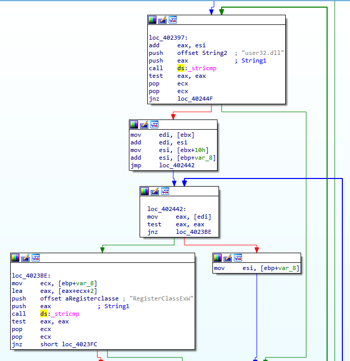
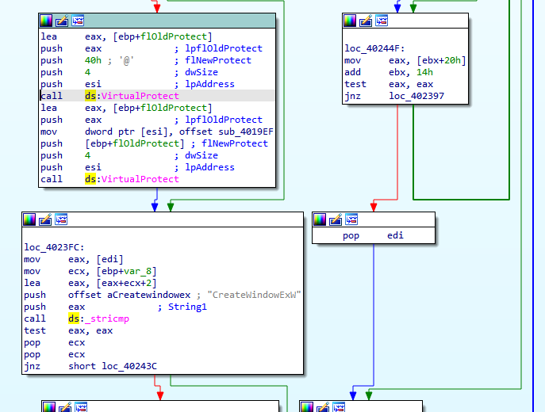
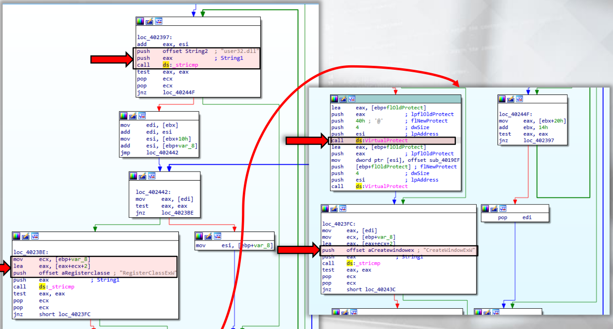

:orphan:
(malware-injection-techniques-api-hooking-techniques)=

# Malware Injection Techniques: API hooking techniques

The API hooking technique (which is based on process injection) is utilized by adversaries in order to modify the input or output of Windows API calls. Use cases include stealing passwords, preventing the loading of security tools, hijacking network connections, logging keystrokes, and hiding processes and files.

Using API hooking, malware can:

- Have complete control over a specific process and record the user experience resulting from interaction with that process, such as browsers, visited websites, antivirus programs, and files scanned by these antivirus programs.

- Capture sensitive information stored in the process memory or API arguments.

- API hooks permit malware to inspect, modify, and filter any data sent to or returned from a program function. Included are any associated libraries.

- API Hooking can be utilized for a variety of valid purposes, including sandboxing and application backward compatibility.

**Hiding the existence of a malware** - To hide its existence from users and antivirus applications,
the malware need to hook the following APIs:

- The malware uses process listing APIs such as `Process32First` and `Process32Next` to remove its process from the process list.

- APIs for listing files, such as `FindFirstFileA` and `FindNextFileA`

- Enumeration APIs for the Registry, such as `RegQueryInfoKey` and `RegEnumKeyEx`

**Stealing banking details** - The malware must hook the following APIs to obtain credential information (by capturing HTTP messages and injecting code into a bank's website):

- Functions for Internet communication, such as
  `InternetConnectA`, `HttpSendRequestA`, `InternetReadFile`, &
  other `wininet.dll` APIs functions. From `ws2_32.dll`, the
  `WSARecv` and `WSASend` can be used.

- Firefox APIs, such as `PR_Read`, `PR_Write`, and `PR_Close`.

**Inject into child process or prevent processes from starting** - The malware must hook `CreateProcessA` and `CreateProcessAsUserA` APIs. APIs for `LoadLibraryA` and `LoadLibraryExA` are also possible.

API hooking methods could be applied using various methods.
This article will cover the most commonly employed techniques.

- Inline API Hooking
- Trampoline API Inline Hooking
- IAT Hooking

## Inline API Hooking

Inline hooking modifies the flow of a process via Hotpatching, which refers to the modification of code while an executable image is running.

_Practical example_: Malware may alter the first few bytes (typically the first five bytes) of an API's assembly code and replace them with `jmp <hooking function>`. This allows the malware to modify the API arguments or bypass the API call, and then generate bogus results such as NULL or error.

```nasm
; Before Hooking:
API_START:
  mov edi, edi
  push ebp
  mov esp, ebp
  ; ...
  ; ...

; After Hooking:
API_START:
  jmp hooking_function
  ; ...
```

As seen in the preceding pseudocode, the malware replaces three instructions (the initial five bytes) with one instruction (which is `jmp` to the hooked function).

Windows now supports API hooking, and an additional instruction has been added. The instruction `mov edi, edi` requires two bytes of space, which allows _prologue5_'s bytes to function.

The hooking_function calls back the API using the instructions at the beginning of the API.

```
hooking_function:
    ;...
    <change API parameters>
    ;...
    mov edi, edi
    push ebp
    mov esp, ebp
    jmp API + 5 ; this will jump to the API after the first    replaced 5 bytes,
    ; in other words skip them.
```

This allows the hooking function to operate without disrupting the program's flow.

It can modify the API arguments and consequently control the generated results, or run `ret` directly to the program without calling the API.

Malware hooking code something like this:

```{code-block} cpp
:force:

#include <iostream>
#include <Windows.h>
​
FARPROC messageBoxAddress = NULL;
SIZE_T bytesWritten = 0;
char messageBoxOriginalBytes[6] = {};
​
int __stdcall HookedMessageBox(HWND hWnd, LPCSTR lpText, LPCSTR lpCaption, UINT uType) {
    // unpatch MessageBoxA
    WriteProcessMemory(GetCurrentProcess(), (LPVOID)messageBoxAddress, messageBoxOriginalBytes, sizeof(messageBoxOriginalBytes), &bytesWritten);
    // call the original MessageBoxA
    return MessageBoxA(NULL, lpText, lpCaption, uType);
}
​
int main() {
    // show messagebox before hooking
    MessageBoxA(NULL, "hello", "world", MB_OK);
​
    HINSTANCE library = LoadLibraryA("user32.dll");
    SIZE_T bytesRead = 0;

    // get address of the MessageBox function in memory
    messageBoxAddress = GetProcAddress(library, "MessageBoxA");
​
    // save the first 6 bytes of the original MessageBoxA function - will need for unhooking
    ReadProcessMemory(GetCurrentProcess(), messageBoxAddress, messageBoxOriginalBytes, 6, &bytesRead);

    // create a patch "push <address of new MessageBoxA); ret"
    void *hookedMessageBoxAddress = &HookedMessageBox;
    char patch[6] = { 0 };
    memcpy_s(patch, 1, "\x68", 1);
    memcpy_s(patch + 1, 4, &hookedMessageBoxAddress, 4);
    memcpy_s(patch + 5, 1, "\xC3", 1);
​
    // patch the MessageBoxA
    WriteProcessMemory(GetCurrentProcess(), (LPVOID)messageBoxAddress, patch, sizeof(patch), &bytesWritten);
​
    // show messagebox after hooking
    MessageBoxA(NULL, "hello", "world", MB_OK);​
    return 0;
}
```

## Inline API Hooking with Trampoline

In the preceding example, malware was able to alter API arguments. Using a Trampoline, however, the malware can modify the API return value and any associated data. This provides the malware with greater control over the API and its output.

The Trampoline is essentially a function that executes only `jmp` to the API and contains the three missing instructions (five bytes):

```nasm
Trampoline:
    mov edi, edi
    push ebp
    mov esp, ebp
    jmp API + 5 ; this will jump to the API after the first replaced 5 bytes,
                ; in other words skip them.
```

In lieu of returning control to the application via the API, the hooking function calls the Trampoline, which returns the API return value to the hooking function. This value is modified by the hooking function before being returned to the application program.

Using Trampoline, malware may inject JavaScript code into the output of APIs, including `InternetReadFile` and `PR_Read` APIs, in order to steal credentials or transfer funds between bank accounts:

```{code-block} nasm
:force:
hooking_function:
    ;...
    <change API parameters>
    ;...
    push API_argument_3
    push API_argument_2
    push API_argument_1
    call trampoline ; jmp to the API and
                    ; return with the API return value
    ;...
    <change API return value>
    ;...
    ret             ; return back to the main program
```

## IAT Hooking

The _Import Address Table (IAT)_ is a lookup table used to store in memory the addresses of all required program functions.

IAT hooking is not a common practice, but it does not require trampoline disassembler or code patching. It modifies the import table addresses so that they point to hooking function rather than the actual API.

The hooking function then executes `jmp` on the actual address of the API or pushes the API's arguments to the stack before returning to the actual program.

This mechanism is effective against numerous applications that include their required APIs in the import table.

However, it is ineffective against APIs that load content dynamically (which use `GetProcAddress` and `LoadLibrary`)

The FinFisher malware uses IAT hooking by modifying the `CreateWindowEx` pointer:







## Conclusion

Memory Forensics could detect API Hooking (which is beyond the scope of this post), but in general:

- Detecting API hooking in memory is similar to detecting process injection, as API hooking is based on process injection.

- In addition to malfind and hollowfind, volatility commands like apihooks can be used. Apihooks search a process's libraries for hooked API (in this case, APIs that begin with `jmp` or `call`). Apihooks lists the names and addresses of hooked APIs and hooking functions.

## References

- [ATT&CK MITRE: API Hooking](https://attack.mitre.org/techniques/T1056/004/)

:::{seealso}
Would you like to learn practical malware analysis techniques? Then register for our online course! [MRE - Certified Reverse Engineer](https://www.mosse-institute.com/certifications/mre-certified-reverse-engineer.html)
:::
