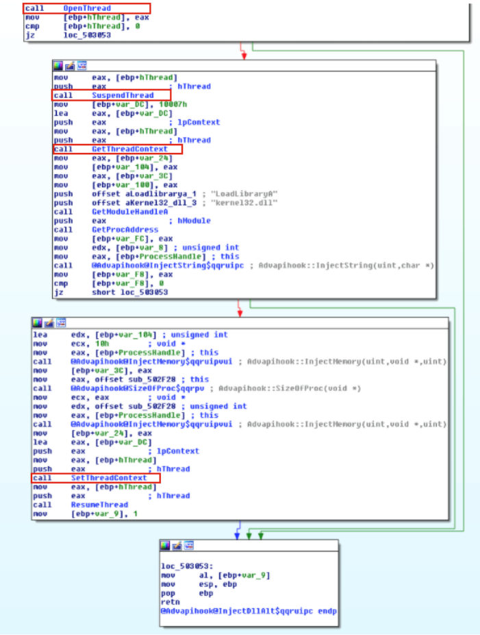

:orphan:
(malware-injection-techniques-thread-execution-hijacking-and-setwindowshookex)=

# Malware Injection Techniques: Thread Execution Hijacking and SetWindowsHookEx

We continue to review the various methods of code injection!

## Thread Execution Hijacking:

This is often referred to as _SIR_, which stands for _"Suspend, Inject, and Resume."_

This variant of the injection technique injects malicious code into the existing thread of a process (thereby avoiding the overhead of creating a new process and thread) and then uses the target to start a thread in itself. Previously, the shell code would have been injected by using the name of the DLL.

As a consequence of this, when we perform analysis, we can discover that the functions `CreateToolhelp32Snapshot` and `Thread32First` come before a call to `OpenThread`:

```cpp
// find thread ID for hijacking
hSnapshot = CreateToolhelp32Snapshot(TH32CS_SNAPTHREAD, NULL);
if (Thread32First(hSnapshot, &te)) {
  do {
    if (pid == te.th32OwnerProcessID) {
    ht = OpenThread(THREAD_ALL_ACCESS, FALSE, te.th32ThreadID);
    break;
    }
  } while (Thread32Next(hSnapshot, &te));
}
```

To begin, the malicious software obtains a foothold on the victim's thread.

The `SuspendThread` function is then used to place the thread into a _"suspended"_ state, which is the next step in the injection process:

```cpp
SuspendThread(ht);
```

The malware then calls `VirtualAllocEx` function to allocate memory space:

```cpp
rb = VirtualAllocEx(ph, NULL, my_payload_len, MEM_RESERVE | MEM_COMMIT, PAGE_EXECUTE_READWRITE);
```

Then calls `WriteProcessMemory` function to code injection:

```cpp
WriteProcessMemory(ph, rb, my_payload, my_payload_len, NULL);
```

There is a possibility that the code that was injected will contain shellcode, the path to a malicious DLL, or the location of the `LoadLibrary` function:


The figure here shows a trojan uses the Thread Execution Hijacking technique:



By executing `SetThreadContext`, the malicious software modifies the `EIP` register of the victim's thread in order to take control of its execution.cThe address of the next instruction can be found in the `EIP` register.
After that, the execution of the thread is restarted, this time using the newly written shellcode:

```cpp
GetThreadContext(ht, &ct);
// update register (EIP)
ct.Eip = (DWORD_PTR)rb;
SetThreadContext(ht, &ct);
ResumeThread(ht);
```

The _"SIR"_ strategy could present a challenge for adversaries due to the fact that suspending and resuming a process in the middle of a system call has the potential to cause the system to become unresponsive.

If the instruction pointer is referring to an address that is inside the range of the `NTDLL.dll` library, then sophisticated malware would probably be able to circumvent this issue by pausing the process and attempting it again at a later time.

## Injection via SetWindowsHookEx

Intercepting function calls requires using techniques known as hooking.

It is possible for malware to make use of it in order to load their harmful DLL whenever a particular action is triggered in a particular thread.

Malware may invoke `SetWindowsHookEx` in order to add a hook function to the chain of hook functions already installed on the system:

```cpp
HHOOK SetWindowsHookExA(
  [in] int       idHook,
  [in] HOOKPROC  lpfn,
  [in] HINSTANCE hmod,
  [in] DWORD     dwThreadId
);
```

The function `SetWindowsHookEx` requires the following four arguments:

- `idHook` - The first argument is the event type, which specifies the scope of the hook type and can be anything from mouse inputs (`WH MOUSE`) to the hitting of keys on a keyboard (`WH KEYBOARD`), `CBT`, and so on.

- `lpfn` - The second one is a pointer to the function that the malware wishes to invoke once the event has been successfully executed.

- `hmod` - The third one is the module, and it is the one that contains the code that the malware will eventually call into action. As a consequence, `LoadLibrary` and `GetProcAddress` come before `SetWindowsHookEx` in the execution order.

- `dwThreadId` - The thread that will be associated with the hook operation is the one passed in as the fourth argument.
  If it is set to zero, then the action will be carried out by each and every thread whenever the event is triggered. Malware typically just targets a single thread in order to produce the least amount of noise. As a consequence of this, it is possible to see calls to `CreateToolhelp32Snapshot` and `Thread32Next` before `SetWindowsHookEx` in order to discover and target a specific thread.

Following the injection of the DLL, the malicious software will proceed to run its own malicious code in the context of the process whose thread-Id was passed to the `SetWindowsHookEx` function. Something like:

```cpp
typedef int (__cdecl *MyProc)();

int main(void) {
  HINSTANCE evilDll;
  MyProc myFunc;
  // load evil DLL
  evilDll = LoadLibrary(TEXT("evil.dll"));

  // get the address of exported function from evil DLL
  myFunc = (MyProc) GetProcAddress(evilDll, "HackMe");

  // install the hook - using the WH_KEYBOARD action
  HHOOK hook = SetWindowsHookEx(WH_KEYBOARD, (HOOKPROC)myFunc, evilDll, 0);
  Sleep(5*1000);
  UnhookWindowsHookEx(hook);

  return 0;
}
```

As you can also see, the `UnhookWindowsHookEx` function uninstalls the hook process that was installed by the `SetWindowsHookExA` function.

It is not possible to inject a DLL that is `32-bits` into a process that is `64-bits`, and it is also not possible to inject a DLL that is `64-bits` into a process that is `32-bits`.

In the event that an application needs to use hooks in other processes, it is necessary for a `32-bit` application to call `SetWindowsHookEx` in order to inject a `32-bit` DLL into other processes, and it is necessary for a `64-bit` application to call `SetWindowsHookEx` in order to inject a `64-bit` DLL into other processes. Both of these calls are required.

It is necessary for the `32-bit` and `64-bit` DLLs to have separate names.

Figure shows the _Ransomware Locky_, which uses this technique:


Also if we investigate the open source, we will find that _Quasar RAT_ employs `Gma.System.SetWindowsHookEx()` is used internally by `MouseKeyHook`, which in turn uses `SetWindowsHookEx()`:

```csharp
private IKeyboardMouseEvents m_GlobalHook;

public void Subscribe()
{
    // Note: for the application hook, use the Hook.AppEvents() instead
    m_GlobalHook = Hook.GlobalEvents();

    m_GlobalHook.MouseDownExt += GlobalHookMouseDownExt;
    m_GlobalHook.KeyPress += GlobalHookKeyPress;
}

private void GlobalHookKeyPress(object sender, KeyPressEventArgs e)
{
    Console.WriteLine("KeyPress: \t{0}", e.KeyChar);
}

private void GlobalHookMouseDownExt(object sender, MouseEventExtArgs e)
{
    Console.WriteLine("MouseDown: \t{0}; \t System Timestamp: \t{1}", e.Button, e.Timestamp);

    // uncommenting the following line will suppress the middle mouse button click
    // if (e.Buttons == MouseButtons.Middle) { e.Handled = true; }
}

public void Unsubscribe()
{
    m_GlobalHook.MouseDownExt -= GlobalHookMouseDownExt;
    m_GlobalHook.KeyPress -= GlobalHookKeyPress;

    //It is recommened to dispose it
    m_GlobalHook.Dispose();
}
```

The majority of malware that steals information also includes a keyloggers via `SetWindowsHookEx`.

Malware known as _Hawkeye_ is offered for sale as "malware as a service." The Hawkeye malware has undergone regular updates and enhancements over the course of its existence. It occasionally receives updates that include newly implemented capabilities and methods.

Sample of Hawkeye malware with `SHA-256: dff7820b2b0b877c46a0cbc6be22b45b11511af7d50e36c7d83fa27f3db277b0` is disguised and coded in C# language. It performs process hollowing to its child process, which is the genuine Microsoft product `RegAsm.exe`, which is used for `.NET` assembly registration. This behavior is typical of the majority of HawkEye samples.

If a breakpoint has been reached and we are able to determine the parameters with which `SetWindowsHookExA` was called:

- `SetWindowsHookExA (0xD, 0x7D18EA,0,0)`

- `idHook = 0xD = WH_KEYBOARD_LL` denotes the type of hook that should be installed.

- `lpfn` equals `0x7D17EA`, which is the address of the procedure that handles the processing of windows messages.

- `hmod = 0` because the procedure is contained within the code of the active process, and since all of the threads operating on the same desktop are monitored, this results in the value `NULL` for `hmod` (see last parameter)

- `dwThreadId = 0` will install the hook on all currently active threads in the same desktop as the thread that is initiating the installation.

## References

- [SetWindowHookExA](https://docs.microsoft.com/en-us/windows/win32/api/winuser/nf-winuser-setwindowshookexa)
- [Mousekeyhook](https://github.com/gmamaladze/globalmousekeyhook)

> **Would you like to learn practical malware analysis techniques? Then register for our online course! [MRE - Certified Reverse Engineer](https://www.mosse-institute.com/certifications/mre-certified-reverse-engineer.html).**
