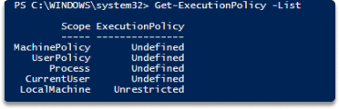
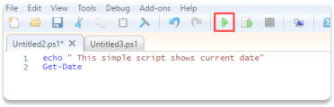
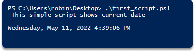

:orphan:
(native-scripting-tools-in-windows-should-you-use-powershell)=

# Native Scripting Tools in Windows: Should You Use Powershell?

If you are a Windows user and new to scripting, you may be unsure about which scripting language and shell to use. Which should you go with? In this post, we'll discuss your Windows-based scripting tool options and distinguish between Powershell and the command line.

## What is scripting?

A script is a program that allows you to write sequential instructions for computers to follow. All commands accessible at the command line are accepted by scripts.

You need to choose a language to write a script.

Whether for scheduling backups, making computations, or web scraping. Whatever you need, using scripts instead of the user interface allows you to accomplish and automate actions more effectively.

## Programming languages

Scripting languages are classified into various categories. Like Microsoft PowerShell, AppleScript, or Bash, some are intended to operate within a certain operating system. Others are cross-platform, which means they can be run on any platform.

## Windows command-line Shells

The Command Shell and PowerShell are the two command-line shells available in Windows. A shell is a computer program that allows you to communicate directly with the OS ( which is referred to as the “operating system”) or software, allowing you to automate IT processes.

### Shell selection

When it comes to writing scripts for Windows, we have various options, like:

- common interpreters and PowerShell,
- Cygwin
- and custom (non-native) shells

### CMD.exe

`CMD.exe` is the default interpreter on Windows operating system.
The Command shell was the first shell integrated into Windows to use batch (.bat) files to automate everyday processes such as user backups.
You may use Windows Script Host to run more complex scripts in the command shell with `cscript` and `wscript`.

### powershell.exe

PowerShell was created to improve the capabilities of the command shell by allowing it to perform PowerShell commands known as cmdlets. Cmdlets are comparable to Windows Commands, but they offer a more flexible scripting language.

### Batch files

Batch files consist of a sequence of commands saved in a plain text file that will be processed by the command-line interpreter.
It is used to reduce the amount of effort necessary for routine operations by allowing you to create a script to automate them.

You can use a batch file (which is marked by a `.bat` extension) for a range of activities.

In 1985, Windows was introduced as a graphical user interface (GUI) on top of text-based operating systems. It was meant to operate on a disk operating system ( which is also referred to as “DOS”).

To enable Windows to launch at the start, you could put the `WIN` command (which is used to start Windows) at the end of the `AUTOEXEC.BAT` file to allow automatic loading of Windows.

**Batch language**

Batch file programming has its language, which is not complicated. However, if we were to create a more sophisticated tool, we might be better off utilizing a different programming language.
Batch file programming has a language that, while not particularly complicated, can nonetheless be beneficial for specific tasks.

### Cygwin

Cygwin is a collection of techniques that may be deployed on computer systems to provide Windows compliance with a wide range of Linux - based functions and utilities.
One of using Cygwin benefits is the ability to use UNIX-like text-based shells, such as our favorite, the bash shell.

The bash shell provided by Cygwin is a standard bash shell that will allow us to execute the vast majority of shell scripts that we can run on UNIX-like operating systems on Windows.

However, using a non-native tool for scripting has some disadvantages like getting errors when you want to use functions that are not built directly into the shell itself.

Although Cygwin provides many of the typical UNIX functions, it does not give us the whole library of them that we may discover when working directly with UNIX, Linux, or OS X. In general, we may work around such limitations and replace lost functionality using our code or the corresponding native commands included in the Windows operating system.

### Do you need a non-native shell?

Due to the largely restricted nature of Microsoft operating systems and the presence of standard apps, you may want to prefer the built-in text-based shells.

Increased scripting capabilities via PowerShell, appear to have helped with some of the pressure driving the development of alternative shells.

## PowerShell vs. command line

**Both of these shells are built using a shared group of commands**: Functions are based on original Microsoft DOS versions

**Console aliases**: An alias is a nickname or variant name for a cmdlet or command element, such as a function, script, file, or executable file.
In any PowerShell command, you may use an alias instead of the command name. You can use aliases in the command line also, but it is temporary. This means that if you open a new session or reopen the terminal, the alias is removed.
To make aliases permanent, we must save them in a directory that is retrieved when you open Terminal.

**Backward compatibility and flexibility**: Windows PowerShell employs some strategies to facilitate the transition from Windows Shell, Unix, or Linux backgrounds.

## Summary

In this paper we discussed Microsoft Windows’ two built-in tools which we can utilize in scripting; `cmd.exe` and `powershell`, an overview of scripting and other available command-line Shells like `.bat` (native) and a non-native but powerful tool _Cygwin_.

Among all of them, Powershell is the only complete, fully functional solution with built-in cmdlets and functions.

**Create a quick Powershell script**

_Time: 5 minutes_

**Step 1** Go to the windows search bar and write `PowerShell ISE`

**Step 2** Right-click and open as _run as administrator_, click _yes_ in the prompt.

**Step 3** Type `Get-ExecutionPolicy -List`, hit `enter`

**Step 4** Type `Set-ExecutionPolicy Unrestricted`, say _yes_ to the prompt.

**Step 5** Click **File**, **new**

**Step 6** Copy and paste this command into your file :

`echo " This simple script shows the current date"`

`Get-Date`

**Step 7** Click save, rename it as `first_script.ps1`, press _save_.

**Step 8** Change the directory to where you saved the file.

**Step 9** Type `first_script.ps1` and hit `enter`

