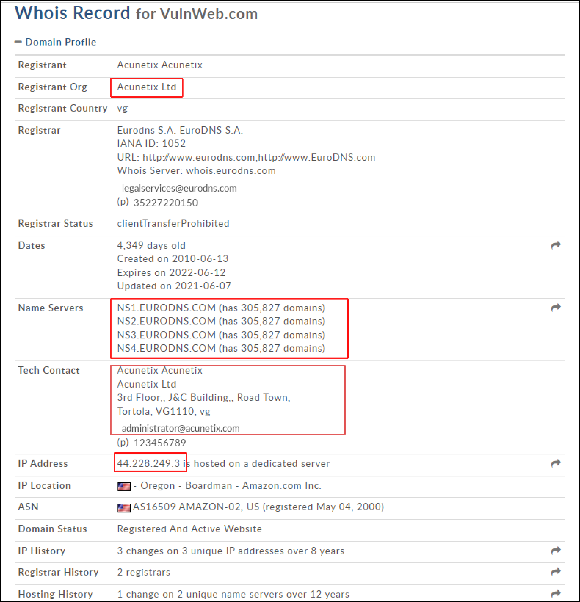
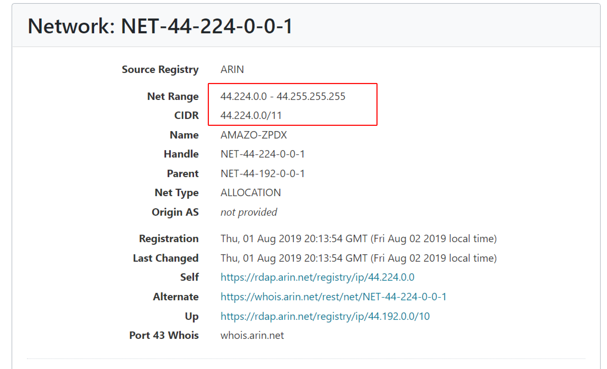
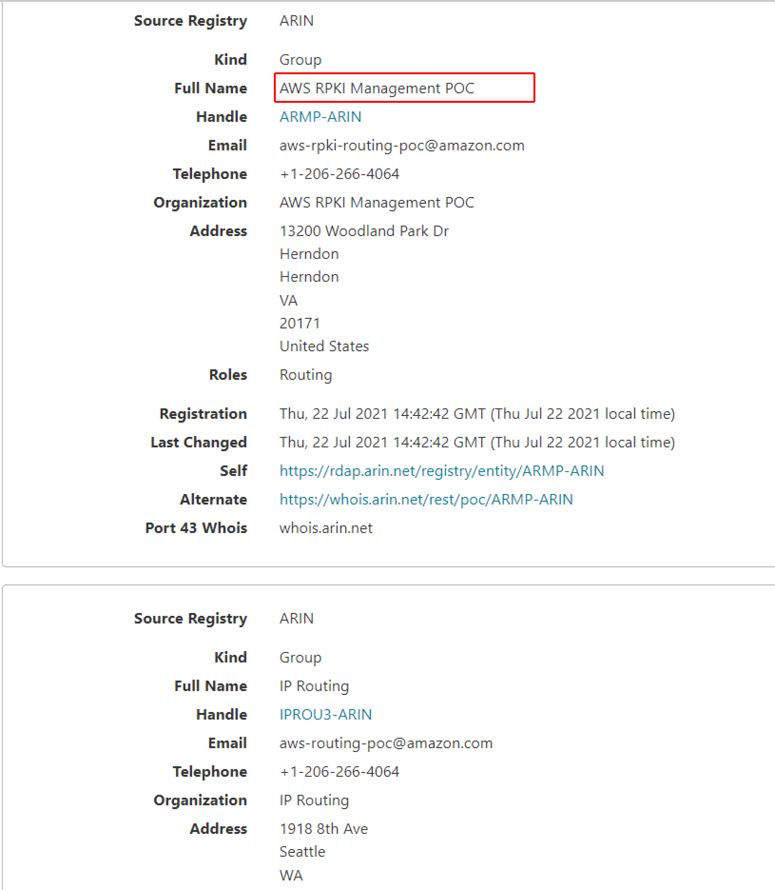
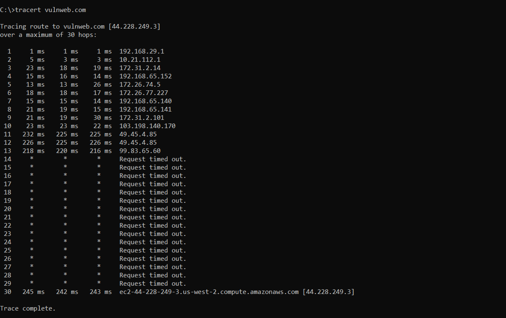

:orphan:
(network-footprinting-the-building-blocks-of-any-successful-attack)=

# Network Footprinting: the Building Blocks of Any Successful Attack

The process of gathering information about a target network, and identifying and discovering network ranges is known as network footprinting. Network footprinting helps an attacker determine the domain's subnet mask and trace the network path between the system and the target machine. As a result, attackers can learn how the network is built and which systems are connected and are being actively used. The network ranges also help in identifying the target network's topology, access control devices, and operating systems.

For private internets, the Internet Assigned Numbers Authority (IANA) has set aside three blocks of IP address space: `10.0.0.0 – 10.255.255.255` (16,777,216 IP addresses), `172.16.0.0 – 172.31.255.255` (1,048,576 IP addresses), and `192.168.0.0 – 192.168.255.255`. (65,536 IP addresses). The data routed through the internet is the data transmitted through the host's public IP address and not the private IP address which is restricted to Hosts local network.

There are five regional internet registries (RIRs) that provide overall management of public IP address space within the geographical region

- American Registry for Internet Numbers” [ARIN](https://www.arin.net)
- Asia-Pacific Network Information Center” [APNIC](https://www.apnic.net)
- Réseaux IP Européens [RIPE](https://www.rpie.net)
- Latin America and Caribbean Network Information Center [LACNIC](https://www.lacnic.net)
- African Network Information Center [AfriNIC](https://www.afrinic.net)

_Let us have a look at different tools used for network footprinting:_

## Whois

Whois is primarily built for Unix systems and searches the registries for information such as domain ownership, IP addresses, locations, and phone numbers. Regional internet registries maintain Whois databases (RIRs) where services such as [domaintools.com](https://whois.domaintools.com/) use the database to perform whois lookups. An attacker can use the whois database to gain information about the target domain, then use that knowledge to build a model of the organization's network.

For example, go to [domaintools.com](https://whois.domaintools.com/) and enter `testphp.vulnweb.com` in the search bar. It provides whois information including registrant information, email, nation, IP address, location, contact information, creation and expiry dates, and a list of domain servers.

To obtain the target network's network range, go to www.arin.net and type in the server IP address in the Search whois text box. This gives the network range of the target network. During this process, there is a good chance of an attacker obtaining a list of internal machines on a DNS server that has been misconfigured.

Entering the IP address of `testphp.vulnweb.com`, which is 44.228.249.3, returns the complete network range. The response image shows that a range is owned and managed by Amazon Services, indicating that Vulnweb is using Amazon's Cloud services. In this example, as illustrated in the images below, vulnweb is using Amazon web services security mechanisms to control its resources.

## Tracert / Traceroute

Traceroute (or tracert for Windows systems) is another network mapping tool that uses the Time to live (TTL) information in the header of ICMP packets to discover the routers on the way to a target host. This tool can determine how many routers a packet passes through, the round-trip time and whether the routers have DNS records. The TTL field indicates the maximum number of routers that a packet may traverse through. Each router that processes a packet decrements one from the TTL count field in the ICMP header, and when the count reaches zero, the packet is discarded and an ICMP error message is sent. An attacker can use this to create an image of the network that includes not just the IPs and their layout, but also the geographic locations where they can be found.

The ICMP traceroute protocol is used by default in the Windows operating system. Enter `tracert` followed by the target IP address or domain name in the command prompt.

From line 14 to line 28, timeouts are displayed instead of information. This usually implies a firewall that does not react to ICMP requests.

## Final Words

In final words, Network footprinting is a crucial step in the process of penetration testing. Attackers often use numerous tools to gather different kinds of network information. Which are the building block of any successful attack.

> **Looking to expand your knowledge of penetration testing? Check out our online course, [MPT - Certified Penetration Tester](https://www.mosse-institute.com/certifications/mpt-certified-penetration-tester.html). In this course, you'll learn about the different aspects of penetration testing and how to put them into practice.**
