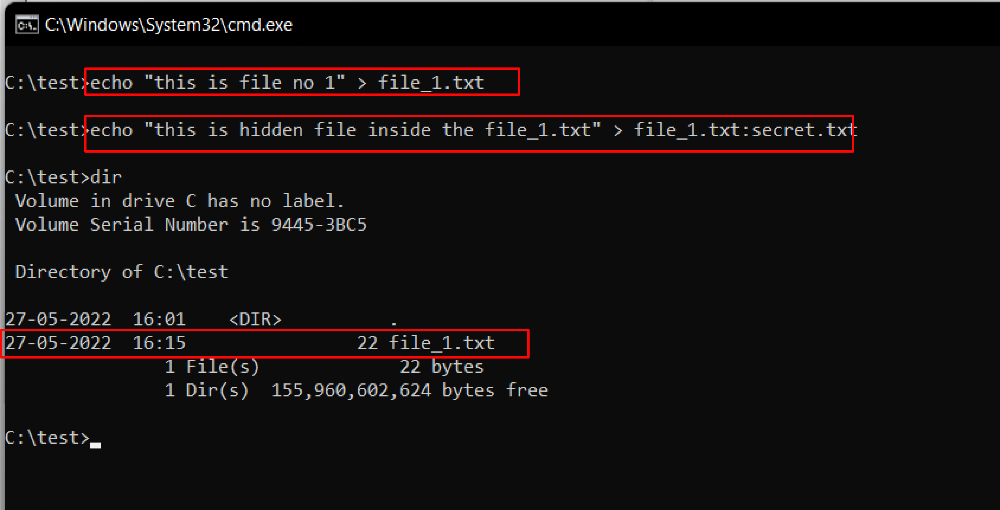
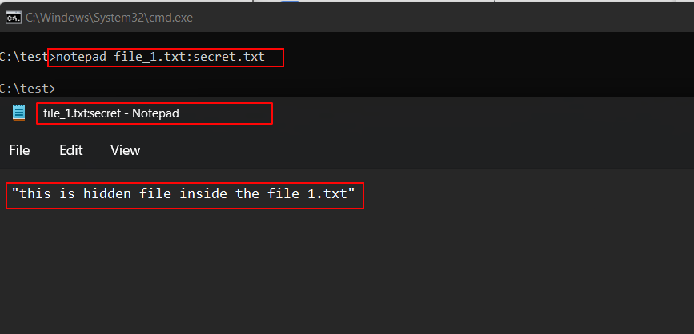
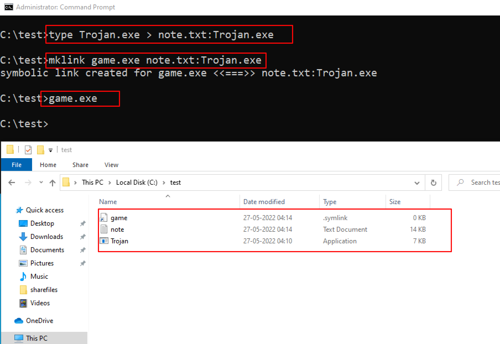

:orphan:
(ntfs-data-stream-manipulation)=

# NTFS data stream manipulation

NTFS is a Microsoft-developed proprietary file system that is used by the majority of Windows systems. NTFS is a filesystem that stores files utilizing two data streams known as NTFS data streams, as well as file attributes. The first data stream contains the security descriptor for the file to be stored, such as permissions, while the second contains the data contained within a file. Another form of the data stream that can be found within each file is an alternate data stream (ADS).

## What is ADS?

ADS is a file attribute available solely in NTFS, and it refers to any type of data associated with a file but not in the file itself on an NTFS system. NTFS ADS is a Windows hidden stream that stores file metadata such as properties, word count, access and author name, and modification timings.

ADSs can fork data into existing files without changing or altering their functionality, size, or display to file-browsing utilities. They enable an attacker to inject malicious code into files on a vulnerable system and execute them without the user knowing.
Attackers use ADS to hide rootkits or hacker tools on a breached system and allow users to execute them while hiding from the system administrator.

Once the ADS is attached to a file, the size of the original file will not change. One can only identify the changes in files through modification of timestamps, which can be innocuous.

## Creation of NTFS streams:

When the user reads or writes a file, their only manipulation in the main data stream by default. The following is the syntax of ADSs

`filename.extension:alternativeNmae`

Open the terminal and type the following command to create a file named `file_1.txt`.
`echo "this is file no 1" > file_1.txt`

Now, type the following command to write to the stream named secret.txt.
`echo "this is a hidden file inside the file_1.txt" > file_1.txt:secret.txt`

We’ve just created a stream named secret.txt that is associated with `file_1.txt` and when you look at the `file_1.txt` you will only find the data present in `file_1.txt`. And also stream will not be shown in the directory as well.

The following command can be used to view or modify the stream hidden in file_1.txt
`notepad file_1.txt:secret.txt `

**Note:** Notepad is a stream-compliant application. Never use alternative streams to store sensitive information.

## Hiding Trojan.exe in note.txt file stream:

The following command has used the copy the trojan.exe into a note.txt(stream)

`C:\test>type Trojan.exe > note.txt:Trojan.exe`

Here type command is used to hide trojan in the ADS inside an existing file.

After hiding trojan.exe behind note.txt, we need to create a link to launch the trojan.exe file from the stream. The following command is used to create a shortcut in the stream.

`C:\test>mklink game.exe note.txt:Trojan.exe`

Type game.exe to run the trojan that is hidden behind the `note.txt`. Here, `game.exe` is the shortcut created to launch `trojan.exe`.

## Prevention again NTFS streams

ADS-encoded files are impossible to discover using traditional file-browsing methods such as the command line or Windows Explorer.

- Move the suspected files to the File allocation table (FAT) partition and delete hidden NTFS streams.
- Use prevention tools such as LADS as a countermeasure for NTFS streams.
- Use updated antivirus systems on your machine.
- Use third-party file integrity checker tools like Tripwire file integrity manager to maintain the integrity of the file.

> **Looking to expand your knowledge of red teaming? Check out our online course, [MRT - Certified Red Teamer](https://www.mosse-institute.com/certifications/mrt-certified-red-teamer.html). In this course, you'll learn about the different aspects of red teaming and how to put them into practice.**
