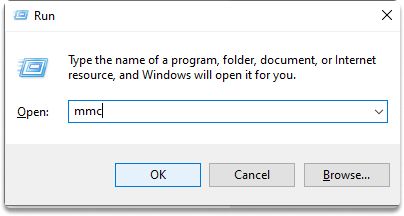

:orphan:
(practical-windows-hardening-security-templates)=

# Practical Windows Hardening: Security Templates

We can strengthen our operating systems in many ways. Today we are going to take a look at the security templates in Windows and how to utilize these tools to protect our environment.

## Security Templates

Security templates in Windows are the entry point for configuring environment settings. Security templates have multiple parameters and they can be customized to regulate devices.

Examples of what you can control and manage with security templates are as follows:

- user privileges,
- password guidelines,
- system management,
- and system authorization.

A security template is a tool that defines parameters for carrying out a certain action. Microsoft includes a complete set of templates that address a variety of typical security issues. These security templates are classified into two types:

- default
- and incremental.

Security templates are `.inf` files. They include settings for the logs, groups, processes, registry security, and system. Group Policy is often used to configure security settings in a business environment that uses a domain. Importing security templates into a Group Policy is possible.

**.SV**: Templates ending with this extension are used for a member or autonomous device.

**.DC**: Templates ending with this extension are used for domain controllers.

**.WK**: These types of security templates are used for consumer user workstations.

## Windows security templates

Windows Security templates are a component of Group Policy in the Microsoft Windows operating system. You can edit, customize or duplicate based on your enterprise security needs. Windows includes the following security templates by default.

**Compatws.inf**: It modifies the file and Registry permissions to ensure that the security settings are compatible with those required to support legacy apps. It is typically employed when you need older application support.

**DC security.inf**: When a server is joined to a domain, this template is built. You may also set back a domain controller to the initial settings.

**Hisecdc.inf**: Improves security on a domain.

**Hisecws.inf**: Improves security on client machines and member servers.

**Securedc.inf**: It enhances a domain controller's security.

**Securews.inf**: It improves client and member machine security.

**security.inf**: It is the basic security settings that are applied after installation.

## Benefits of security templates

By utilizing security templates, you can save time and effort during the first implementation.
It enhances the fine-tuning process of administrative units(OUs), or the whole domain as time allows.

## How to use security templates?

You can use the security templates snap-in to edit templates.

**Secedit**

It is a command-line medium that you can prefer if you’re working with multiple devices and scripts.

**Security Configuration and Analysis tool**

You can utilize from this MMC tool if you’re administering a single device.

## Hands-on: Windows Hardening

### Define a minimum password policy with a windows security template

_Time estimated: 10 minutes_

**Adding security templates Snap-In to (MMC) on Windows 10**

**Step 1-)** Click Windows + `r`.
Type `mmc` on the pop up and click enter.

**Step 2-)** Click Add/Remove Snap-in from the File menu.

**Step 3-)** Click the standalone tab, then Add, in the Add/Remove Snap-in dialog box.

**Step 4-)** Click Security Templates in the Add Snap-in dialog box, click Add, and OK.

**Set up and describe a password policy in MMC**

**Step 5-)** In the console directory, extend Security Templates.

**Step 6-)** Right-click on your path (default location for templates, you can also add nem one), and then click New Template.

**Step 7-)** Type password policy in the description, and then click OK.

**Step 8-)** Click on password policy, on the left side, account policy and password policy.

**Step 9-)** Click on minimum password length.

**Step 10-)** Click on Define this policy setting in the template box, and set the length option to _8_. And then click OK.

Congratulations! You have successfully hardened your windows environment!

## References:

- [Define Security Templates By Using the Security Templates Snap-In](https://docs.microsoft.com/en-us/troubleshoot/windows-server/identity/define-security-templates-using-security-templates-snap-in)
