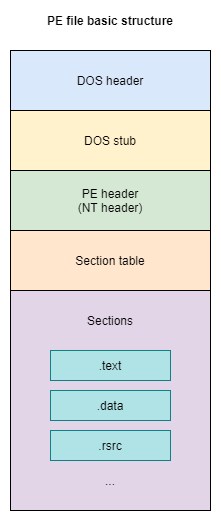

:orphan:
(reverse-engineering-portable-executables-pe-part-1)=
# Reverse Engineering Portable Executables (PE) - Part 1
While contemplating malware investigation, one of the most significant subjects to find out more about is understanding the *Portable Executable* (`PE`) file design.

## PE-format

The diagram at the top is a wellknown outline of the PE file. We will get into the info of each one of the structure’s areas, but what I want you to think of for now, is that the PE format is a manner the program informs the OS of its execution requirements. Let’s give an explanation for the concept in extra info. I know you might be pronouncing all we do is double click on an icon or call an EXE through a few shell software like, for example, `cmd.exe`, but yet behind the scenes, there are many activities being initiated.    

In this article we will recognition at the static side of the format, but we can cover the dynamic execution in later blog posts.    

Before being carried out, every software informs the OS of the special requirements that it wishes, on the way to run properly. These requirements can be, however aren't restricted to:

1. Memory area wanted
2. Memory permissions
3. Where to region the program in reminiscence
4. What libraries and features are wished
5. Where inside the loaded address area to begin the execution

This is wherein the PE shape comes into play. It has all the solutions to the ones questions, plus many extra. All of them are defined in the PE format and all the OS has to do, is study them and try to obey the executable’s goals.

One of the significant ideas, which we just found out about is the way that an executable isn't simply a lot of code that gets executed. The second significant idea, is just most executables (programs) today rely upon other executables or libraries. In the past you might find a single program that does everything with zero dependencies on others, but that is no longer the case today.

## But why is that concept also important to keep in mind?

The answer is simple: When doing malware analysis, the samples you will be working with are 99% going to be dependent on some other libraries. Understanding how these libraries incorporate into the program is a vital for your investigation.   

Let's take an example. Imagine a program needs to encryption messages and send between computers via Internet. Simple, right? 

If this program does not depend on any libraries, it should have, within it, code to (Alice send message to Bob):

1. Encrypt message
2. Connect to the internet
3. Send message
4. Receive message from another computer
5. Decrypt message

The following illustration shows how symmetric key encryption works:

You may be saying that, indeed, those are five basic functions, above all, they are really not only five. The developer should foster the ability to encrypt message, associate with the Internet, send the message there, and afterward receive another. The engineer will likewise must be answerable for setting up an area for the downloaded messages to be put away on the disk.

All of these functions should be in the built into the program in order to achieve its goals. This is not how programs work today; they depend on the Operating System to implement encryption algorithms, to provide Internet and disk-writing capabilities.

This is what we meant when saying that the program will have everything inside it.

## What is a library?

There are such countless various definitions, however what you want to know is that it's a collection of code and information, which can be utilized by different projects simultaneously.

Windows implementation of a shared library is called *Dynamic-link Library* (`DLL`).

These libraries have the .dll file extension and furthermore utilize the `PE`-file design, as .exe records, as we will see later.   

The concept of libraries is very helpful for software developers. Imagine they need to develop different tools that all speak with the Internet. What they can do is create a library that is responsible of connecting to the Internet and doing different functionality such as downloading, uploading, checking connections, etc. 

Another example, is tools for working with encryption algorithms. Malware developer can create a library with many functions: encrypt implementation, decrypt implementation, key generation. 

If this something like ransomware, also is needed functions which worked with filesystem: enumerate disks, enumerate files and folders.

Then they can reuse that library with all the tools they develop.

## How the code and a library are put together to generate exe?

In generally, stages of compiling are:   

These are only illustrations to explain the idea.

So as we saw, the *linker* assumes a significant part in adding those libraries to the last executable. In any case, there are various approaches to connecting which you should be aware:

- static linking
- dynamic linking

With static linking, at gather time, the linker will determine all the library necessities and copy the library into the last executable.

Dynamic linking is actually divided into two types: implicit linking and explicit linking.    

With *implicit linking*, the linker will interface the library referred to into the program, yet this library and the capacities referred to don't get added to the executable and are just stacked at execution time.

At execution time, the OS stacks this library for the
executable and deals with all the memory addresses for the
program.

Whenever a program is utilizing *implicit linking*, then you will observe a part in the PE structure, which holds every one of the libraries being imported and the functions referred to.

*Explicit linking* doesn't need an import segment nor does the linker interface the library to the program. This kind of connecting is done inside the actual code by the developer.

You can think of explicit linking as a program with an add-on plugin engine system. The program can extend its capabilities with plugins that could be added and removed while the program is running. There is no need to recompile the program to extend the program, all you need is load the new plugin and you get the new features.    

## Which type of linking is better?

Assume a model, where our memory is running three programs, and every one of them are utilizing a similar library. There is a waste of memory space, since library is loaded three times.

The case is different with dynamic linking: library is loaded once but many times.

Also dynamic linking is easily maintained and have smaller size of executables.

Now that we understand the basics, we can start our journey to PE format in the next part.

> **Would you like to learn practical malware analysis techniques? Then register for our online course! [MRE - Certified Reverse Engineer](https://www.mosse-institute.com/certifications/mre-certified-reverse-engineer.html).**