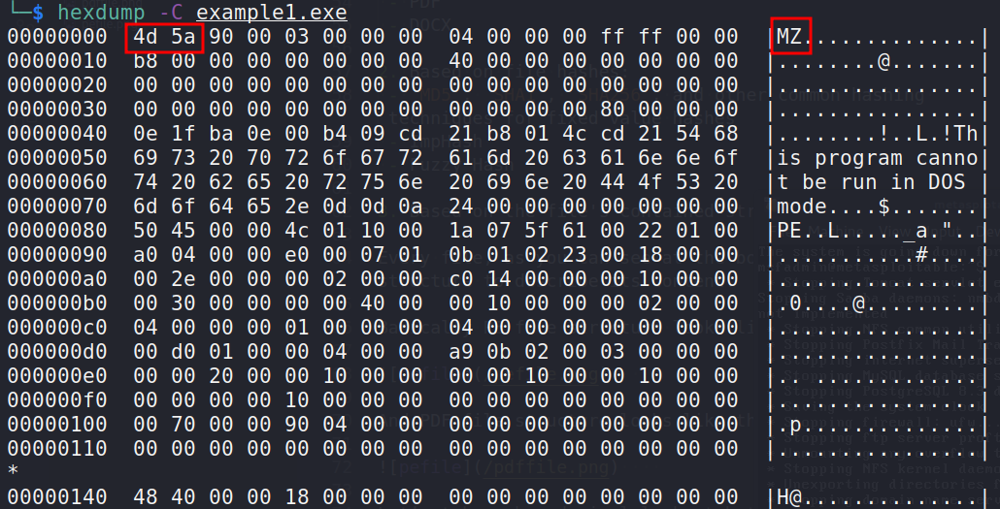
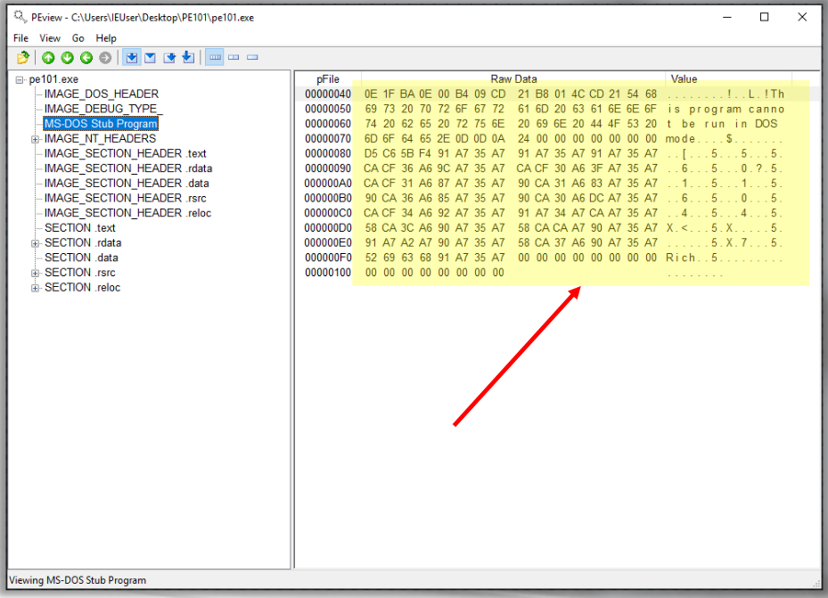
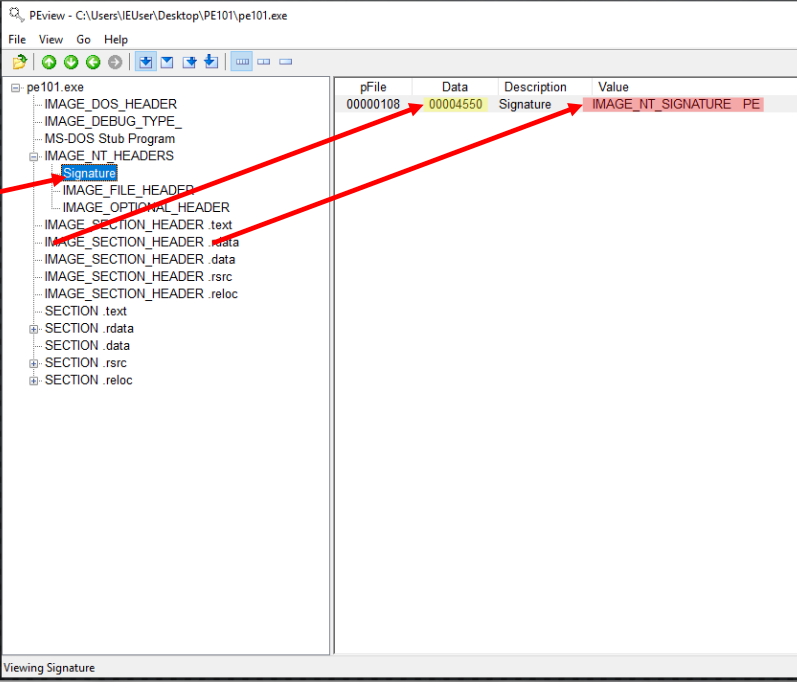
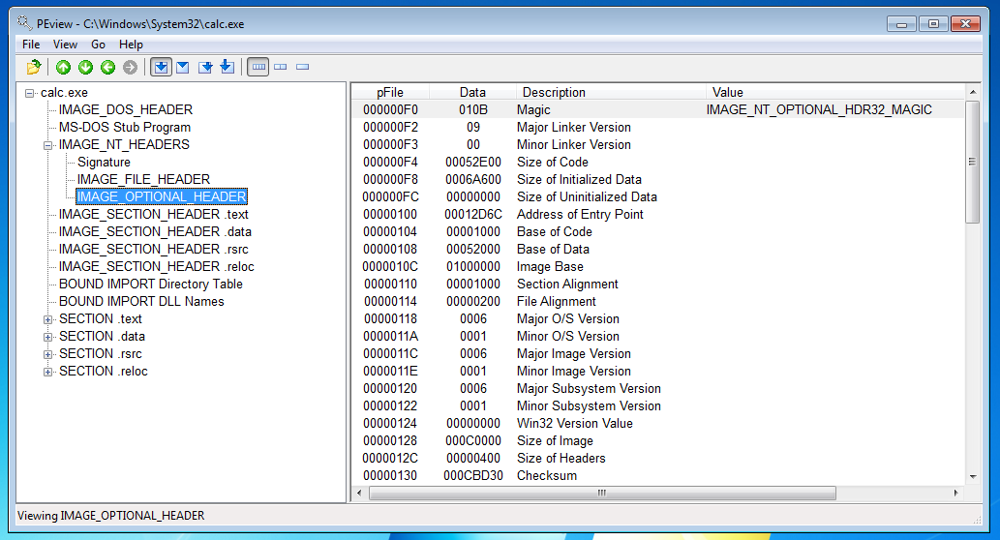
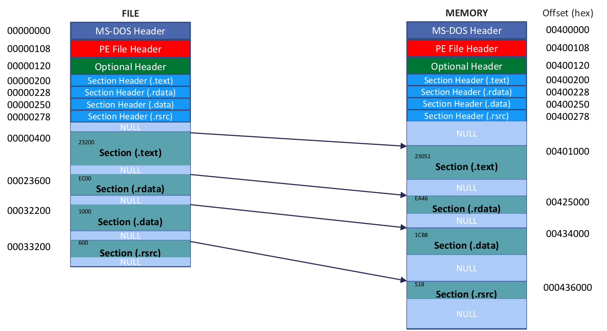
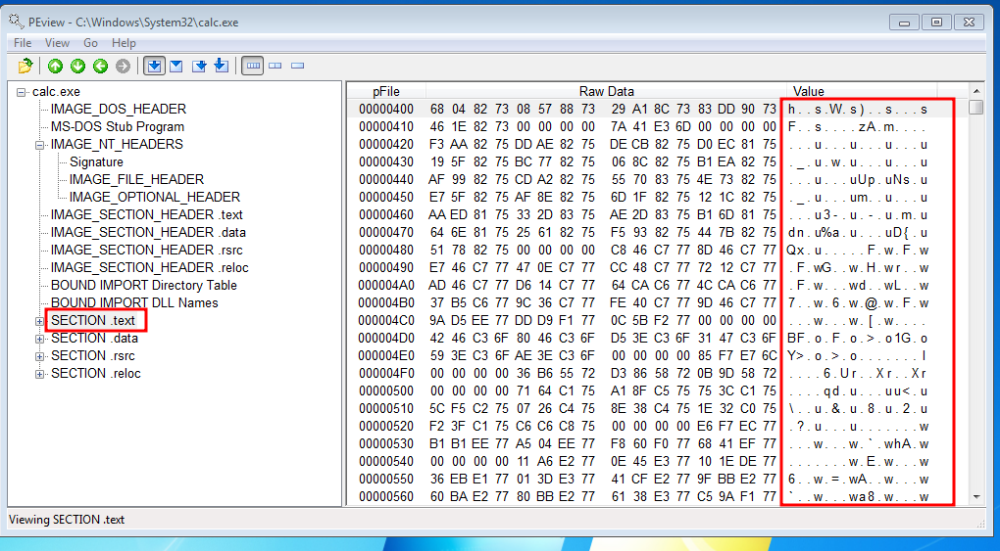
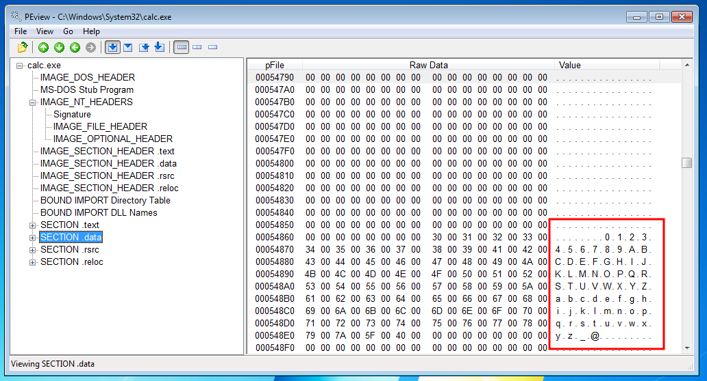
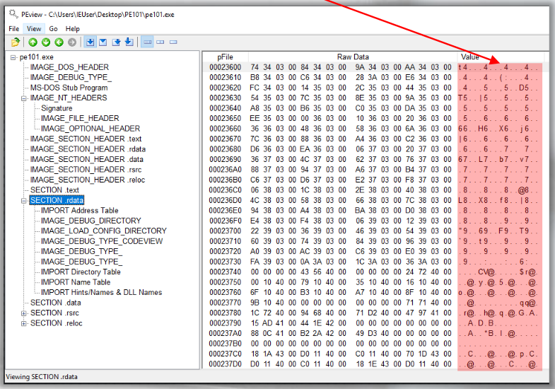
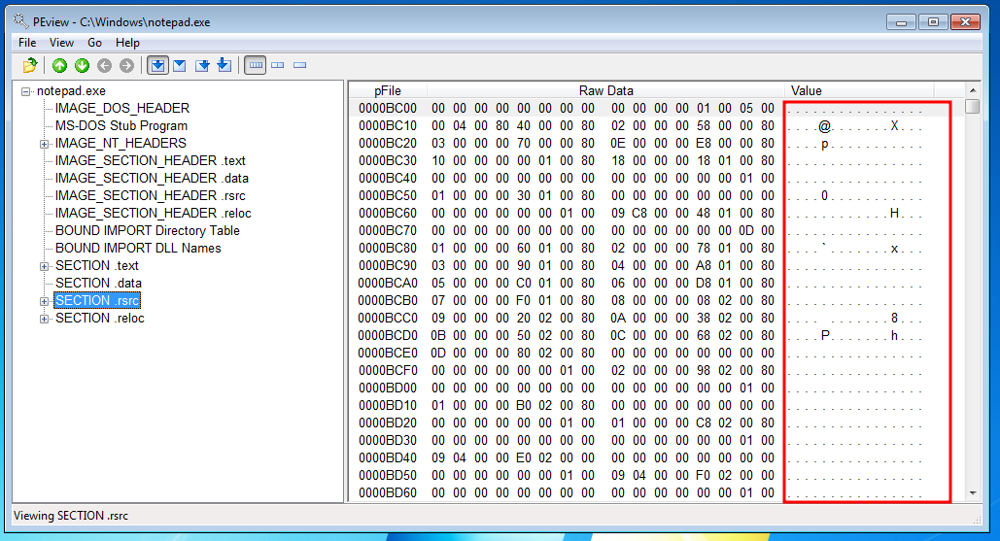

:orphan:
(reverse-engineering-portable-executables-pe-part-2)=

# Reverse Engineering Portable Executables (PE) - Part 2

The PE file format is a data structure that is used by Microsoft Windows programs. It is a container for all the information that is needed by the program. This includes the code, data, and resources. The file format is also used by other operating systems, but the Windows version is the most common. For example, the Portable Executable (PE) file format is used for executables and dynamic-link libraries (DLLs).

Here's a high-level overview of the PE file format:


## PE/COFF file format

_Portable Executable_ (`PE`) is the binary file format that Microsoft Windows uses for executables, dynamic link libraries, and others.

PE is gotten from the _Common Object File Format_ (`COFF`) specification, which is additionally utilized by most Unix executables. The name portable (compact) comes from the way that the configuration isn't design explicit.

## Portable Executable

PE is divided into many headers and sections; we will not
cover every single byte in the PE file format for many
reasons:

1. It could probably require an entire book to do that
2. The entries you will find depend mostly on how the
   executable was built (compiled)
3. We need to focus on the maximum vital parts of PE for this collection of articles

For a detailed poster of the PE file format, check [Ange
Albertini's Corkami project](https://github.com/corkami/pics):


The following file types use the PE file format:

- `.exe` - executable
- `.dll` - dynamic link library
- `.efi` - Extensible Firmware Interface file. EFI files are boot loader executables
- `.mui` - Multilingual User Interface file which contain assets that permit changing the Windows point of interaction to show unique dialects.
- `.ocx` - ActiveX Forms
- `.acm` - Audio Compression Manager
- `.ax` - MPEG-4 DVD filter
- `.scr` - Screensaver
- `.sys` - Device driver
- `.tsp` - Windows Telephony Service Provider file
- `.cpl` - Control Panel
- `.drv` - Driver file (kernel)

All of the types listed can be executed, some, for example, `.exe` and `.scr`, can be executed straightforwardly through the Windows Shell (`Explorer.exe`), while others, for example, `.dll` records, require one more program or administration to run them.

The type of file is defined at compile time (e.g. `exe` or `dll`).

Mainly `PE` is divided into _Headers_ and _Sections_. Let’s start analyzing them and understanding their details.

## File Headers

The main file headers are:

**MS-DOS Header** - This is the beginning of the PE file (offset zero) which starts with the magic (signature) value _"MZ"_ or `0x5A4D`.
The value _"MZ"_ are the initials of the `PE` designer _Mark Zbikowski_:



The two important fields in this header are:

- `e_magic` - Signature: MZ. **Every portable executable will begin with this sequence**
- `e_lfanew`: `DWORD` offset to new PE header that includes `PE\0\0`

The data structure of this header could be seen in the following C code:

```cpp
typedef struct _IMAGE_DOS_HEADER {      // DOS .EXE header
    WORD   e_magic;                     // Magic number
    WORD   e_cblp;                      // Bytes on last page of file
    WORD   e_cp;                        // Pages in file
    WORD   e_crlc;                      // Relocations
    WORD   e_cparhdr;                   // Size of header in paragraphs
    WORD   e_minalloc;                  // Minimum extra paragraphs needed
    WORD   e_maxalloc;                  // Maximum extra paragraphs needed
    WORD   e_ss;                        // Initial (relative) SS value
    WORD   e_sp;                        // Initial SP value
    WORD   e_csum;                      // Checksum
    WORD   e_ip;                        // Initial IP value
    WORD   e_cs;                        // Initial (relative) CS value
    WORD   e_lfarlc;                    // File address of relocation table
    WORD   e_ovno;                      // Overlay number
    WORD   e_res[4];                    // Reserved words
    WORD   e_oemid;                     // OEM identifier (for e_oeminfo)
    WORD   e_oeminfo;                   // OEM information; e_oemid specific
    WORD   e_res2[10];                  // Reserved words
    LONG   e_lfanew;                    // File address of new exe header
  } IMAGE_DOS_HEADER, *PIMAGE_DOS_HEADER;
```

**MS-DOS Stub** - In the event that an executable record can't run under MS-DOS, the system will print the blunder message _"This program can't be run in DOS mode."_, then, at that point, end:



**PE-Headers** - This section is short and merely contains the magic bytes `PE\0\0` or `50 45 00 00`.

Here we can see the `COFF` File Header for `32-bit` programs in C data structure:

```cpp
typedef struct _IMAGE_NT_HEADERS {
    DWORD Signature;
    IMAGE_FILE_HEADER FileHeader;
    IMAGE_OPTIONAL_HEADER32 OptionalHeader;
} IMAGE_NT_HEADERS32, *PIMAGE_NT_HEADERS32;
```

or for `64-bit`:

```cpp
typedef struct _IMAGE_NT_HEADERS64 {
    DWORD Signature;
    IMAGE_FILE_HEADER FileHeader;
    IMAGE_OPTIONAL_HEADER64 OptionalHeader;
} IMAGE_NT_HEADERS64, *PIMAGE_NT_HEADERS;
```

[PEView](http://wjradburn.com/software/) will show the `PE\0\0` or `0x50450000` which reflects the `PE` file signature if you expand the `IMAGE NT HEADERS` and check the _Signatures_ tab:



**COFF File Header** - After that comes the standard `COFF` file header:

```cpp
ypedef struct _IMAGE_FILE_HEADER {
    WORD    Machine;
    WORD    NumberOfSections;
    DWORD   TimeDateStamp;
    DWORD   PointerToSymbolTable;
    DWORD   NumberOfSymbols;
    WORD    SizeOfOptionalHeader;
    WORD    Characteristics;
} IMAGE_FILE_HEADER, *PIMAGE_FILE_HEADER;
```

The most important fields are:

_Machine_ - Identifies the target machine that this program could be used on
_NumberOfSections_ - Shows the number of sections this program has.
_TimeDateStamp_ - The date the file was produced (since `00:00 January 1, 1970`). It could be utilized for intelligence and investigation, but be cautious because it is readily modified.
_Characteristics_ - Indicates the attributes of the file.

The most known Machine types are:

`IMAGE_FILE_MACHINE_AMD64` with (value is: `0x8664`) - x64.
If `IMAGE_FILE_MACHINE_I386` (value is: `0x14c`) - Intel 386 or later.
`IMAGE_FILE_MACHINE_ARM` (`0x1c0`) - ARM little endian.
`IMAGE_FILE_MACHINE_ARM64` (`0xaa64`) - ARM64 little endian.
`IMAGE_FILE_MACHINE_POWERPC` (`0x1f0`) - Power PC little endian.

The following flag values are examples of those found in the _characteristics_ field:

`IMAGE_FILE_EXECUTABLE_IMAGE` - Used exclusively for images, this code indicates that the picture file is legitimate and ready to run.
`IMAGE_FILE_LARGE_ADDRESS_ AWARE` - Application can handle > 2-GB addresses.
`IMAGE_FILE_32BIT_MACHINE` - Machine is using a 32-bit word architecture.
`IMAGE_FILE_SYSTEM` - The image file is a system file, not a user program.
`IMAGE_FILE_DLL` - The image file is a dynamic-link library (DLL).

The `IMAGE_FILE_DLL` specifies whether or not this is a _DLL_. An _EXE_ and a _DLL_ are distinguished by a single bit. Remember that *DLL*s require the use of another program to run.

Let's move on to the next header...

**Optional Header** - is not actually optional, especially for executables. It contains all of the data that the loader needs to load the program:

```cpp
typedef struct _IMAGE_OPTIONAL_HEADER {
    //
    // Standard fields.
    //

    WORD    Magic;
    BYTE    MajorLinkerVersion;
    BYTE    MinorLinkerVersion;
    DWORD   SizeOfCode;
    DWORD   SizeOfInitializedData;
    DWORD   SizeOfUninitializedData;
    DWORD   AddressOfEntryPoint;
    DWORD   BaseOfCode;
    DWORD   BaseOfData;

    //
    // NT additional fields.
    //

    DWORD   ImageBase;
    DWORD   SectionAlignment;
    DWORD   FileAlignment;
    WORD    MajorOperatingSystemVersion;
    WORD    MinorOperatingSystemVersion;
    WORD    MajorImageVersion;
    WORD    MinorImageVersion;
    WORD    MajorSubsystemVersion;
    WORD    MinorSubsystemVersion;
    DWORD   Win32VersionValue;
    DWORD   SizeOfImage;
    DWORD   SizeOfHeaders;
    DWORD   CheckSum;
    WORD    Subsystem;
    WORD    DllCharacteristics;
    DWORD   SizeOfStackReserve;
    DWORD   SizeOfStackCommit;
    DWORD   SizeOfHeapReserve;
    DWORD   SizeOfHeapCommit;
    DWORD   LoaderFlags;
    DWORD   NumberOfRvaAndSizes;
    IMAGE_DATA_DIRECTORY DataDirectory[IMAGE_NUMBEROF_DIRECTORY_ENTRIES];
} IMAGE_OPTIONAL_HEADER32, *PIMAGE_OPTIONAL_HEADER32;
```



The most important header fields are:

_Signature/Magic_ - Represents `PE32` for 32-bit (`0x10b`) and `PE32+` for 64-bit (`0x20B`)
_AddressOfEntryPoint_ - A relative address to the image base, where the execution starts from.
_ImageBase_ - The preferred address of the first byte of image when loaded into memory; must be a multiple of
`64K`. The default for DLLs is `0x10000000`. The default for most Windows EXEs is `0x00400000`.
_SectionAlignment_ - The alignment (in bytes) of sections when they are loaded into memory. It must be greater than
or equal to _FileAlignment_. The default, is the page size for the architecture.
_FileAlignment_ - The alignment factor (in bytes) used to align the raw data of the image file's parts. A power of `2` between `512` and `64K`, inclusive, should be used.
`512` is the default value. If _SectionAlignment_ is smaller than the page size of the architecture, _FileAlignment_ must match _SectionAlignment_.

_MajorOperatingSystemVersion_ - The major version number of the required operating system.
_MajorSubsystemVersion_ - The major version number of the subsystem.
_SizeOfImage_ - The size of the image in bytes, including all headers, which must be a multiple of _SectionAlignment_.
_Subsystem_ - The subsystem that is required to run this image.
_DLLCharacteristics_ - The DLL characteristics of the image.

Some people believe that the OS executes the `.exe` file from the beginning (offset zero), which is incorrect.

The execution of the program begins at the address specified in _AddressOfEntryPoint_.

### How the PE-file is presented on disk and memory

There are a few topics that need to be clarified before we proceed with our dissection of the PE file.
These are the ones:

- Relative Virtual Address (`RVA`)
- Base Address
- Virtual Address (`VA`)

Let’s go and explain these, which are extremely important.

On a `32-bit` operating system, each process is guaranteed `4GB` of virtual memory, which means that each process will have a memory address range of `0x00000000` to `0xFFFFFFFF`.

Let's pretend we have the following example, which displays how the file appears on disk:



An example of a `VA` based on last picture is `0x00400108`, which is the address of where the `PE` File
header is loaded in memory.

A Virtual Address (`VA`) is nothing more than a memory address in that address space.
This address has nothing to do with real memory addresses because we are dealing with virtual addresses rather than physical memory address space.

Now, the location of the PE File header address we discovered is entirely dependent on where the image is loaded.
The _ImageBase_ notion comes into play here.
This value is defined in the _Optional Header_, but just because the program tells the OS where it wants its image file to be loaded doesn't imply the OS will do so.

Therefore, the VA will depend first on where the image file is loaded in memory and then on the _Relative Virtual Address_ (`RVA`).

We can calculate `RVA` with the help of the following formula: `RVA = VA - ImageBase`

For example VA for the MS-DOS Header in our example:

`VA = Image base + RVA = 0x00400000 + 0x0 = 0x00400000`

RVA for the Optional Header:

`Virtual Address - ImageBase = 0x00400120 - 0x00400000 = 0x120`

What about VA for the Resource Section Header?

`VA = Image base + RVA = 0x00400000 + 0x278 = 0x000400278`

Just remember, _everything depends on where the ImageBase is loaded_.

### Sections

It is time to go over the sections and understand what they are.

**Section Table** - This array of structures is found immediately after the _PE Optional Header_. This table consists of an array of `IMAGE_SECTION_HEADER` structures.

The field _NumberOfSections_ in the COFF header is where
the quantity of sections is characterized.

`IMAGE_SECTION_HEADER` structure:

```cpp
typedef struct _IMAGE_SECTION_HEADER {
    BYTE    Name[IMAGE_SIZEOF_SHORT_NAME];
    union {
            DWORD   PhysicalAddress;
            DWORD   VirtualSize;
    } Misc;
    DWORD   VirtualAddress;
    DWORD   SizeOfRawData;
    DWORD   PointerToRawData;
    DWORD   PointerToRelocations;
    DWORD   PointerToLinenumbers;
    WORD    NumberOfRelocations;
    WORD    NumberOfLinenumbers;
    DWORD   Characteristics;
} IMAGE_SECTION_HEADER, *PIMAGE_SECTION_HEADER;
```

**.text** section - this is the first section found in a
PE file, and it is where the code of the program is found:



On the off chance that there is anything else in this segment, really take a look at it cautiously in light of the fact that it could be suspicious.

**.data** section - this is where the initialized
data of the program is found. Example of data found here
are global and static variables that are initialized
at compile time, plus the it includes string literals.



**.rdata** section - this is where the import information or read-only initialized data is located. The name depends on the compiler and linker used.



**.rsrc** section - this is where the resource information of the image is found:



Don't try to memorize all of the fields and values now. You will get more experienced in them as you move on with your career as a malware analyst.

In the next blog post of our series we talk about identifying obfuscation: how threat actors use trick to hide their malware.

**External resources:**

[PEView](http://wjradburn.com/software/)  
[PE bear](https://github.com/hasherezade/pe-bear-releases)  
[MSDN PE format](https://docs.microsoft.com/en-us/windows/win32/debug/pe-format)  
[corkami](https://github.com/corkami/pics/blob/master/binary/pe101/README.md)  
[An In-Depth Look into the Win32 Portable Executable File Format](https://docs.microsoft.com/en-us/archive/msdn-magazine/2002/february/inside-windows-win32-portable-executable-file-format-in-detail)  
[An In-Depth Look into the Win32 Portable Executable File Format, Part 2](https://docs.microsoft.com/en-us/archive/msdn-magazine/2002/march/inside-windows-an-in-depth-look-into-the-win32-portable-executable-file-format-part-2)  
[MSDN IMAGE_NT_HEADERS](https://docs.microsoft.com/en-us/windows/win32/api/winnt/ns-winnt-image_nt_headers32)  
[MSDN IMAGE_FILE_HEADER](https://docs.microsoft.com/en-us/windows/win32/api/winnt/ns-winnt-image_file_header)  
[MSDN IMAGE_OPTIONAL_HEADER](https://docs.microsoft.com/en-us/windows/win32/api/winnt/ns-winnt-image_optional_header32)  
[MSDN IMAGE_DATA_DIRECTORY](https://docs.microsoft.com/en-us/windows/win32/api/winnt/ns-winnt-image_data_directory)

> **Would you like to learn practical malware analysis techniques? Then register for our online course! [MRE - Certified Reverse Engineer](https://www.mosse-institute.com/certifications/mre-certified-reverse-engineer.html).**
