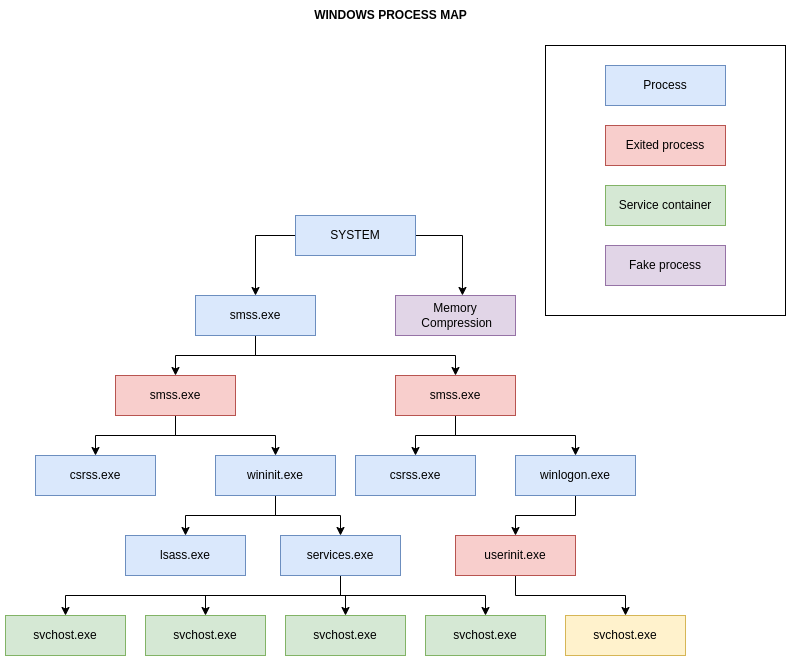
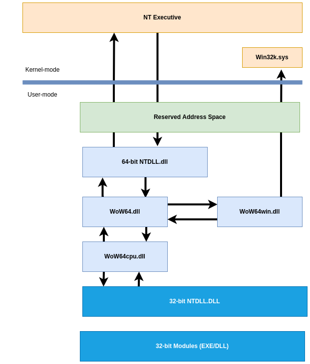
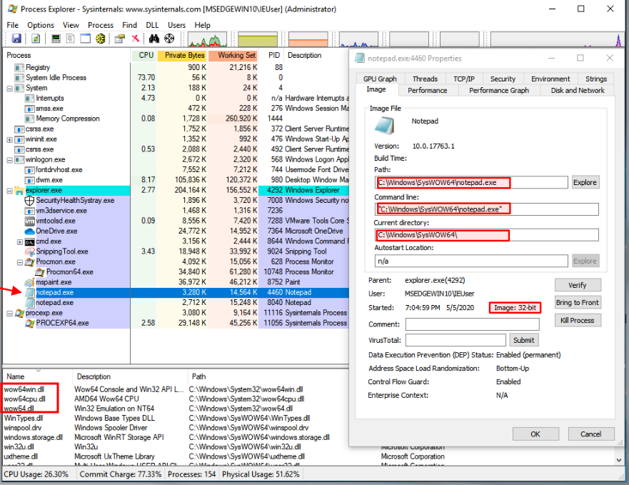
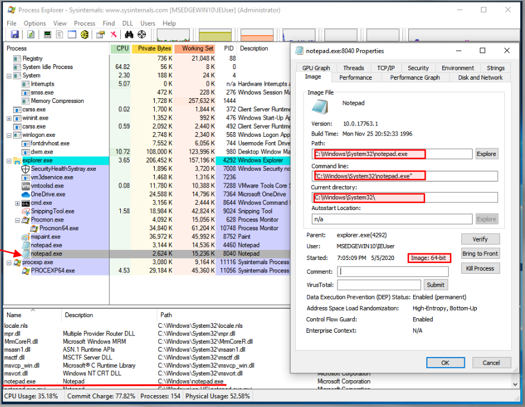
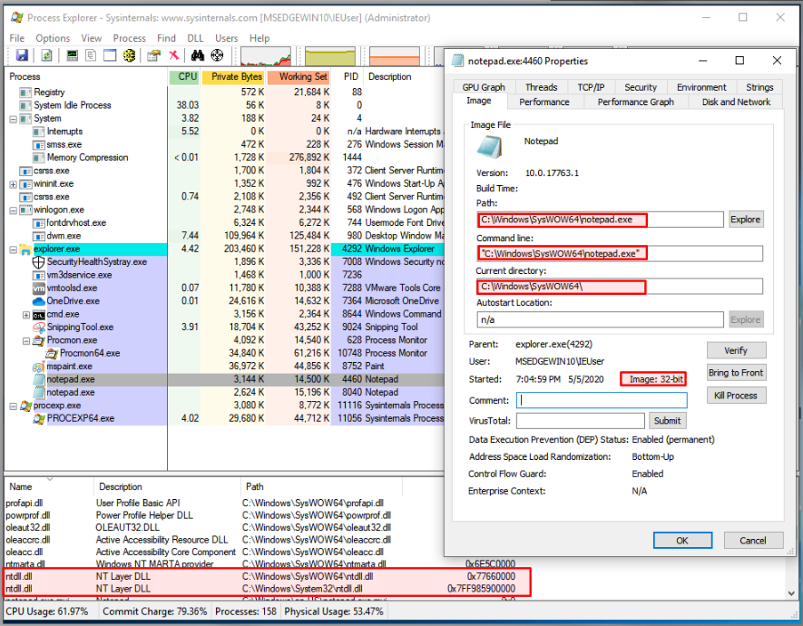
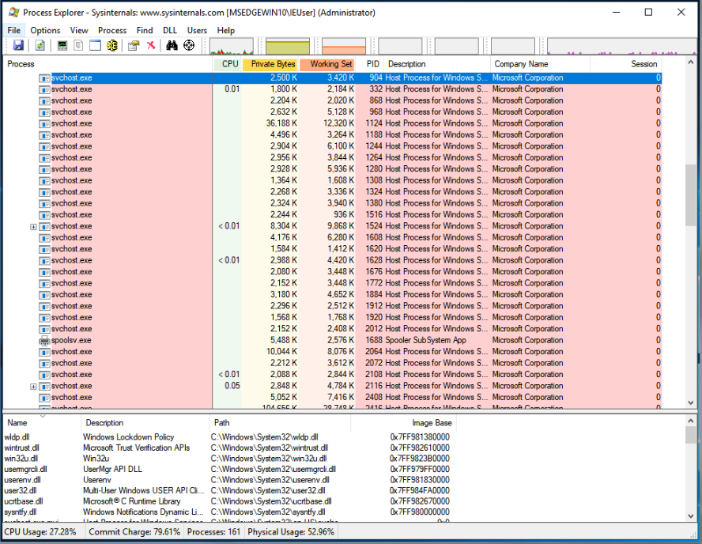

:orphan:
(run-32-bit-windows-based-applications-on-64-bit-windows-with-wow64)=

# Run 32-Bit Windows-Based Applications on 64-Bit Windows with WOW64

Windows WOW64 is a subsystem of the Windows operating system that allows 32-bit applications to run on 64-bit Windows systems. WOW64 is included with all 64-bit versions of Windows and is transparent to the user, meaning that 32-bit applications will run as if they were native 64-bit applications. WOW64 provides compatibility with existing 32-bit applications and drivers, and also allows for the development of new 64-bit applications that can take advantage of the increased performance and security of 64-bit Windows. In this article we explain how WOW64 works and why it matters in fields such as Malware Analysis.

## What is WoW64?

In the picture above we cover only main processes.

Windows `32-bit` on Windows `64-bit`, sometimes known as _WoW64_, is a component of the Windows operating system that allows `32-bit` applications to operate on Windows `64-bit`.

In other words, it is a technology that enables `32-bit` applications to operate on `64-bit` Windows without the application being aware that it is operating in an emulated environment.

**WoW64 Main Components and Layout**

As we saw in the previous layout figure, the WOW64 emulator runs in user mode. WoW64 is an interface between the `32-bit` version of `Ntdll.dll` and the kernel of the processor, and it intercepts kernel calls.

WOW64 emulator DLLs consists of:

- `Wow64.dll` is the basic emulation infrastructure and the entry-point routines for `Ntoskrnl.exe`.
- `Wow64Win.dll` provides entry-point function thunks for `Win32k.sys`.
- `Wow64Cpu.dll` (only for `x64`): enables the execution of `x86` programs on `x64`.

These DLLs, along with the `Ntdll.dll` (`64-bit` version), are the only `64-bit` binaries that can be loaded into a `32-bit` process.

There will be two sets of _Executables and DLLs_ on a Windows `64-bit` System:

1. `C:\Windows\System32` -> Native `64-bit`
2. `C:\Windows\SysWoW64` -> `32-bit` images

According to the preceding statement, native Windows `64-bit` executables and DLLs can be found in the `C:\Windows\System32` folder.

Consequently, `cmd.exe`, `notepad.exe`, and any other executables executing from this path are native `64-bit` images.

This is an example of Notepad (`32-bit`) running from `SysWOW64` directory:

Also see the `WoW64` subsystem files being loaded `wow63win dll`, `wow64cpu.dll`, and `wow64.dll`.

And this is Notepad (`64-bit`) running from `System32` directory:

So you might be asking: _Why all this redundancy in DLLs and EXEs?_

This is due to the fact that `32-bit` processes cannot load `64-bit` DLLs, and vice versa. Also, as you recall from earlier posts, the pointer sizes and address ranges are different, which implies that without this emulation, they cannot function! The sole exception is DLLs containing only resources.

Also, if you check the `32-bit` version, you will see that it has to load both the `32-bit` and `64-bit` version of `NTDLL.dll` because calls must be done using `64-bit` version, so the `32-bit` will pass them to the `64-bit`, which is part of
how these processes work on a `Windows 64-bit`:

Check the addresses used for each of the `NTDLL.dll` pictures on the preceding image. The `32-bit` version uses a `4-byte` address, but the `64-bit` uses an `8-byte` address (`8 bytes`).

> Note: The columns have been manually arranged to present the information you see. This is not how they are displayed by default.

**WoW64 File System Redirections**

`WOW64` hides the fact that there is a different directory for
`64-bit` and `32-bit` images by using a file system redirector. In most cases, whenever a `32-bit` application attempts to access `%windir%\System32`, `%windir%\lastgood\system32`, or `%windir%\regedit.exe`, the access is redirected to an architecture-specific path.

Below is a list of examples what happens when a `32-bit x86` Process makes a request:

- `%windir%\System32` (original) -> `%windir%\SysWOW64` - (redirected path for `32-bit x86` Processes)
- `%windir%\lastgood\system32` -> `%windir%\lastgood\SysWOW64`
- `%windir%\cmd.exe` -> `%windir%\SysWOW64\cmd.exe`

Note: Please check the _exceptions_!
File redirection exceptions could happen if:

1. Access to display `UAC` has special case
2. Directories in the list below are also exempt from
   redirection:

- `%windir%\system32\catroot`
- `%windir%\system32\drivers\etc`
- `%windir%\system32\catroot2`
- `%windir%\system32\logfiles`
- `%windir%\system32\driverstore`
- `%windir%\system32\spool`

But in Windows Server 2008, Windows Vista, Windows Server 2003 and Windows XP: `%windir%\system32\driverstore` is redirected.

Also please check the [Microsoft documentation](https://docs.microsoft.com/en-us/windows/win32/winprog64/file-system-redirector) for further details.

**WoW64 Registry Redirector**

Similar to the file system redirector, the registry also contains a redirector to isolate `32-bit` and `64-bit` applications by presenting distinct logical representations of specific registry sections.

- Registry calls are intercepted and mapped to their proper logical registry views and physical registry locations.

- The process of redirection is transparent to the application.

Redirected keys are mapped to physical locations under `Wow6432Node`.

For example, `HKEY_LOCAL_MACHINES\Software` is moved to `HKEY_LOCAL_MACHINE\Software\Wow6432Node`. However, the physical position of redirected keys should be considered reserved by the system, and applications should not directly access a key's physical location because it may change.

**Why are we discussing all of this?**
Well if you are monitoring a `32-bit` malware sample on a Windows `64-bit` system and then you see the files, libraries, and registry locations being accessed are all different than what you might expect, now you know why.

Below is a list of other core Windows System files to keep an eye out for:

- `Ntdll.dll` is a DLL with a specific purpose containing internal support routines and system-service dispatch stubs to executive functions. Through a process known as system service dispatching, `Ntdll.dll` transfers incoming API calls to their appropriate kernel services.

- `Kernel32.dll` is commonly mistaken as the Windows kernel but is actually a user-mode DLL that simply passes on requests for the kernel to `ntdll.dll`.

> Note: `Kernel32.dll`, `Advapi32.dll`, `User32.dll`, `Gdi32.dll` are core Windows subsystem DLLs

- `Ntoskrnl.exe` - Executive and kernel
- `Hal.dll` - HAL
- `Win32k.sys` - kernel-mode part of the windows subsystem (GUI)
- `Hvix64.exe` - Intel Hypervisor
- `Hvax64.exe` - AMD Hypervisor
- `.sys` files in `\systeRoot\System32\Drivers` core driver
  files, such as DirectX, VolumeManager, TCP\IP, TPM, and
  ACPI support.

**What is a System Service?**

You would be surprised if we say, _"It’s just a process"_!

A service is identical to a process, with the exception that it often runs in the background and the user may not interact with it directly! That is, this is a background process.

## Conclusion

Malware authors could make their malware run as a service, so it is also essential to comprehend how it operates and how it is often configured. This topic will be discussed in greater depth in a subsequent post about _"persistence mechanisms."_

Yes, all of them are Windows services operating in the background. There is no specific count for them, but they are numerous!

## References

[WoW64 Implementation Details](https://docs.microsoft.com/en-us/windows/win32/winprog64/wow64-implementation-details?redirectedfrom=MSDN)  
[Filesystem Redirector](https://docs.microsoft.com/en-us/windows/win32/winprog64/file-system-redirector)
[Registry Redirector](https://docs.microsoft.com/en-us/windows/win32/winprog64/registry-redirector)

> **Would you like to learn practical malware analysis techniques? Then register for our online course! [MRE - Certified Reverse Engineer](https://www.mosse-institute.com/certifications/mre-certified-reverse-engineer.html).**
