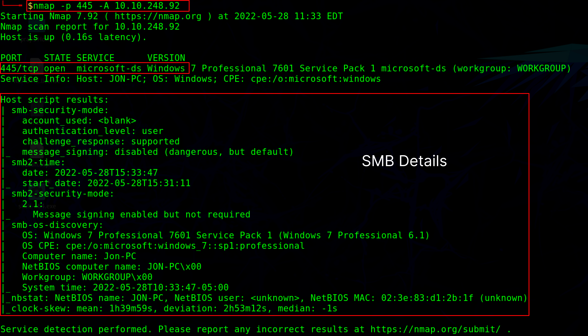
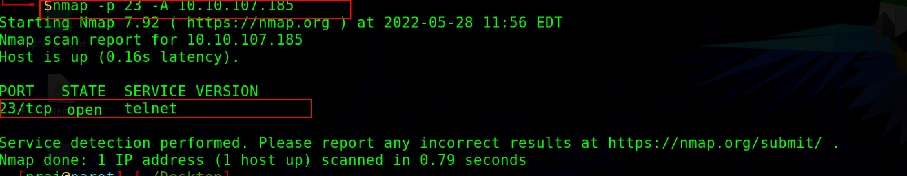
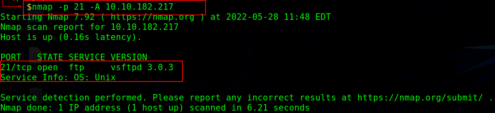

:orphan:
(scanning-smb-telnet-and-ftp-default-ports)=

# Scanning SMB, Telnet and FTP default ports

One way an attacker can obtain a better understanding of a network and its security posture is by scanning its file transfer services, this data can then be used to detect security vulnerabilities. Common protocols such as SMB (server message block), FTP (file transfer protocol), and telnet are commonly seen when performing penetration testing.

## SMB Enumeration :

The SMB protocol is a network file sharing protocol that allows computers to share access to files, directories, and printers. SMB operates directly on `TCP port 445` by default, or via the NetBIOS API on `UDP ports 137 and 138`, and `TCP ports 137 and 139`. SMB is an important component of the Windows operating system and is widely used in Windows-based networks. SMB is also compatible with Linux and other Unix-based operating systems.

SMB also enables application users to access, write, and modify files on the remote server. A network that is running this service is extremely vulnerable to SMB enumeration, which provides a great deal of information about the target.

In general, Attackers usually perform banner grabbing to gather information such as OS details and version and service running. Using this information attackers can perform attacks such as brute force attacks and SMB relay attacks. Attackers use tools like Nmap, enum4linux, and nulinux to perform SMB enumeration.

```
nmap -p 445 -A <target IP>
-p option specifies to scan the port 445
-A  option is used for OS detection, Version detection, and traceroute information.
```



The `STATE of PORT 445/tcp is OPEN`, indicating that `port 445` is open and the SMB service is active. An attacker can also obtain knowledge like OS information and Traceroute information using the same command.

## Telnet Enumeration:

Telnet is a network protocol that allows users to control computers or servers from a remote location. It has a simple text-based interface that makes it simple to use and understand. This protocol allows machines on LANs and the Internet to communicate with each other.

Port scanning is used by attackers to obtain information about open ports and services on the target server. If the Telnet port is discovered to be open, attackers can learn about the information being shared, including the target's hardware and software. Attackers can perform direct scanning for `Telnet port 23` using the Nmap tool.

```
nmap -p 23 -A <target domain>
-p option specifies to scan the port 23
```



The `STATE of PORT 23/tcp is OPEN`, indicating that port 23 is open and the telnet service is active.

## FTP enumeration :

The File Transfer Protocol (FTP) is a common network protocol that is used to transfer files from one host to another across a TCP-based network, and its default `port is 21`. FTP is used to send website files from the server to the local computer for editing, or publishing. FTP is also used to download files from the server to the local computer, such as downloading a software patch or upgrading the local copy.

FTP transfers data in plaintext between a sender and a receiver, exposing sensitive information like usernames and passwords to attackers. FTP does not provide a secure network environment or user authentication. Attackers can use this information to launch various attacks such as FTP bounce, FTP brute force, and packet sniffing by scanning and enumerating open `port 21` running FTP services.

```
nmap -p 21 -A <target domain>
-p option specifies to scan the port 21
```



The `STATE of PORT 21/TCP is OPEN`, indicating that `port 23` is open and the FTP service is active.

## Final words:

Common sharing services or other abandoned services may allow attackers to breach a network's security. There are many tools and techniques like Metasploit, enum4linux, rustscan, and many more which can be used to enumerate the most common protocols.

:::{seealso}
Looking to expand your knowledge of penetration testing? Check out our online course, [MPT - Certified Penetration Tester](https://www.mosse-institute.com/certifications/mpt-certified-penetration-tester.html)
::: In this course, you'll learn about the different aspects of penetration testing and how to put them into practice.**
