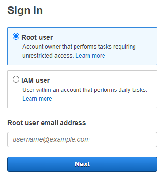
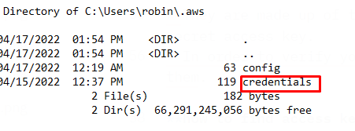
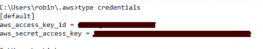
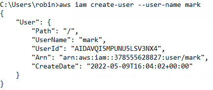
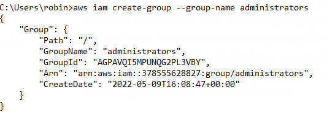
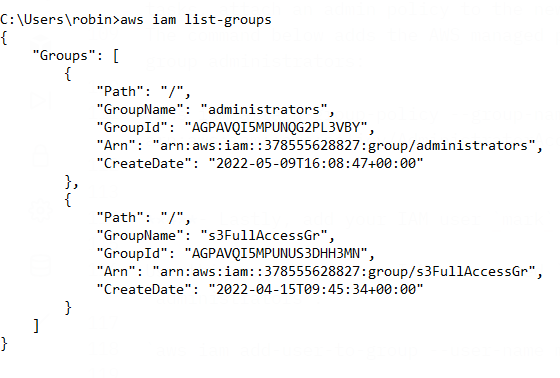
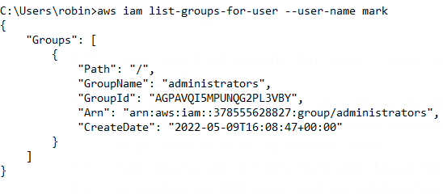
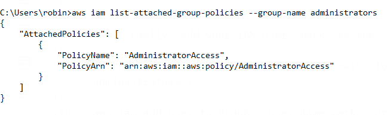

:orphan:
(secure-your-aws-root-account-with-5-best-practices)=

# Secure Your AWS Root Account with 5 Best Practices

Your AWS root account is the most important account in your AWS environment, and it’s critical that you take steps to secure it. This article proposes five best practices to follow.

## Introduction

You created an AWS account successfully and you’re ready to test a Lambda function for your app because it‘s free tier eligible. You type in _AWS management console_ to google search and see there are two options for signing in:

- root user
- IAM user

You type in your email and password, and now you’re logged in to the AWS console.

What happens from this point is that your actions can not be undone or restricted because you are _root_. This may scare you because, in the case of any security exploitation, an attacker will have access to your whole system since you are signed in as root. You want to minimize risks and take extra measures to secure your account.

Let’s keep your account safe.

## Best practices for protecting your AWS root user account

### Step 1 - Configure IAM

**What is IAM?**

AWS Identity and Access Management is a web-based service that enables you to control and protect access to AWS services in a secure way.

**Create an administrator IAM user**

Use your root account only to create an IAM user with administrative privileges for yourself.

**Create additional IAM users for different tasks**

Use the newly created IAM user to add other users for different tasks.

### Step 2 - Enable MFA (Multi-factor authentication)

Enable two-factor authentication for all of your users. To use your account with MFA, you must submit a password, code and access key. Adding an additional step of authentication improves the security of your account.

## Step 3 - Manage your access keys securely

**What is AWS security credentials?**

When you connect with AWS, you must provide your AWS security credentials in order for AWS to authenticate:

- who you are
- and whether you have authorization to access the resources you are seeking.

AWS authenticates and authorizes your requests using the security credentials.

For example, when you want to access a running EC2 instance, your credentials must permit it. AWS refuses your request if your credentials aren't authorizes to perform a specific action.

**What are access keys?**

- They are made up of two units: an access key number and a secret access key.
- In order to verify your requests., you need to use both of them.

**How to find access keys stored on windows?**

AWS access keys credentials are stored in `.aws` folder in this path:

`C:\Users\your-user-name\.aws`

**Access key best practices**

- As a general rule of thumb, never include access keys in publicly available code (for example, a public Git repository). If you share your code on GitHub, you can use git-secrets.
  Git-secrets, look for AWS credentials as well as other critical information, assisting you in avoiding committing sensitive code or documents.

- The secret access key can only be obtained when it is created. If you forget, you must create it again. So, keep your access key credentials in a safe place.

- If you already have root access keys, don’t use them. The root user access key permissions tied to your AWS account cannot be reduced. So the best security practice is to delete them.

- If haven’t created access key credentials for the root user of your AWS account, don't generate them except it is definitely necessary.

- Protect your access keys with the same care that you do your login details.

- Root user access keys provide you with complete control over your AWS account. If you require access keys for a long time, create a new IAM user with limited capabilities and produce access keys for that person instead.

- If you must have an access key on hand, change it on a regular basis. You can only have two access keys. This allows you to rotate the active keys in accordance with industry best practices.

### Step 4 - Adhere to a strict password policy

- Your password is set when you create your account, and you may change it at any time by visiting the _Security Credentials_ page.
- Although an account password policy for IAM users can be defined, it does not apply to the root user.
  AWS requires the following requirements for your password:
  - It must have at least eight characters. The maximum limit is 128 characters.
  - It must include at least 3 of the following characters:
    - uppercase,
    - lowercase
    - numbers
    - special characters
  - Choose a strong, difficult-to-guess password.

## Step 5 - Minimize the actions you perform as a root user.

Even if you're the only person who has access to your account, utilize IAM users for day-to-day access.

Sign-in as a root only in these two circumstances:

- Creating your first IAM user and group
- Executing activities that only the root user may accomplish.

## Creating your first IAM user with CLI

**Step 1- Create an IAM user, using the AWS CLI.**

The `create-user` command below adds an IAM user called _mark_ to the account in use:

`aws iam create-user --user-name mark`

_Output_:

**Step 2 - Instead of attaching admin policies directly to the IAM user, create a group and attach them to the group.**

The following command establishes an IAM group called _administrators_:

`aws iam create-group --group-name administrators`

_Output_:

**Step 3 - Since you don’t want to use AWS root, especially for administrative tasks, attach an admin policy to the newly created _administrators_ group.**

The command below adds the AWS managed policy _AdministratorAccess_ to the IAM group administrators:

`aws iam attach-group-policy --group-name administrators --policy-arn arn:aws:iam::aws:policy/AdministratorAccess`

**Step 4 - Lastly, add your IAM user _mark_ to the _administrators_ group.**

Use this code to add an IAM user named _mark_ to the IAM group called _administrators_:

`aws iam add-user-to-group --user-name mark --group-name administrators`

- list groups with `aws iam list-groups` command to see attached policies

  

- verify your IAM user belongs to the _administrators_ group.

The list-groups-for-user command reveals the groups to which the IAM user mark belongs:

`aws iam list-groups-for-user --user-name mark`

## Summary

AWS provides a variety of options to help you safeguard your account. Unfortunately, as most of these measures are not activated by default, you must take action to enable them.
Today, we took the very first step to secure our root account via AWS CLI.

1- We created an IAM user and an administrator group.

2- Attached _AdministratorAccess_ policy to our group

3- Added our IAM user to this group in _AWS CLI_

Also we discussed 5 important practices to protect your AWS root account:

- Give your IAM users least privilege.
- Restrict your root actions to a minimum.
- Enable MFA for all users.
- Control your passwords and access keys.
- Create an IAM user for administrative

As an effective root user, now you can protect your account and know where to start!

:::{seealso}
Want to learn practical Cloud Security skills? Enroll in [MCSE - Certified Cloud Security Engineer](https://www.mosse-institute.com/certifications/mcse-certified-cloud-security-engineer.html)
:::
