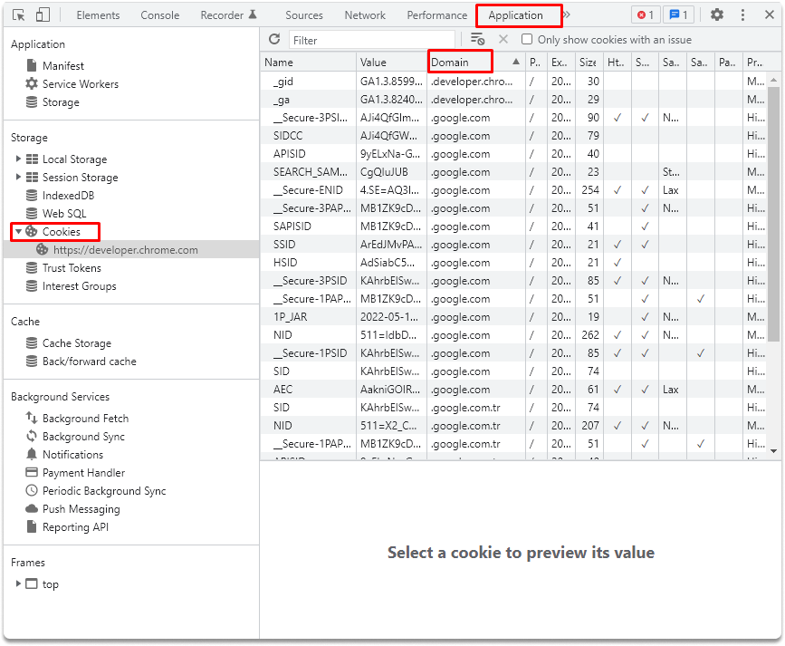

:orphan:
(securing-application-cookies)=

# Securing Application Cookies

Sensitive data storage and safety in online applications is a major vulnerability. Attackers employ a variety of techniques to get illegal access to the data stored in your system (which is also referred to as "client-side") and processed by apps. In this blog post, we are going to explain what a cookie is, design vulnerabilities, and possible methods of preventing cookie attacks.

## What is a cookie?

When you browse a site, the server sends a small piece of data. This data is downloaded and locally stored by your browser. You retrieve this information each time you visit a web application.

Cookies can contain details, for example; your sessions, preferences, usernames, and passwords.
Web sites are relieved of the burden of storing and maintaining details related to your sessions and your user preferences.
There are three categories of cookies:

- session cookies,
- permanent cookies,
- and tracking cookies.

**Session Cookies**

Web applications use these cookies to save information. When your session expires, these cookies are removed. When you restart your session, your web browser may employ session restoring. As a result, they may last indefinitely.
They contain authentication-specific data related to your sessions, such as browser display choices and, in certain situations, session IDs or user credentials.

**Persistent Cookies**

Persistent cookies store nonsensitive information about your connection. The application specifies a waiting period for these cookies, and your Web browser keeps them until the waiting time value expires.
Persistent cookies let Web applications keep information about your connection. They contain unclassified data such as your user preferences on that website. When you shut down the web application, these cookies won’t be deleted. Instead, the application sets a timeout value for your persistent cookies. Your web browser downloads and keeps this information until the timeout value expires.

**Tracking Cookies**

When you browse a site, the web application may download tracking cookies (which are also known as "third-party cookies") in the background. Web apps use third-party cookies to track your behaviors, types, and contents of the sites you visit.

## Cookie Vulnerabilities

Applications use cookies as a storage medium. Data processing in software creates various vulnerabilities. However small and seamless they may be, cookies pose a significant security risk and are the target of several sorts of attacks. Here are some cookie vulnerabilities and ways of avoiding exploitation.

**Cookie hijacking**

Attackers generally target session cookies since they carry sensitive information. They can sniff network traffic to collect cookies. If they are able to compromise the physical device, they can get access to cookies saved on the local hard drive. Here are some actions a cookie attacker could achieve with cookie hijacking:

- He or she can start a new session.
- Evade website authentication.
- Take control of your account without your awareness.

**Cookie prefix-abuse**

Your browser may store unauthorized cookies and deliver them to all pages under the parent domain. A server cannot guarantee that a cookie was set from a safe origin or even know where a cookie was first placed. An attacker can take advantage of this design flaw and set a cookie with the Domain property. He or she can also grant access to that cookie on all other subdomains. If there is a susceptible application on a sub-domain, an attacker may be able to defeat Cross-Site Request Forgery (CSRF) protection or hijack your session. You can also be subject to an active MITM attack.

**Cookie Leaking**

When your sensitive information is stolen by cookie hijacking, unauthorized users can gain access to it. Cookie leakage happens when sensitive information like user names, passwords, and account numbers is saved in cookies and subsequently acquired by unauthorized users. Session cookies, which record surfing behavior, may also be deemed sensitive in some instances. Unauthorized users who get access to this information through cookies may use this knowledge to launch further attacks. They can start a new attack with your user credentials and account data.

## How to Prevent Cookie Attacks

- While developing your software, allow the secure-bit option on cookies. This will prevent the program from sending cookies across unprotected protocols like HTTP.

- Start SSL sessions on proper sites to secure your cookies on the network.

- Design your applications in a way that their cookies won’t hold confidential information. Encrypt the values if it is absolutely required.

- Disable third-party cookies. Any cookie which doesn’t originate from your parent domain scans freshly produced cookies on your system and generate tailored popups based on keywords.

:::{seealso}
Want to learn practical Secure Software Development skills? Enrol in MCSI’s [MASE - Certified Application Security Engineer](https://www.mosse-institute.com/certifications/mase-certified-application-security-engineer.html)
:::
