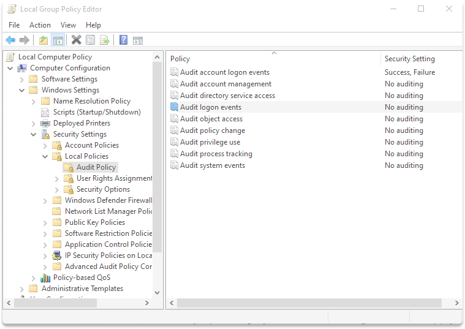
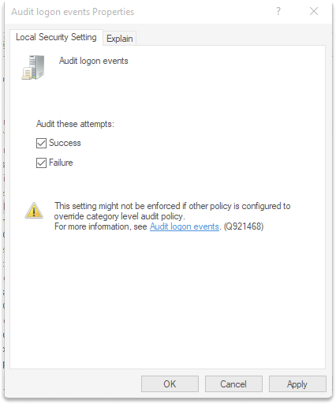
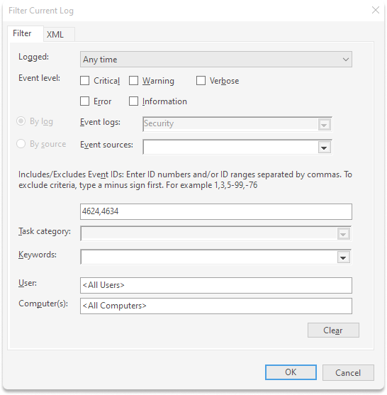
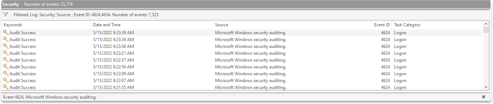
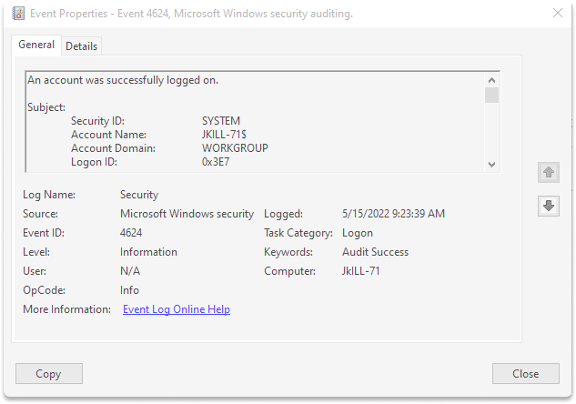

:orphan:
(securing-windows-an-introduction-to-windows-group-policy)=
# Securing Windows: An Introduction to Windows Group Policy

Many operating system default designs do not supply an optimal degree of security since precedence is given to those who want information access. As a result, it is critical to adjust OS environments to solidify the system for access management. Microsoft supplies a simple way to design and implement Group Policy to groups of computers. With this method, you can strengthen the operating systems and make them less vulnerable to assault.

In this blog, we are going to make an introduction to

- Windows Group Policies,
- What are a group policy objects (GPOs),
- and your options for securing the operating system in domain-joined and home environments.

In the last section, we are going to make a simple exercise to audit logon and logoff events with the local group policy editor (`gpedit.msc`) and analyze these events in the event viewer.

## Windows Group Policies

It enables a broad range of sophisticated settings that sysadmins may employ to manage the workplace environment of Active Directory users and accounts.

If used efficiently, Group Policies help you strengthen the security of user devices and protect them against both insider risks and external attacks.

The more policies you apply, the more network traffic there will be, which means that the logging-in process will take more time.

In Windows, Group Policy enables you to configure protection settings and set up particular applications on a group of devices. To learn about group policies, taking a look at a group policy object will be helpful.

## What are group policy objects(GPO)?

- A GPO is a set of configurations produced with the Microsoft Management Console (MMC). If you are a Windows home user, you can configure the policy in your Group Policy Editor.
- You can link a GPO to specific or numerous Active Directory (which are called units, sites, domains, or organizational units). You can utilize the MMC to establish GPOs that specify registry-based rules, security choices, setup, and other features.
- Group Policies are preserved as Group Policy Objects in Active Directory (AD). These items deliver the set of commands for the job that is conducted.

Group policy is executed in these four methods:

**1) LGP (Local Group Policy):** A system is not joined to a domain by default. You need to configure a domain and join this domain. To use LGP, you need to set up the Group Policy on the Policy of the Local Group. Setting up Group Policy on the local machine When you change a setting, it is automatically updated. You don’t need to execute a command to enforce the update. This method doesn’t scale well if you are administering the whole system.

Drawback: This is ineffective for controlling devices on a network.

**2) Site Group Policies may increase network traffic, so only use them when necessary.**

First of all, you need to configure Active Directory, which will push out all the policies to your system. The GPO will be enforced on all devices and users joined to the domain. You can benefit from a domain group policy if you want to enforce actions encompassing all of the company.

**3) Organizational Unit Group Policy (OU):** You can use OU Group Policy to apply a GPO to a group of users or machines within an organization.

## Summary

Windows Group Policy is an effective management tool for home users, IT professionals and system administrators to manage and control the configuration of Windows systems in organizations.

If you're a system admin, you can utilize Group Policies to govern and adjust user configurations, manage user data, and execute remotely setup and maintenance programs.
Hovewer if not applied properly, some GPOs may harm network speed and login times related to the amount and complexity.

## Exercise: Secure your windows home environment

In this simple exercise, we are going to audit logon events on our local computer with a local group policy editor.

Here are two event id's that we are going to audit:

`4624`:This event is generated, When a login session is established.

`4634`: This event indicates that the login session has ended and no longer exists.

**Step 1**: Press `windows`+`r` and type `gpedit.msc`.

As an alternative, go to the Windows search bar and type `edit group policy.
This is where all the settings of your local device are kept under different sections (computer and user configurations).

**Step 2**: Under _Computer Configuration_, click on _Windows Settings_, and go with _Security Settings_. Lastly, span _Local Policies and Audit Policies_.

On the right section click on audit logon events policy.

**Step 3** : Check both success and failure boxes, Click on _Apply_ and _Ok_.

**Step 4** : Reboot your machine.

**Step 5** : Press on`windows`+`r` and type `eventvwr.msc`.

**Step 6** : Expand _Windows Logs and go to Security_.

**Step 7** : On the left panel, click on _filter current log_.

**Step 8** : Delete all evet id placeholder and type `4624`,`4634`.

Click _Ok_.

**Step 9** : You can audit logon by clicking on one of the events.

> **Are you interested in Windows Security? Check out our course [MNSE - Network Security Essentials](https://www.mosse-institute.com/certifications/mnse-network-security-essentials.html)!**
