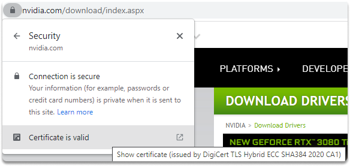
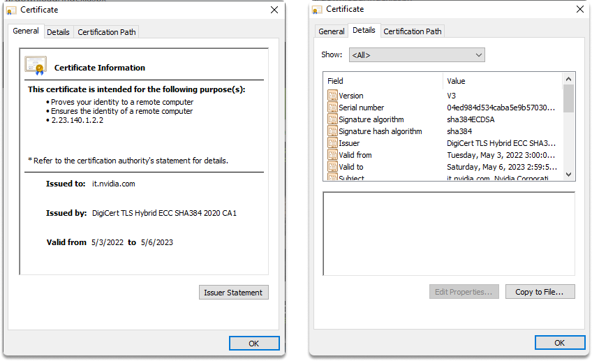

:orphan:
(server-client-communication-security-digital-certificates)=

# Server-Client Communication Security: Digital Certificates

In this blog, we will take a quick look at PKI, and examine how digital certificates assist in the security of interactions between a server and an end-user, the components of a digital certificate, and the function of certificate authorities.

## A basic introduction to public key infrastructure (PKI)

Cryptographic methods and digital certificates are used to build a Public Key Infrastructure (PKI) for identity validation via a trusted third party called certification authority.

Certificate Authorities create public key infrastructure (PKI) in order to successfully manage public-key cryptography procedures. It enables users to transact securely using public-key cryptography.

Public-key encryption allows secure communication between previously unknown parties. The public key infrastructure (PKI) hierarchy of trust connections enables this.

## What is a digital certificate?

Digital certificates are simply digitally signed copies of a user's (or system's) public key, certified by a trustworthy third party.

Users know that a public key is valid when they check that it was signed by a trustworthy certificate authority (CA).

_Below is an image of checking if a web application's digital certificate is valid_

## Certificate Authorities (CA)

The trustworthy organization that signs the certificate is referred to as the _issuer_. Certificate authorities are trusted third parties that provide digital certificates.

If users believe that a certain CA issues certificates without adequately confirming a user's identity, that CA will soon lose credibility and its certificates will become useless.

## Certificate creation

- Once you've satisfied the certificate authority about your identity, you give them your public key.
- Then, the authority generates a digital certificate with its private key.
- The certificate authority digitally signs the certificate and provides you with a copy.

You may then safely give this certificate to anybody with whom you want to securely interact.

Here are the details included in an X.509 compliant certificate:

- version of X.509
- serial number
- the algorithm that was utilized to produce the signature
- distinguished name of the owner
- period of validity
- subject public key
- name of the certificate authority
- validity duration

There are several other possible attributes and claims that can be present in a certificate, but these are probably the most important.

_Below is a web application's digital certificate._

## How you can verify a digital signature?

When you obtain a digital certificate from someone you wish to communicate with, you verify it by confirming the CA's digital signature with the CA's public key.

As a next step, you must guarantee that the certificate was not released on a certificate revocation list. Then, you can infer that the public key is genuine if it meets some qualities such as;

- the certificate authority is reliant
- CA has a genuine digital signature,
- the certificate is not on the revoked list and it contains reliable information.

Because digital certificate verification methods are incorporated into many common online browsers and email programs, you won't need to become engaged in the details of the process very often.

However, in order to make proper security decisions for your business, you must have a good awareness of the technological aspects taking place behind the scenes.
It's also why, when purchasing a certificate, you should go with a well-known CA.
If a CA is not included in, or is later removed from, a major browser's list of trusted CAs, the utility of your certificate will be severely limited.

## Conclusion

Digital certificates provide communicative groups confidence that the people they are interacting with are who they say they are. Cryptographic systems also guarantee integrity and non-repudiation.

Digital certificates enable companies to safely exchange their public key with people with whom they do not have a pre-existing connection.

:::{seealso}
Do you want to get practical skills to work in cybersecurity or advance your career? Enrol in [MCSI Bootcamps](https://www.mosse-institute.com/bootcamps.html)
:::
