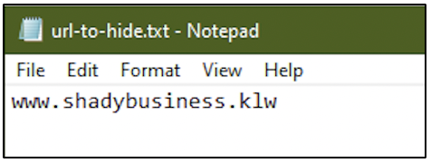

:orphan:
(significance-of-windows-alternate-data-streams-in-dfir)=

# Significance of Windows Alternate Data Streams in DFIR

The best place to hide something is to hide it in plain sight – is a belief that crooks live by. Windows operating systems have a feature called _Alternate Data Streams_, abbreviated as ADS. The intention behind developing this feature was for technical advancements, but it has been misused to hide things in plain sight. This blog post gives you insight into Windows Alternate Data Streams – what is it, why was it introduced in the first place, how it has been misused and how it impacts DFIR.

## What are Alternate Data Streams?

Let’s start with a quick demo. There are two files _triangles.docx_ and _pic-to-hide.png_ within _Documents\streams_ folder. The goal is to hide the contents of the PNG file within the DOCX file.

From the following screenshot, we can see that the size of the DOCX file is around 17 KB and the size on disk is around 20 KB. What do these two sizes represent?

Consider a bucket. Assume you are placing a book inside the bucket. The physical dimensions of the book would be smaller than that of the bucket. The value ‘Size’ (in the following screenshot) can be likened to the size of the book (the file, in this case). The value ‘Size on disk’ can be likened to the size of the bucket (storage region within the hard disk for the file. On disks formatted as NTFS, buckets of specific size are used to store files. Detailed description of those buckets is beyond the scope of this blog post.)

There is one suspicious URL within the TXT file.

The goal is to hide the TXT file within the DOCX file. This can be achieved using the _type_ command as shown in the following screenshot. The syntax is

`type file-to-hide > file-to-hide-within:hidden-stream-name`

Once this command executes successfully, we have successfully created an Alternate Data Stream for the TXT file within the DOCX file. Even when you open the DOCX file, you will not see the contents of the TXT file. In this case, the size of the file and its size on disk remains the same, as seen in the following screenshot.

But how can we view this secret content? Since we know the name of the DOCX file and the name of the ADS within it, we can view the contents in _Notepad_. The command used is shown in the following screenshot.

We can view the suspicious URL. In the following screenshot, note the file name in the title bar.

Let’s try another one. From the following screenshot, we can see that we have _script.docx_ and _hexeditor.exe_ within _E:\Source_

The goal is to hide the EXE within the DOCX file. The following screenshot shows the current size of the DOCX file and the size assigned to it on disk (size of the bucket assigned to store this file on the hard disk.)

The following command creates an ADS called _hexeditor.exe_ within the DOCX file.

Now take a look at the file sizes. It appears that the size on disk of the DOCX file has significantly increased. Just by looking at the _Size_ and _Size on disk_ values, we can see that it is rather odd.

When the DOCX file is opened, there is no indication of an EXE within it. Now is it possible to open the Hex Editor application within the ADS of the DOCX file? Of course! Take a look at the command in the following screenshot. A process can be created using the name of the alternate data stream.

Once the command executes successfully, the hex editor application opens.

## How to detect if a file has Alternate Data Streams?

Within a directory, simply run _dir /r_ command. From the following screenshot, you can see that there are 2 files within this directory, but there are three filenames. One of the names has _:$DATA_ attached to it.

Every file in NTFS is made up of attributes. You can read more about this _[NTFS](windows-ntfs-file-attributes-for-digital-forensics)_. A file always has only one $DATA attribute. This is not represented in the directory listing. When an ADS is created for a file, data belonging to the secret file is stored as another $DATA attribute for the file. The second $DATA attribute, i.e. the ADS is represented in the following listing. It’s safe to say that, when a file has more than one $DATA attribute, then it has an ADS within it.

Now, take a look at the following screenshot. It represents the contents _E:\Source_. Within the highlighted portion, you can see the name of the DOCX file, followed by the ADS that we created (hiding the hex editor application). There is one more ADS, called Zone Identifier! More on this in a bit.

## Why did Microsoft create Alternate Data Streams?

Microsoft created ADS for interoperability with the file system used on Apple computers. This means files created on Windows computers can be used on Apple computers.

It has other legitimate uses too. In some cases, when a file is downloaded from the internet, the file will have an ADS called _Zone Identifier_ which has information about the URL the file was downloaded from. In the screenshot shown above, the hex editor application was downloaded from the internet, it already had an ADS. When we created an ADS within the DOCX file for the EXE, the existing ADS of the EXE was also added to the DOCX file.

Take a look at the following screenshot. This is a listing of three executables from the Downloads folder. Executables for _DB Browser for SQLite_ and _OBS Studio_ have an associated _Zone Identifier_ as an ADS. But the executable for _Python_ does not have it.

There are other legitimate uses too of ADS.

## Significance of ADS in DFIR

Clearly, a legitimate feature can be misused by cyber adversaries to store secret data or store executables secretly.

Here’s what a DFIR professional can do:

- Be aware of ADS and how they exist
- When using various forensic tools, if you become aware that a file has two $DATA attributes, that should ring some alarm bells. Dig into the contents of the ADS
- When you have a suspect disk, you can use the _dir_ command or _lads.exe_ tool to identify the existence of files with alternate data streams.

Here’s a quick project idea for you:

- Create an ADS for a text file by storing a PNG file within it
- Use _dir_ or _lads.exe_ to identify that the text file has an ADS
- Attempt to view the ADS contents of the text file. You can view images using MS Paint

:::{seealso}
Want to learn practical Digital Forensics and Incident Response skills? Enrol in [MDFIR - Certified DFIR Specialist](https://www.mosse-institute.com/certifications/mdfir-certified-dfir-specialist.html)
:::
