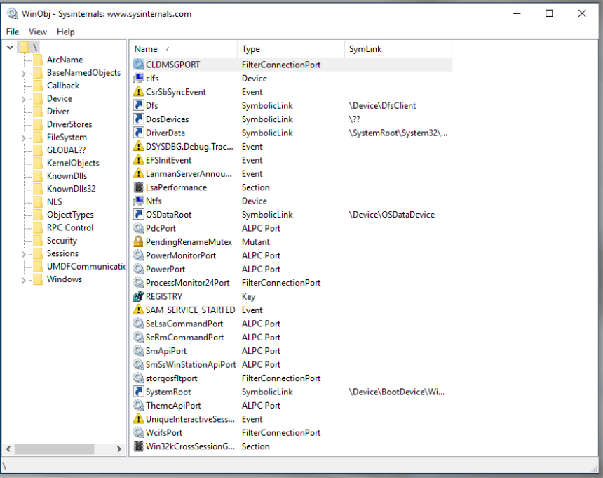

:orphan:
(the-most-comprehensive-suite-of-tools-for-microsoft-windows)=

# The Most Comprehensive Suite of Tools for Microsoft Windows

Sysinternals is a suite of free products that was founded by Bryce Cogswell and Mark Russinovich in 1996 and later acquired by Microsoft. These tools are continually updated. These programs are useful not just for managing, diagnosing, troubleshooting, and monitoring a Microsoft Windows environment, but also for Malware Analysts and Threat Hunters.

We will be using Sysinternals extensively throughout Windows Internals, Malware Analysis and Vulnerability Research articles; consequently, we recommend reading Mark Russinovich's blog entries for more information and examples of how they assisted with trojans, ransomware, and even APTs.

Another useful resource is the book _"Troubleshooting with the Windows Sysinternals Tools"_, which details the in-depth use of the tools:

## Process Explorer

Is a sophisticated task manager that can be utilized to learn more about active processes. Process explorer can also be used to monitor which DLLs and handles are opened by a process. It could be used for system troubleshooting, memory leak detection, and investigations.

In the main window, the processes are displayed in a tree format, and on the right, the CPU and memory used by each process, as well as the process ID, are displayed:

Process Handles:

DLLs loaded by a Process:

## WinObj

It is also essential to comprehend the various kernel objects provided by the Microsoft Windows operating system. These could be viewed using the [WinObj](https://docs.microsoft.com/en-us/sysinternals/downloads/winobj) tool from Sysinternals.
WinObj is a `32-bit` Windows NT application that utilizes the native Windows NT API (provided by NTDLL.DLL) to access and display information from the NT Object Manager's name space:

## ListDLLs

Libraries (DLLs) have a fundamental role in Windows and any other operating system, as they provide programs with the features and capabilities they need to operate and perform their programmed tasks.

As we will see later in our blog, DLLs could be used in process injection techniques, which are frequently employed by adversaries to evade detection with malware.
[ListDLLs.exe](https://docs.microsoft.com/en-us/sysinternals/downloads/listdlls), also from Sysinternals, is an alternative to Process Explorer for displaying which DLLs are loaded into a process:

## Handle

As previously explained, handles are references to kernel-space objects that are accessible to a process. Process Explorer can list the handles of a process, but there is another Sysinternals tool called ["handle"](https://docs.microsoft.com/en-us/sysinternals/downloads/handle) that can do the same thing:

### Process Monitor aka Procmon

Before we conclude this section, there is one more tool you should always have in your arsenal. Yes, it is also a Sysinternals product. [Procmon](https://docs.microsoft.com/en-us/sysinternals/downloads/procmon) is an advanced process monitoring tool that can display in real-time the activity of a process or thread behind the scenes. In other words, it will display all activities and events occurring while the process or thread is active.

Quoted from Mark Russinovich’s mention in his book:
_"The majority of the 'Case Of' troubleshooting stories I receive from users can be summarized as, 'We had a mysterious problem; we ran Procmon; we found the cause of the problem.'"_

Procexp indicates that a process has an open handle to a specific file, whereas Procmon displays the low-level operations that were performed by the process on that file, including when they occurred, how long they lasted, whether they were successful or not, and the call stack (the code trail leading up to the operation).

Each row corresponds to a one low-level event that has occurred on the system. Each row includes the following:

- **Time** - The time when the event occurred Process
- **Name** with an icon for the process’ executable file
- **PID**
- **Operation** - With an icon representing the event's nature. Examples of operation paths include a file-system path beginning with a drive letter or UNC path, a registry path beginning with the hive name, and the source and destination of network addresses and ports. Events typically associated with malware include the creation of a registry key, the deletion of a file, and the modification of a file's attribute.
- **Path of Operation** - If applicable, the path of the object on which the operation is applied
- **Results** - The operation result may by `SUCCESS`, `KEY DELETED`, `ACCESS DENIED`, `END OF FILE`, `PATH NOT FOUND`, and `BUFFER OVERFLOW`.
- **Details** additional information about each operation, including: fileOpen (information such as the type of file being opened and its sharing mode)

The `BUFFER OVERFLOW` operation result in Procmon indicates that the client application requested data but did not have a bucket large enough to hold all of the data. Therefore, the server is responding to inform the client that a larger bucket is required. _There is no exploitation here._

Right click on any row and select Properties (or hit Ctrl + K) to show the Event Properties window. The event properties window has three tabs:

1. **Event tab** - This tab displays additional information regarding each event, including Date and time, Thread ID, event class, operation, operation result, path, and duration. In the depicted diagram, the ReadFile event on a.dll file in the System32 folder produced the result SUCCESS. There are additional event details below the line.
   These particulars are unique to this event and will vary for future events (please keep that in mind):
   

2. **Process** - This tab shows information about the process of the chosen event at the time when the event occurred:
   

3. **Stack** - displays the thread's stack at the time the event was recorded. The stack can be utilized to determine the cause of an event and the component responsible for it:
     
   Kernel-mode frames of a stack are designated with the letter `K` on the left of the frame and user-mode stacks (not all systems) with the letter `U`. If Process Monitor is able to locate symbols for images referenced in the trace, it will attempt to resolve addresses to the functions in which they reside:
   

To locate an event based on a text value within that event, choose Find from the _Edit_ menu (`Ctrl + F`). Procmon permits exact and partial matches to any value you specify; examples of partial matches include _"begins with"_, _"ends with"_, _"contains"_, _"less than"_ or _"greater than."_

To jump to a file location or registry, select the file or registry event and then choose Jump To (`Ctrl + J`) from the Event menu.

Since Procmon displays a vast amount of data, filtering is a crucial operation for identifying events of interest. There are numerous ways to apply filtering, including:

1. Process Name
2. Operation
3. Result
4. Detail
5. Path
6. Others

Process Monitor includes _five major profiling types_ (five buttons in the red rectangle) that can be used to include or exclude specific events. The occasions are:

1. **Registry Activity**: Includes activities performed on the registry, such as the creation, enumeration, querying, and deletion of keys and values (`RegCreateKey`, `RegEnumKey`, `RegSetValue`, `ReDeleteValue`, `RegQueryValue`, `RegCloseKey`, `RegOpenKey`).

2. **File System Activity**: Includes operations on local and remote file systems and devices, such as opening a file, closing a file, enumerating a directory, writing to a file, and querying a file system, regarding the file size, timestamps, etc., of a file or directory.

3. **Network activity**: Includes source and destination addresses for all UDP and TCP network activity. ProcMon can be configured to resolve network names from network addresses, or to only display IP addresses. Select `Show Resolved Network Addresses` from the `Option` menu to display resolved network names.

4. **Process and Thread Activity**: Includes events such as a process being created, started, or destroyed; a thread being created or destroyed; a program loading a DLL; and executable images and data files being loaded into the address space of a process.

5. **Profiling Events**: Generates logs for each process and thread's event on the system, such as the amount of processor time and memory storage usage.

For example, if we are looking for specific activity changes,
then we can exclude all other activities that are not of
interest:

Here we can see that the focus is only on registry activity and that’s why we can only see events related to Windows registry.

You can also use the Include Process From Window option, which allows you to filter the display based on the process ID associated with a selected window or many other properties, as depicted in the figure to the right:

We can use the Jump To option to quickly navigate to a particular location. As shown in the figure, this can be used to navigate directly to the location being accessed by the registry:

As you can see, we were able to jump a specific location in the registry. This is very useful when you also want to validate or check what info has been added, removed, updated, etc.

We can also save captured event results for later use. You can save the results in three different formats, including `PML` (standard procmon format), `CSV`, and `XML`, in case you want to return to analyze them later:

Three formats are used for Procmon traces:

- `PML`: is the native file format for Procmon. This format preserves all captured data, including information about modules and stacks.

- `CSV`: facilitates data importation into Excel, TimeLine Explorer, or any other data analysis application. You can also compare two trace files using text-file comparison applications such as WinDiff, WinMerge, etc.

- `XML`: allows the trace file to be processes by tools that can parse XML.

## What Procmon Operation filters are useful for malware analysis?

While there is no definitive answer, as each circumstance is unique, the following filters are useful over time:

- _Send and Receive for both TCP and UDP_: will capture any connection attempts made by malware while it is running. • - - _Load Image_: loading DLLs and Executables that the malware uses attempts to load.

- _Create File_: will capture all attempts made by malware to create files. Please note that not all CreateFile attempts result in the creation of actual files or directories! This operation can be used to read, write, move, and delete files.

- _Registry activities_: malware uses this type of activity to maintain persistence on the system after a reboot by creating registry keys (s).

- _Process Create, Process Start, and Thread Create_: includes processes that have been created and started, as well as threads created during execution.

### References

[Troubleshooting with the Windows Sysinternals Tools](https://docs.microsoft.com/en-us/sysinternals/resources/troubleshooting-book)  
[Process Monitor](https://docs.microsoft.com/en-us/sysinternals/downloads/procmon)  
[Process Explorer](https://docs.microsoft.com/en-us/sysinternals/downloads/process-explorer)  
[WinObj](https://docs.microsoft.com/en-us/sysinternals/downloads/winobj)  
[Handle](https://docs.microsoft.com/en-us/sysinternals/downloads/handle)  
[ListDLLs.exe](https://docs.microsoft.com/en-us/sysinternals/downloads/listdlls)

:::{seealso}
Would you like to learn practical malware analysis techniques? Then register for our online course! [MRE - Certified Reverse Engineer](https://www.mosse-institute.com/certifications/mre-certified-reverse-engineer.html)
:::
