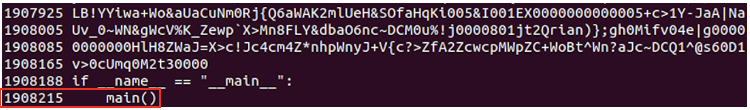
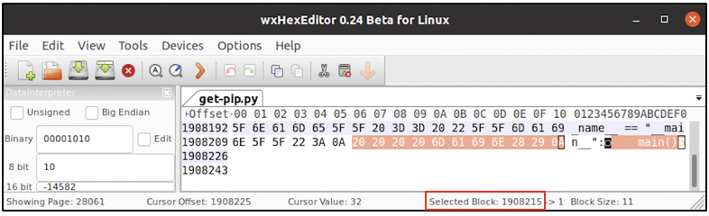

:orphan:
(the-strings-tool-extracting-text-for-digital-forensics)=

# The 'strings' Tool: Extracting Text for Digital Forensics

There is a command like tool called ‘strings’ that helps to extract the text strings from any file. ‘strings’ is one of the most important tools every digital forensic professional must know about. This blog post discusses about the working of ‘strings’ utility and its significance in DFIR.

## What are ASCII and UNICODE strings?

We can see every file and application on our computer in a language of our choice – English, Spanish or any other regional language. However, all those files and applications are understood by the computer only in binary. To have a middle ground between human readable language and computer language, we attempt to interpret a binary value as hexadecimal. For example, the binary value 01001101 in hex is 4D. Every four bits in a binary value is represented by a single digit in hex. So, 0100 in binary corresponds to 4 in hex and 1101 in binary corresponds to D in hex. This type of conversion is performed for every single letter that you see on your computer. Imagine the number of conversions that your computer does every second!

How does a computer know to map 01001101 to 4D. Why not 3D or 5D? This is because there is a predefined mapping between binary and hexadecimal values for some values. Typically, the uppercase English alphabets A to Z, the lowercase English alphabets a to z, numbers 0 to 9 and special characters like $, &, \*. ASCII and Unicode are some character sets which define these mappings.

Unicode describes the mapping for the alphabets in most the global languages like English, Greek & Latin, mathematical symbols, emoticons and more. ASCII describes the mapping only for the uppercase and lowercase letters of the English language, numbers 0 through 9 and the special characters.

ASCII and Unicode have mappings for the English language. Both character sets map the binary value 01001101 to the alphabet M, which is 4D in hex. Typically, each character set holds the binary, hexadecimal, octal, decimal and human readable form of a bit sequence like 01001101.

Any sequence of bits interpreted using the ASCII character map is referred to as an ASCII string. Any sequence of bits interpreted using the Unicode character map is referred to as a Unicode string.

## What does ‘strings’ tool do?

Given a file (text file, image file or binary), _strings_ can extract the ASCII and Unicode strings for it. _strings_ binary is available for Windows, Linux-based and Mac operating systems. By default the tool extracts only the ASCII strings, using the command:

`strings <file-to-extract-strings-from>`

To also extract the Unicode strings from a file, special switches must be passed to the command line tool. On Linux-based systems, switch _-el_ must be used to display the Unicode strings in a file.

`strings -el <file-to-extract-strings-from>`

In some cases, it may be important to find out the extract location of a particular string within a file. In that case, on Linux-based computers _-td_ switch can be used to display the offset at which a particular string has been found.

`strings -td <file-to-extract-strings-from`

The following screenshot is a snippet of output when the command shown above was run against a file _get-pip.py_. It can be seen that the string _ main()_ with some preceding spaces was found at offset 1908215. Some identified strings will be human-readable, while others will not be so.

When the file was opened in the hex editor, the string can be found at offset 1908215. The following screenshot represents this.

## Why is ‘strings’ tool important for DFIR?

During a forensic investigation, there may be a requirement to view all the strings or words in a file. Assume you have a binary like _cmd.exe_. You suspect that whenever the binary is executed, it connects to an attacker’s remote server. For this connection to occur, the binary must use a Dynamic Link Library (DLL) file that enables networking.

To quickly identify if there is a malicious DLL embedded within the binary, run _strings_ against it using the following command:

`strings cmd.exe`

You will be shown a long list of human-readable strings present within _cmd.exe_. You can also view the Unicode strings by passing in the _-el_ switch on a Linux-based computer. The listing will have the names of DLLs embedded within the binary. You can look for the existence of DLLs that enable networking capabilities for the binary.

In some cases, you may want to identify all the strings within a _[memory dump](uncover-crucial-information-within-memory-dumps)_. Running _strings_ against a memory dump may indicate:

- the existence of any malicious files/binaries on the system
- you may find malware signatures used by anti-virus software on the system
- values that indicate any abnormal activity within the system
- suspicious commands that were executed

When an investigator attempts to obtain strings from a memory dump, they must also attempt to map the identified string to a specific process or network connection in memory. This can be accomplished using forensic techniques, which is beyond the scope of this blog post.

In DFIR, _strings_ utility can be used to quickly comprehend the ASCII and Unicode strings in a file/binary to help determine the next course of action. Sometimes, when you attempt to extract the Unicode strings from a file, you may come across hidden messages or codes in foreign languages. The _strings_ binary available for Linux-based and Windows computers has more capabilities than the binary available for Mac.

## Project Idea

It would be a good idea to be familiar which how the _strings_ utility works. It will be a great addition to your DFIR toolkit.

- Choose a binary
- Ensure that _strings_ utility is available on your Windows or Linux-based computer. You can set up a virtual machine
- Identify the ASCII strings in the binary
- Identify the Unicode strings in the binary
- Print the offset for all the strings in the binary
- Open the binary in a hex editor, navigate to a specific offset and view the string in that location
- Are you able to identify the company/organisation that has developed this binary?

:::{seealso}
Want to learn practical Digital Forensics and Incident Response skills? Enrol in [MDFIR - Certified DFIR Specialist](https://www.mosse-institute.com/certifications/mdfir-certified-dfir-specialist.html)
:::
