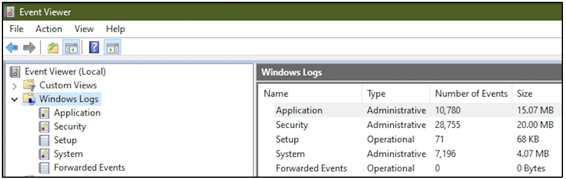
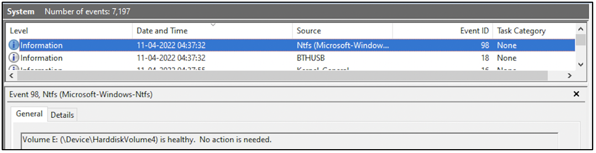

:orphan:
(windows-event-logs-in-digital-forensics)=

# Windows Event Logs in Digital Forensics

Windows Event Logs are an important part of digital forensics. They provide a record of activities that have taken place on a computer, which can be useful in investigating a crime or determining what went wrong in the event of a system failure. Event logs can be generated by both the operating system and applications, and they can be stored locally or remotely. When investigating a digital forensic case, it is important to check the event logs to see if there are any clues that can help solve the case.This blog post discusses what windows Event Logs are and their significance in digital forensics.

## What are Windows Event Logs?

Windows Event Logs offer a centralized logging mechanism for recording logs generated by the operating system and applications. Logs or events are collected by the _Event Logging Service_ and stored across multiple categories.

## Categories of Event Logs

**System**: Logs relevant to system events like system reboots, service start/stop, system updates, driver use/changes, etc. can be found in this category of event logs.

**Security**: Logs relevant to system logon by users/applications (successful or failed logons), access control, security settings, etc. can be found here.

**Application**: Logs generated by applications like security center, volume shadow copy service, web browser, disk manager, etc. can be found here.

**Custom**: The administrator can set up windows event logging for specific applications or services.

The following screenshot shows the various categories of logs on a system. The event logs can be viewed using _Event Viewer_ application, that is available on all Windows systems by default.

!

## Information in a single log

Within a single log entry, several fields of information are stored. Some of them are:

- Timestamp of when the event occurred
- Name of the application/service that generated this log
- Description of the log
- Description of other systems/resources involved in the activity (other systems on the network, printers, etc.)
- Event ID assigned to the type of event
- User account involved in the event

Let’s talk about the **Event ID**. This is a value designated by Windows for specific events. Here are some examples:

- Event ID 7045 signifies service creation
- Event ID 4720 signifies creation of a user account
- Event ID 4624 signifies successful logon
- Event ID 4625 signifies failed logon

Every log entry also has a level associated with it:

_Information:_ This level is assigned to a log after the successful operation of a service or application. Eg: when a service starts or stops

_Warning:_ This level is assigned to a log when it indicates a potential problem in the future. Eg: when there is minor misconfiguration or when there is low disk space

_Error:_ This level is assigned to a log when it indicates a severe failure of some kind, that requires immediate attention. Eg: a log indicating failure of software license activation

The following screenshot is an event log entry within _System_ log. It has been generated on April 11th 2022, at 4:37 hours. The entry provides information that the state of a volume formatted as NTFS is healthy.

!

## Where can Event Logs be found?

Although Event Logs can be viewed using the _Event Viewer_ application, the files are stored on a specific location on disk.

Prior to Windows Vista, event logs were stored in %SYSTEMROOT%\System32\Config with the extension _.evt_.

On latest versions of Windows, event logs can be found in %SYSTEMROOT%\System32\winevt\Logs with the extension _.evtx_.

By default, event logs are stored in the paths described above. However, the paths can be customized by modifying specific _[registry](get-the-most-out-of-the-windows-registry-in-your-digital-forensic-investigations)_ keys at HKLM\SYSTEM\CurrentControlSet\Services\EventLog.

The maximum size of a single event log can be configured by the system administrator. Depending on the log size and how much a system is being used, you can encounter logs dating back days or even months.

## How are Windows Event Logs useful in Digital Forensics?

Event Logs are an extremely valuable resource during a forensic investigation. It provides a window into most of the activities that had taken place on a system recently.

If you have the _[forensic image](get-the-evidence-you-need-with-forensic-images)_ of the _C:_ drive of a computer, then you can find the event logs within the configured location. The logs can be extracted and parsed for evidence. From a live system, event logs can be extracted by simply copying the _.evtx_ files to the investigator’s storage device. The acquired _.evtx_ files can be processed using tools like _LogParser_, _Event Log Explorer_, _LOGAlyze_, etc.

Even within a _[memory dump](uncover-crucial-information-within-memory-dumps)_, it is possible to find event logs that had been generated recently. Event logs can be carved from a memory dump using tools like _EVTXtract_.

Some organizations may configure event logs to be processed by log analytics tools to be able to visualize the logs better.

When you are parsing the event logs during an investigation, you must remember to take into account the time zone the device had been operating in. Most forensic tools capable of parsing event logs also provide the capability to perform time correction.

## Project Idea

Here’s a project idea for you.

1. Execute some commands using _Command Prompt_ and _PowerShell_
2. See if you spot event log entries within Application logs and PowerShell logs relevant to the commands you typed
3. Temporarily disable Windows Defender
4. See if you can spot event log entries relevant to Windows Defender. What is the ‘level’ assigned to the log entry? Which application has generated this log entry?

The ability to interpret Windows Event Logs is a valuable skill for a digital forensic investigator.

> **Want to learn practical Digital Forensics and Incident Response skills? Enrol in [MCSI's MDFIR - Certified DFIR Specialist Certification Programme](https://www.mosse-institute.com/certifications/mdfir-certified-dfir-specialist.html)**
