:orphan:
(windows-exploitation-stack-overflow-part-1)=

# Windows Exploitation: Stack Overflow Part 1

Even though advanced Windows exploitation is far different from Linux, basic stack smashing is strikingly comparable between the two operating systems. Similarly to Linux, the key part is to identify program entry points. We will not discuss how to find an attack surface in this post, but rather how to perform the actual exploitation.

A vulnerability can be introduced into an application by a variety of inputs, including:

- Text fields where the user can type in text
- Command-line arguments and remote resources the application fetches
- Files processed by the application.

The fundamentals of exploiting a buffer overflow in Windows are the same as in Linux.
A large amount of data will be written to the stack, maybe as a result of an errant copy operation.

This causes a crash because the extremely big buffer overwrites the previously saved return address, and upon returning from a current stack frame to a previously overwritten one, `EIP` is overwritten by user data.

The most fundamental buffer overflows on Windows are known as _vanilla EIP overwrites_ or _direct EIP overwrites_, in which the `EIP` is immediately overwritten after a sufficient amount of data is supplied.

In upcoming blog posts, we will examine additional Windows stack overflow exploitation techniques involving indirect `EIP` overwrite, such as Unicode overflows and SEH-based exploits.

We will analyze a practical example of Windows basic stack overflow exploitation using `Windows XP Service Pack 1`.

## Windows basic overflow analysis

To demonstrate Windows stack overflow exploitation, we will use the [ASX to MP3 converter](https://www.exploit-db.com/apps/f4da5b43ca4b035aae55dfa68daa67c9-ASXtoMP3Converter.exe) running on Windows XP Service Pack 1.

This software receives input by parsing `.m3u` files, among other methods. Typically, the `m3u` format places links to online media resources one per line. While this could be an intriguing attack vector, particularly for online converters, let's concentrate on our local example.

Let's attempt to overflow the application's memory by adding a lengthy `m3u` position. Create a brief Python script to facilitate the `m3u` file generation:

```python
buffer = "http://"
buffer += "A" * 18000

f = open("exploit.m3u", "w")
f.write(buffer)
f.close()
```

This code snippet generates the file `exploit.m3u` with the string `http://AAA....AAA`.

Let's now execute the Python script. The file `exploit.m3u` will be displayed.

Then, we'll launch the converter software, but we won't open the `.m3u` file just yet. Next, the debugger will be connected to the Converter.

Let’s start the Immunity Debugger. We’ll then go to `File -> Attach` and find the Converter on the process list:

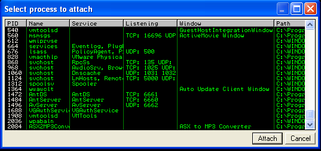

As soon as the debugger is attached, the application enters a paused state, which prevents you from interacting with it because the debugger prevents it from executing any code.

Simply press the `Run` button (or `F9`) to resume the application's normal execution.

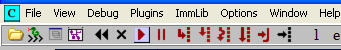

Finally, let’s drag and drop the `exploit.m3u` onto the software window.

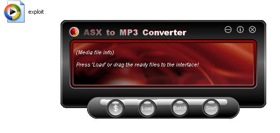

The application becomes unresponsive, but a buffer overflow can be identified using the debugger.

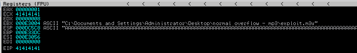

Since `A`'s ASCII hex representation is `0x41`, we are certain that it was our buffer that caused the `EIP` to contain the value `0x41414141` (`AAAA`).
We are aware that the `EIP` can be controlled, but the path to code execution is lengthy.

Let's begin by determining the exact number of characters required to overwrite the `EIP`.

To accomplish this, you can use the pattern create / pattern offset functionality of metasploit; however, similar functionality is already built into `mona.py`, so let's use this instead.

Simply type the following into the console of the debugger:

```bash
!mona pattern_create 18000
```

You will then receive the output in the debugger window:

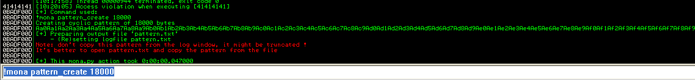

According to the debugger's warning, the pattern has been truncated, and copying it from this window will render it useless. Instead, it will remain unchanged in the `pattern.txt` file, which is located in the Immunity Debugger folder by default: `C:\Program Files\Immunity Inc\Immunity Debugger`

Let’s paste the pattern into an exploit:

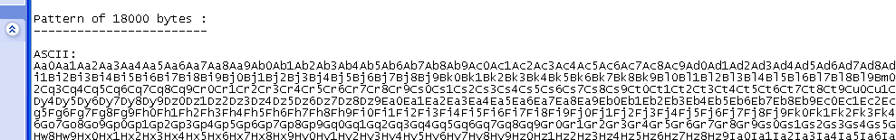

We’ll then re-create the m3u file:

```python
buffer = "http://"
buffer += "Aa0Aa1Aa2Aa3Aa4Aa5Aa6Aa7Aa8Aa9Ab0Ab1Ab2Ab3Ab4Ab5Ab6..."

f = open("exploit.m3u", "w")
f.write(buffer)
f.close()
```

Additionally, the application should be restarted. Conveniently, we can do so from the debugger level in this instance. Clicking the `File` menu will display the most recent application at the bottom.

If a _"Exception"_ occurs during application loading, press `Shift + F9` to return to normal startup. Exceptions will be explained in a later of this blog post series.

Drag and drop the newly created exploit `m3u` file onto the
converter and check in the debugger what happens:

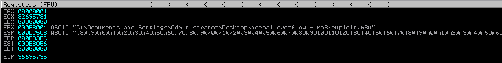

We can retrieve the number of characters that caused the program to crash using `mona`. You can simply rewrite the command's `EIP` value to allow it to calculate the offset, as shown below:

```bash
!mona pattern_offset 36695735
```

The pattern was found after `17417` bytes:

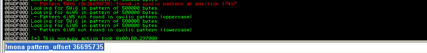

Let’s introduce this amount to the exploit, as follows:

```python
buffer = "http://"
buffer += "A" * 17417
buffer += "B" * 4
buffer += "C" * 600

f = open("exploit.m3u", "w")
f.write(buffer)
f.close()
```

Don't forget to regenerate the exploit file. Now, within the debugger, let's restart the application and feed it the most recent `m3u` exploit file.

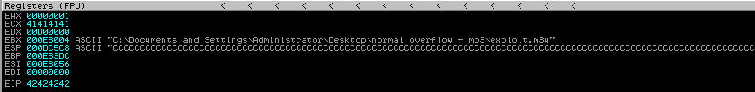

Perfect! We are overwriting the EIP with “BBBB”. What can
we do with it though?

We can indicate where the `EIP` address will point (currently we used the invalid address `BBBB`). How do we specify the address of a piece of code to execute?

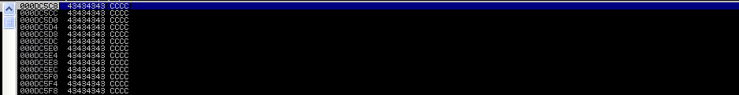

If we examine the stack at address `0x000d5c58`, we find that our buffer consists of the letter `C`. Can we use this address instead of `B`'s to cause the `C`-buffer to be executed?

Unfortunately, no.

The stack's address contains a _null byte_. Due to the fact that a _null byte_ is treated as a string terminator, the application will likely cease copying anything that follows the null. This indicates that the `C`'s will not be copied, and the application will begin executing some random code that previously resided in that location (but was replaced by `C`'s).

However, when observing the registers, it seems that one of them, the Stack Pointer (`ESP`), points to and contains the address of our `C`-buffer.


Assembly language provides several instructions that could be useful in such a circumstance.

If a register contains a memory address, the execution flow can be redirected to this address by executing instructions such as:

- `jmp REGISTER`
- `call REGISTER`
- `push REGISTER; ret`

So, for example, if `EDX` is `0x11223344` and the current instruction being executed is `jmp EDX`, the next instruction executed will be the one beginning at `0x11223344`.

In the current scenario, the `ESP` contains the address of a buffer we control. Thus, if we execute `JMP ESP`, the `C`-buffer will be executed!

Therefore, we must locate the address of the _"Jump ESP"_ instruction.

Executing the `jmp ESP` instruction will cause the program to begin executing the code pointed to by `ESP`. In this instance, this is controllable data.

Mona makes it easy for us. Simply type:

```bash
!mona jmp -r ESP
```

As the debugger searches the entire memory of the process and all of its dependent modules for suitable instructions, the debugger may freeze momentarily. When it completes, the results will be available in a `jmp.txt` file in the Immunity folder, or by selecting _View -> Log_ from the Immunity menu.

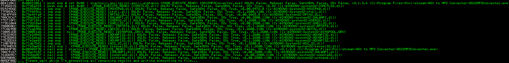

You may select any of the modules provided that the jump address does not begin with `0`. Also, be sure to select the `jmp esp` instruction, as an equivalent one may not perform identically.


Now, let's determine if this address is valid. First, let's add it to the exploit while keeping endianness in mind. Therefore, the address should be written in reverse order.
`0x55929d6e` = `\x6e\x9d\x92\x55`:

```python
buffer = "http://"
buffer += "A" * 17417
buffer += "\x6e\x9d\x92\x55" # will become EIP 0x55929d6e
buffer += "C" * 600

f = open("exploit.m3u", "w")
f.write(buffer)
f.close()
```

If we jump to the `C`-buffer, we must find a way to immediately halt the execution.

`C`, which is represented by `0x43` in ASCII, is also a valid opcode for `INC EBX`. If we jump to a series of `INC EBX` statements, they will be executed, resulting in a crash.

To prevent such an issue after jumping to `ESP`, let's insert some code that pauses the execution and notifies us that everything is functioning as expected.

For this purpose, the `INT3` (Breakpoint) instruction will be ideal. Its operand code is `xcc`.

Let's insert the breakpoint instruction just before the `C`- buffer. We will also regenerate an exploit file and restart the application within the debugger:

```python
shellcode = "\xcc"

buffer = "http://"
buffer += "A" * 17417
buffer += "\x6e\x9d\x92\x55" # will become EIP 0x55929d6e
buffer += shellcode # breakpoint
buffer += "C" * 600

f = open("exploit.m3u", "w")
f.write(buffer)
f.close()
```

Sadly, we did not land in the buffer zone. However, the `ESP` does not precisely point to the beginning of the `C`-buffer. We touched down within this buffer.

_How can we figure out where are we now?_

Be patient. The answer to this question will be in the [next part](windows-exploitation-stack-overflow-part-2).

## References

- [ASX to MP3 converter](https://www.exploit-db.com/apps/f4da5b43ca4b035aae55dfa68daa67c9-ASXtoMP3Converter.exe)
- [ASXtoMP3Converter.exe ASX to MP3 3.1.3.7 - '.m3u' Local Buffer Overflow](https://www.exploit-db.com/exploits/42974)

:::{seealso}
Looking to expand your knowledge of vulnerability research and exploitation? Check out our online course, [MVRE - Certified Vulnerability Researcher and Exploitation Specialist](https://www.mosse-institute.com/certifications/mvre-vulnerability-researcher-and-exploitation-specialist.html)
::: In this course, you'll learn about the different aspects of vulnerability research and how to put them into practice.**
