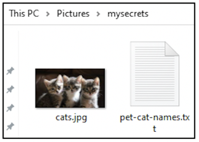
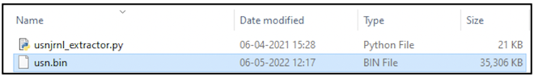
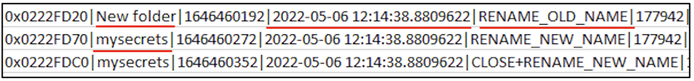
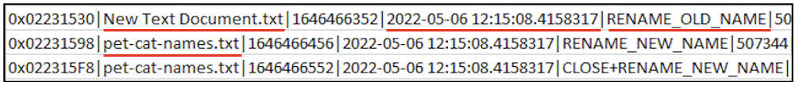

:orphan:
(windows-file-system-journal-in-digital-forensics)=

# Windows File System Journal in Digital Forensics

Windows operating system stores a lot of information about the activities performed by a user. Ranging from which binaries were executed, to how applications were used, to even storing information about which files/directories were created or deleted or modified recently. This blog post discusses about one log source called the $UsnJrnl file, which records information about every operation performed on files and directories.

## Introducing $UsnJrnl

Most Windows systems use New Technology File System (NTFS) to efficiently handle the large number of files on the hard disk. NTFS has some special files called _System Files_ that are responsible to perform this file management. You can read more about _[NTFS System Files](forensic-importance-of-windows-file-management)_.

One of the NTFS system files is a file called $UsnJrnl that is stored within $Extend directory. $UsnJrnl is referred as the file system change journal. It is a file that holds information about every change that occurs to files and directories on disk. Some of them are:

- file/folder creation
- file/folder deletion
- file/folder renaming
- file/folder modification by compression or encryption
- shortcut created for file/folder
- access control data for file/folder was changed
- data added or removed from file/folder

## How to use $UsnJrnl for digital forensics?

Cyber adversaries are getting smarter by the day. They are aware of footprints they leave behind and now take steps to wipe away those footprints. This wiping away of footprints is formally referred to as _anti-forensic technique_ - steps taken to hinder the digital forensic process. On a Windows computer, it could be deleting the binary for a recently executed malware, hiding a file they intend to use again later, or even deleting prefetch files. You can read _[more about prefetch files](windows-prefetch-files-may-be-the-answer-to-your-investigation)_.

It is possible to find evidence of anti-forensic steps performed from the $UsnJrnl file. If an adversary had deleted a prefetch file, within the $UsnJrnl file you can find evidence about this deletion.

## Realising the usefulness of $UsnJrnl

Here is a quick walk through of how $UsnJrnl can provide clues about recent file/folder activity.

Within _Pictures_ folder, a new folder called _mysecrets_ was created. Within the new folder, a new text document was created and renamed as _pet-cat-names.txt_. An image file has also been placed in this folder. Let’s see if we can find any information about this activity from the $UsnJrnl.

On your Windows computer, it is not possible for a regular user to view the $Extend folder and its contents. $UsnJrnl can be extracted using tools like _UsnExtractor_ or _ExtractUsnJrnl_. Most of the commercial forensic tools can also perform this task for you.

Upon extraction, you will have access to the contents of $UsnJrnl file as shown below. The tool used for this demo has extracted the change journal to _usn.bin_.

The contents of _usn.bin_ will not be human-readable. To interpret this, $UsnJrnl parsing tools like _UsnJrnl2Csv_ or _USN-Record-Carver_ can be used. When the resulting output was parsed, there were a sequence of log entries to indicate that a folder called _New Folder_ was renamed to _mysecrets_ on 6th May at 12:14 hours.

There were some more entries indicating that _New Text Document.txt_ was renamed to _pet-cat-names.txt_ on 6th May at 12:15 hours.

Likewise, there will also be log entries to indicate the copying of _cats.jpeg_ into _mysecrets_ folder.

You may have noticed that within the output of $UsnJrnl file, we can see only the file names. How is it possible to know the exact location of that file in a hard disk? In the screenshots shown above, there are some more fields of information to the right of the timestamp. Co-relating those fields with other pieces of evidence will help you identify the complete path of a suspicious file on disk.

## Project Idea

Do you want to try acquiring evidence from $UsnJrnl?

1. Create a folder, add some files to it. Rename some files. Delete some files.
2. Acquire the contents of $UsnJrnl
3. Parse the contents of $UsnJrnl
4. Look for log entries relevant to the activities you performed

Once you identify a sequence of interesting operations from $UsnJrnl, you can proceed to create a timeline of activity that had occurred on the system. You can read more about timelines _[read more about timelines](importance-of-timelines-in-a-forensic-investigation)_

:::{seealso}
Want to learn practical Digital Forensics and Incident Response skills? Enrol in [MCSI's MDFIR - Certified DFIR Specialist Certification Programme](https://www.mosse-institute.com/certifications/mdfir-certified-dfir-specialist.html)
:::
