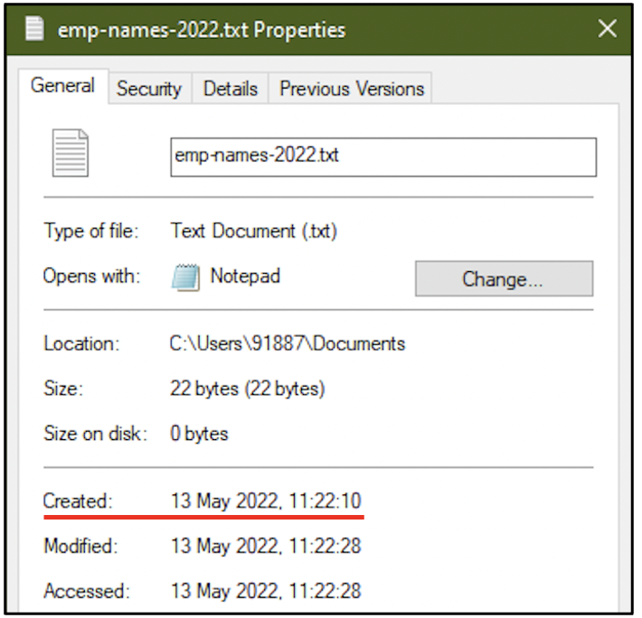
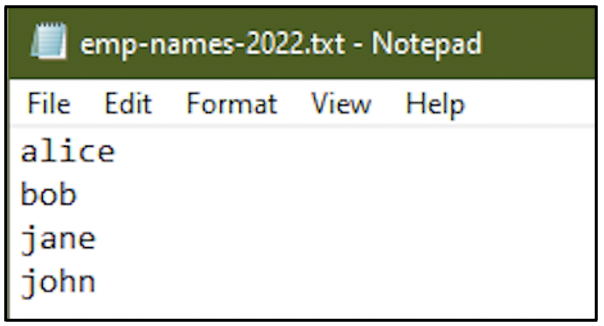
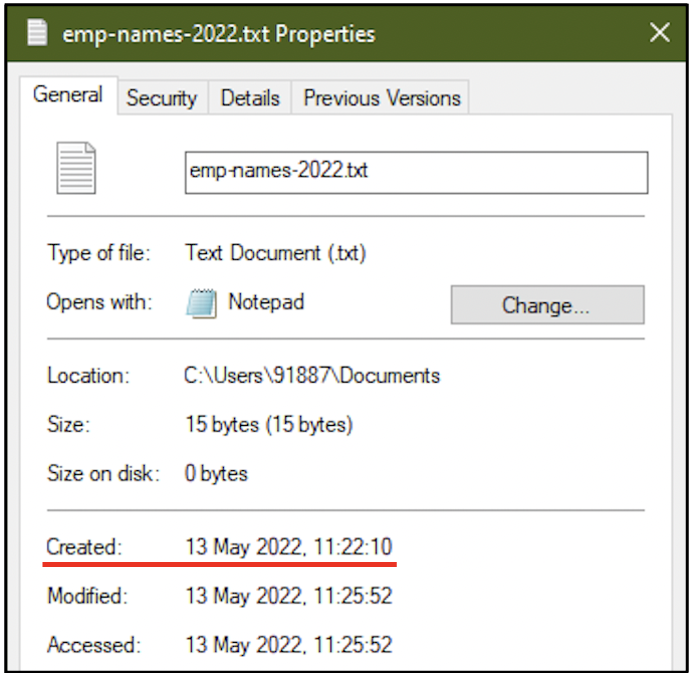
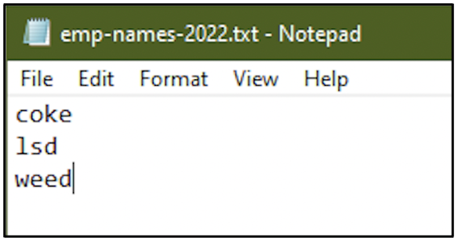
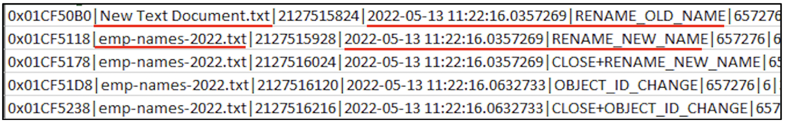
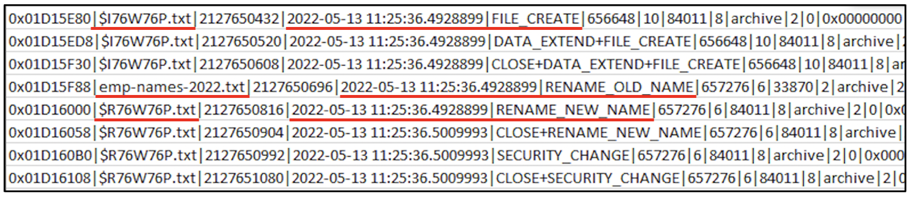
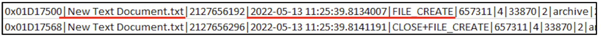
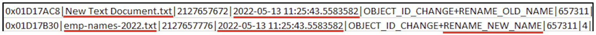

:orphan:
(windows-file-system-tunneling-in-digital-forensics)=

# Windows File System Tunneling in Digital Forensics

Digital Forensics relies on the power of timestamps and timelines. Windows operating systems that use NTFS or FAT file system for their storage media like hard disks, have a feature called _File System Tunneling_ which influences how timestamps exist. This blog post discusses what file system tunneling is and its impact on digital forensics.

## Scenario

Joe was a System Administrator working late one Friday evening. He was working on a Windows computer. Earlier during the day, at around 11:00am, he had drafted some PDF documents in order to propose new software purchase. One of those documents was titled `Purchase-Proposal-May22.pdf` Working late was getting to him and he stepped out of his office for a cup of coffee at 7:00pm without locking his computer.

Just as he was finishing his coffee, he received a call from the cybersecurity team. _‘Hey Joe! Your computer is communicating with a known blacklisted C2 channel. We need to jump in and investigate. We’ll meet you in your office STAT.’_

Joe did not understand what C2 meant. He let the cybersecurity team work their magic.

The team built a _[timeline](importance-of-timelines-in-a-forensic-investigation)_ of activities they found suspicious:

- 13th May 2022, 7:05 pm: Malicious PDF file `Purchase-Proposal-May22.pdf` opened
- 13th May 2022, 7:06 pm: JavaScript code embedded within the PDF file communicating with known C2 channel
- 13th May 2022, 7:10 pm: Alert triggered in SIEM, caught by cybersecurity team

The team has identified that Joe has created the malicious PDF file at around 11:00am.

Joe could not understand what was going on? All he was trying to do was type up a software purchase proposal and now he is accused of embedding malware in a PDF file. He had stepped away from his computer at 7:00pm, but the file has been opened at 7:05pm. It was all going way over his head!

Let’s try to help Joe.

## Introducing File System Tunneling

First, we will understand what file system tunneling is.

A text file _emp-names-2022.txt_ was created on 13th May 2022 at 11:22 hours.

The text file had the names of four people.

On the same day, at 11:25 hours the file _emp-names-2022.txt_ was created. A new text document was created and named as _emp-names-2022.txt_. The latest document created must have the creation time as 11:25 hours. But take a look at the following screenshot: the creation time is still 11:22 hours.

The new file is using the creation time of the deleted old file. The only common factor between the old file and the new file is the file name. However, the contents of the new _emp-names-2022.txt_ file does not appear to have the names of employees, it appears to have the names of illegal drugs.

Here is what has happened: there is a feature called _File System Tunneling_ on file systems like NTFS and FAT, where, if a file is deleted and another one is created in its place with the same name in the same path, the new file gets the creation time of the old file. This is the behaviour observed with the _emp-names-2022.txt_ file.

Tunneling is valid only if the new file is created within 15 seconds after deletion of the old file. This time window is referred to as _tunneling cache time._

## Tunneling Configuration

By default, tunneling is enabled on all NTFS formatted volumes. The tunneling feature can be controlled by registry keys at _HLKM\SYSTEM\CurrentControlSet\Control\FileSystem_.

To disable tunneling, add a registry key called `MaximumTunnelEntries` in the path specified above and set it to 0.

To modify the tunneling cache time, the registry key called `MaximumTunnelEntryAgeInSeconds` in the path specified above can be modified.

By default, these registry keys do not exist. So if you do find them in a computer, it means that the user has attempted to modify the tunneling configuration.

## A final word about File System Tunneling

How can we help Joe prove that he did not create this malicious file? By asking the cybersecurity team to take a look at the file system journal. _[Windows File Management](forensic-importance-of-windows-file-management)_ blog post walks you through the forensic significance of the NTFS journal and how it can be used to become aware of recent file/folder operations.

Within the file system journal, entries were found indicating the creation and deletion of _emp-names-2022.txt_ at 11:22 hours and the creation of a text document with the same name at 11:25 hours.

The following screenshot indicates the creation of _emp-names-2022.txt_ for the first time at 11:22 hours.

The following screenshot indicates the deletion of _emp-names-2022.txt_ that had taken place at 11:25 hours, right before the new creation. On Windows computers, whenever a file is deleted, it is stored in the Recycle Bin.

The Recycle Bin stores a deleted file as `$I` file and `$R` file. From the screenshot shown below, you can see that a file called `$I<characters>.txt` has been created and the actual _emp-names-2022.txt_ has been renamed to `$R<characters>.txt`. The same sequence of characters appears in the names of the `$I` file and `$R` file. We are not diving into Recycle bin forensics in this blog post. But looking at the timestamps and the file operations, it is safe to infer that _emp-names-2022.txt_ has been deleted at 11:25:36 hours.

The following screenshot indicates the creation of a new text document at 11:25:39 hours.

That new text document has been renamed to _emp-names-2022.txt_ at 11:25:43 hours.

This whole deletion, creation and renaming process has occurred within 15 seconds. Although file system tunneling has had its effect, it is still possible to get intricate details about file system operations from the file system change journal.

We can ask the security team to process the file system journal from Joe’s computer and look for any activity indicating abuse of file system tunneling. Joe did leave his computer unlocked when he stepped away for coffee. Maybe someone was trying to make Joe look bad.

Anyway, note to self: do not leave critical computer systems unlocked and unattended.

> **Want to learn practical Digital Forensics and Incident Response skills? Enrol in [MCSI's MDFIR - Certified DFIR Specialist](https://www.mosse-institute.com/certifications/mdfir-certified-dfir-specialist.html)**
