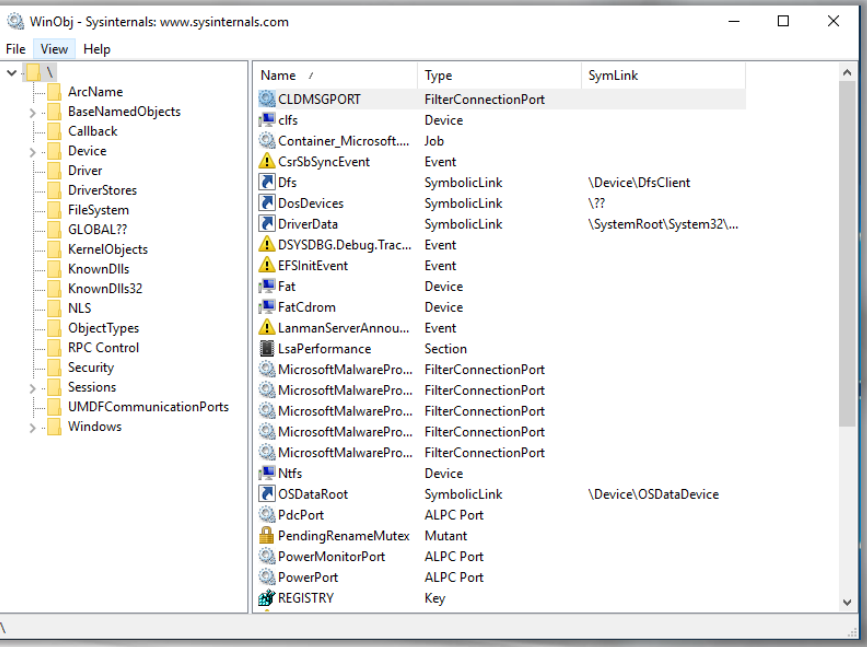

:orphan:
(windows-internals-processes)=

# Windows Internals: Processes

Before we begin anything connected to malware execution, let's delve into the Windows System Internals and grasp the basic components of a process and the system on which we will conduct our investigations and analyses. Understanding how to trace and monitor suspicious processes in your restricted environment is crucial.

## Process

Under the majority of operating system texts, it is defined as a program in execution, but it is much more than that, and this definition is technically incorrect!

A _process_ is a resource mechanism that represents an instance of a running application.

This resource mechanism is also a standalone object used to manage the required application resources in a contained or isolated environment.

This indicates that every process has its own environment!

Each process has the following main
elements:

- Executable Image (the program file)
- Private Virtual Address Space
- Private Handle Table
- Access Token
- Thread(s)

**Executable Image** - This is the executable program, the file that contains the executable code. It is also known as a _"Image File."_. Every process will contain a minimum of one image file.

**Private Virtual Address Space** - Each process use its own linear virtual address space to load the necessary resources. This may include the picture file, any necessary libraries, stack, heap, and other resources.

This address space is exclusive to the process and contributes to the creation of a contained and isolated environment in which the process can execute safely without interfering with other processes running on the machine.

The size of the user space Virtual Address Space for each process depends on three main features:

- Is the process `32-bit` or `64-bit`?
- Is the system `32-bit` or `64-bit`?
- Is the linker flag `/LARGEADDRESSAWARE:yes` set?

Each process on a `32-bit` system have `2GB` by default. If `32-bit` process on `32-bit` system has been linked with the `LARGEADDRESSAWARE` flag, it could be increased to a max of `3GB`.

If a `32-bit` process running on a `64-bit` system has the `LARGEADDRESSAWARE` flag set, it has `4GB`. If not, it will have `2GB` by default.

It will have `8TB` Virtual Address Space for `64-bit` processes for `Windows 8` and prior, and `128TB` for `Windows 8.1` and beyond.

## Processor Modes

If you noticed, we mentioned _"user-space"_. Yes, we was only discussing the user space Virtual Address Space size.

Processes can operate in any of two modes:

- User-mode
- Kernel-mode

Let's investigate what we mean by these modes and the size of the kernel's Virtual Address Space(VAS). The processor switches between the two modes available depending on the type of code being executed.

When we launch an application (e.g., `notepad.exe`), the application will launch in _user-mode_, and the processor will switch to _kernel-mode_ if a privileged operation is required to manage system resources via the kernel (e.g. open a file on disk).

This indicates that a Virtual Address Space is reserved for code running in:

- user-mode called _"User space"_
- kernel-mode called _"Kernel space"_

Each application running in user-mode will have its own Virtual Address Space, but the operating system will share one Virtual Address Space!

This means the OS and all its components (will be explained
later) are all running in one Virtual Address Space. The size of the system Virtual Address Space is `2GB` on `32-bit` systems and will be theoretically using `248TB` on `64-bit` systems.

**32-bit User and Kernel Virtual Address Space** - The lower address ranges from `0x00000000` to `0x7FFFFFFF` is used for the user space. Higher address ranges from `0x80000000` to `0xFFFFFFFF` is used for the kernel space.

**64-bit User and Kernel Virtual Address Space** - The lower address ranges from `0x00000000000` to `0x7FFFFFFFFFF` is used for the user space. Higher address ranges from `0xFFFF080000000000` to `0xFFFFFFFFFFFFFFFF` is used for the kernel space.

Now, you might be asking, each process has that amount of address space? Hey, but I don’t have that amount of `RAM` on my computer!

Those are excellent questions, however the reason why each process has so much room, even if you do not physically have that much RAM or disk space, is because it is all _"virtual"_!!!

Yes, this is an illusion; there are not actually 4GB or more of `RAM/disk space` being utilized. This is why it is known as virtual memory.

## Virtual Memory

Processes always deal with virtual memory and the reason why it is referred to as virtual, is because:

- There is an indirect relationship between the address used and the address in physical memory.

- A buffer allocated to a process could be mapped to a physical address or to a file on disk called page.

The process does not need to know whether or not the memory address that will be accessed exists in physical memory.
If the memory location to be performed is in physical memory (`RAM`), then the `CPU` will execute it; otherwise, the `CPU` will raise a page fault, which will instruct the memory management to retrieve the page where the data sits and load it into memory so that the `CPU` can execute it.

**Virtual Address Space vs Physical Address Space** - Now, each process will be separated into what are known as pages (`4 kilobytes` in size), and once again, just the necessary pages are loaded into the main memory (`RAM`). More information about pages can be found in the our [memory forensics blog](digital-forensics-main-page).

These locations are continuous while these pages are in virtual memory, but when they are put into main memory, they could be placed anywhere.

The memory manager is responsible for mapping virtual address space addresses to physical address space addresses. We have no access to real addresses and only work with virtual ones.

Consider for the time being that each process will have its own table in which the Virtual Address Space address is mapped to the Physical Address Space address.

When the process needs to access a location, the table is checked to see if that address is in physical memory or not. If it is, then it will be accessed, if not, then it will trigger a page fault as we said and then get loaded into physical memory, which leads to updating this table.

## Shared Libraries (DLLs)

Virtual memory also aids in the utilization of physical memory by only loading executable data into physical memory. If it will not be executed, there is no reason to load it.

Also, if two processes utilize the same library, why should it be loaded twice? What happens if many processes require the same library? Three processes? Four?

An illustration in the next picture should explain the idea:

Shared Libraries (DLLs) and How they are mapped in memory.

## Handles

Have you ever wondered, _"What is a handle?"_ Consider it an indirect pointer to an object in kernel space. Each process additionally has a private table that points to kernel objects.

These objects could be:

- File
- Registry Key
- Network Socket
- LPC Port
- Mutex, Semaphore, Event, IOCP
- Tokens
- Process / Thread
- GDI Objects (e.g. Window, bitmap, region, etc)

**Private Handle Table** - For instance, if a process wishes to write to a file, it will request access to the file through the kernel.

The kernel is responsible for opening the file and generating a handle, which is then added to the handle table, allowing the process to access the file.

[WinObj from SysInternals](https://docs.microsoft.com/en-us/sysinternals/downloads/winobj) can be used to determine what objects exist on a Windows system. There are so many distinct kinds of items that we just mentioned a handful of them:

## Access Token

This object maintains the default security context of the process, which is then used by the thread that will execute the code.

Keep in mind that a thread could later have a different token by impersonating a different security context.

By default, a process' token will contain the security context of the user operating the process, as well as the user's groups and rights.

Keep in mind that we can start processes with the context of a different user, which means a token with a different context will be created and associated to the newly started process.

## Threads

Threads are the actual execution units of a process. They carry out the execution.

Each process will have at least one thread and will typically begin running code at the EXE file's main entry point.

Process with a _single thread_ (left) and a process with _multi-threads_ (right)

## Conclusion

These are the primary and brief explanations of how each element is used, however that does not mean they are always utilized in this manner!

Both malware and exploit developers attempt to exploit vulnerabilities and breach boundaries...

## References

- [Virtual Address Space](https://docs.microsoft.com/en-us/windows/win32/memory/virtual-address-space)
- [Microsoft Documentation: User-mode and Kernel-mode](https://docs.microsoft.com/en-us/windows-hardware/drivers/gettingstarted/user-mode-and-kernel-mode)
- [Sysinternals WinObj](https://docs.microsoft.com/en-us/sysinternals/downloads/winobj)

:::{seealso}
Would you like to learn practical malware analysis techniques? Then register for our online course! [MRE - Certified Reverse Engineer](https://www.mosse-institute.com/certifications/mre-certified-reverse-engineer.html)
:::
