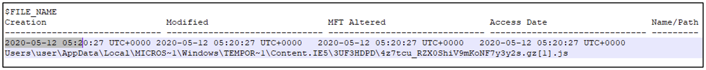

:orphan:
(windows-ntfs-file-attributes-for-digital-forensics)=

# Windows NTFS File Attributes for Digital Forensics

Jane just purchased a new mobile phone. She enjoys describing about it to her friends – the color, form factor, storage capacity, RAM, etc. Everything that she is describing about the new phone are _attributes_. The English dictionary describes an _attribute_ as a feature of a product. Most _[Windows](forensic-importance-of-windows-file-management)_ computers, use NT File System for file management. Every file would have a name, timestamps, file owner, file size and its data. NTFS stores the various information relevant to a file, as file attributes. This blog post introduces you to the most important NTFS file attributes and describe why they are important for digital forensics.

## What are the NTFS File Attributes?

The following sections describes the attributes used by NTFS to store information about a file.

**`$STANDARD_INFORMATION`**: This attribute holds information about the file timestamps (creation time, modification time, access time), if the file is compressed or encrypted or hidden or is an archive and information about the file owner.

**`$FILE_NAME`**: True to its name, this attribute stores the file name and file size. It also stores the timestamps (creation time, modification time, access time). Now which timestamps are more important – the ones stored in `$STANDARD_INFORMATION` or the ones stored in `$FILE_NAME`? Well, that is a story for another blog post!

**`$DATA`**: The actual file content is stored by this attribute.

**`$INDEX_ROOT, $INDEX_ALLOCATION`**: Directories use these two attributes to store information about the files stored within that directory.

**`$SECURITY_DESCRIPTOR`**: This attribute stores access control information for a file.

**`$OBJECT_ID`**: NTFS assigns a unique ID to every file. That ID is stored within this attribute. This can be likened to the unique student ID number assigned to you in a class.

**`$LOGGED_UTILITY_STREAM`**: If a file is encrypted, this file stores encryption information for that file.

**`$REPARSE_POINT`**: When you create a shortcut for a file and open the shortcut file, it will take you to the original file. This is because, the shortcut file stores information about where the original file is. This information is stored by the `$REPARSE_POINT` attribute. NTFS also allows you to create shortcuts for directories across two hard disks on your computer. These shortcuts called as junctions also use `$REPARSE_POINT` attribute to store information.

**`$SYMBOLIC LINK`**: This attribute was previously used to store shortcut information for files, but is obsolete now.

**`$VOLUME_INFO, $VOLUME_NAME, $VOLUME_VERSION`**: When you format your hard disk, you would give it a name. By default, Windows assigns alphabets like _C:_ or _D:_ to it. For every volume on your hard disk, these three attributes store information about it in a system file called $Volume.

Every single file on your computer, is defined by a specific set of attributes from the list described above.

The _[Master File Table (MFT)](forensic-importance-of-windows-file-management)_ handles all the files on a hard disk. An entry for every file exists in the MFT. That entry has the collection of attributes which describe a file.

All attribute names start with the dollar `($)` symbol. All characters in the name are represented with uppercase characters.

## Why should I know NTFS File Attributes for Digital Forensics?

When you process the _[forensic image](get-the-evidence-you-need-with-forensic-images)_ of a hard disk using forensic tools like _Autopsy_, _FTK Imager_ or _The Sleuth Kit_, the utilities will report about the various attributes that describe a file. Knowing what those attributes are will help you interpret the output presented by the forensic tools.

When you process a _[memory dump](uncover-crucial-information-within-memory-dumps)_ taken from a computer, it contains information about files that were recently created or copied into the hard disk. If you suspect that an adversary has dropped malware on your computer, it is possible that you can find evidence about it from a memory dump. Forensic tools will report information about the recently created files, along with detailed information about those files’ attributes.

## What can I do with this new information?

Here is a project idea for you.

- Download a new malware sample on a virtual machine
- Execute the malware sample on the VM
- Take a memory dump of that VM
- Use Volatility tool to process that memory dump
- Use _mftparser_ plugin present in Volatility tool against the memory dump
- See if you can recover information about the executed malware sample
- Since the sample was recently downloaded, it qualifies as a recently created file on the hard disk. The _mftparser_ plugin will present information about the `$STANDARD_INFORMATION`, `$FILE_NAME` and `$DATA` attributes of a file.

We know that timestamp information can be found within the `$STANDARD_INFORMATION` and `$FILE_NAME` attributes. You can use that information to find out when the file was created on disk.

Here is an example. The following screenshot is a snippet of the output of _mftparser_ plugin, when executed against a memory dump. You can see that a temporary JavaScript file with a random name has been created on 12th May 2020 at 5:20 hours.

In the real world, if it is suspected that a malware sample has been executed on a machine, check if it is possible to get a memory dump from that machine. Use _mftparser_ plugin against that memory dump and see if you can find when the sample was copied into the machine. You can even find evidence about creation of _[prefetch files](windows-prefetch-files-may-be-the-answer-to-your-investigation)_, which indicates that a binary had been executed on a computer recently.

:::{seealso}
Want to learn practical Digital Forensics and Incident Response skills? Enrol in [MDFIR - Certified DFIR Specialist](https://www.mosse-institute.com/certifications/mdfir-certified-dfir-specialist.html)
:::
