:orphan:
(windows-recycle-bin-forensics-dumpster-diving-for-evidence)=

# Windows Recycle Bin Forensics: Dumpster Diving for Evidence

Windows Recycle Bin Forensics can be likened to dumpster diving. One of the best places to look for evidence is in the trash. Every time a user deletes a file, it lands up in the Recycle Bin, which is the _trash_ area for Windows Operating systems. This blog post discusses how files exist within the Recycle Bin and how digital forensics can be performed on it.

## Why is the Recycle Bin important for DFIR?

Let’s assume you are investigating a machine where you suspect that a malicious PDF file has been opened. You are not able to find that file anywhere on the file system. It may exist within the Recycle Bin.

When a file has been deleted, information about the full path (absolute path), deletion time, file size and file type; are stored within the Recycle Bin. If the malicious PDF file exists within the Recycle Bin, then it will be possible to find out when it was deleted and also the absolute path of where it existed on the file system.

## Where is the Recycle Bin folder?

You will typically find the Recycle Bin on the Desktop of your computer. However, that is a shortcut to a hidden location.

Within a drive, here _C:_, the folder viewing options have been modified to display hidden items.

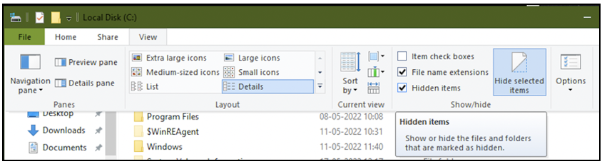

The contents of the Recycle Bin can be found within a hidden directory `$Recycle.Bin`.

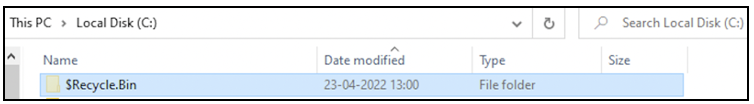

Every drive/volume on a Windows computer has a dedicated Recycle Bin for every user. On Windows 95/98/ME the contents of the Recycle Bin were found within the folder `C:\Recycled`. On Windows NT/2000/XP the contents of the Recycle Bin were found within the folder `C:\Recycler`. Since Windows Vista, all versions of Windows have the contents of Recycle Bin within the directory `C:\$Recycle.Bin`.

Within this directory, there is a dedicated folder for every user; where the folder name is the _Security Identifier_ for a user. A Security Identifier (SID) is a unique value to identify a user, group or system account on a Windows computer. SIDs typically start with S-. Every value within the hyphens (-) has a special meaning.

The value S-1-5-18 corresponds to the SYSTEM account. User accounts will have values starting from 1000 as the last field in the string. In the following screenshot, apart from the folder used by the SYSTEM account, there are two other folders: _Recycle Bin_ specific for the currently logged in user and S-1-5-21-\*-1002 specific for the user whose SID ends in 1002.

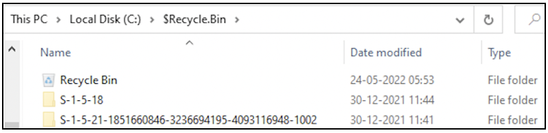

Within Command Prompt, you can use _dir_ command to view the content of this folder. _/a_ switch is used to display hidden contents, as the entire `C:\$Recycle.Bin` folder is a hidden one. From the following screenshot, you can find the two SIDs seen in the previous screenshot, along with the SID of the currently logged in user (underlined in red). The Recycle Bin of the currently logged in user had the name _Recycle Bin_ in the GUI.

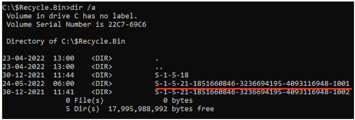

To map the SIDs to the users on the system, `wmic useraccount get name,sid` command can be used. If the last field in the SID has a value in the 1000s range, it corresponds to users. If the last field in the SID has a value in the 500s range, it corresponds to system accounts. You can see that there is no mapping for user 1002. This means that this user existed on the system previously and currently their user account does not exist. The last field in the SID is referred to as Relative Identifier (RID).

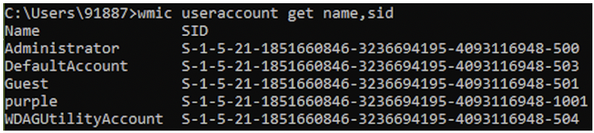

Now we know where the Recycle Bin for the currently logged in user exists on the file system.

## Recycle Bin Forensics in Action

Now let us delete some files and see how they exist on the Recycle Bin. Currently the bin is empty.

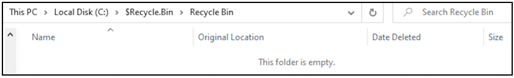

Two files _stars.png_ and _tent.png_ have been deleted on 24th May 2022 at 06:00 hours and 05:59 hours respectively. For each deleted file, you can view the deletion timestamp (relevant to the time zone the device is operating in), the absolute path (full path) of the file, the file size & type and the latest time at which it was modified. It appears that both files had existed on the Desktop.

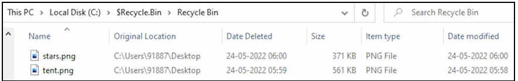

Note how the _Recycle Bin_ folder of the current user has its modification time updated to reflect the addition of a file to the bin. Here _stars.png_ was deleted last at 06:00 hours and added to the bin.

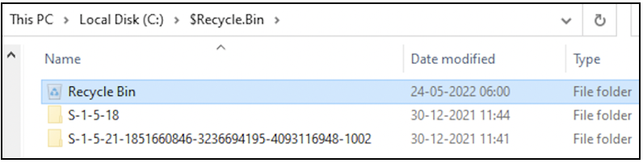

On the current machine, the Recycle Bin displays the deleted files _stars.png_ and _tent.png_. Typically, a forensic investigator would copy the contents of the Recycle Bin to another machine for analysis. When the contents of the bin are copied and viewed on another computer, the contents would appear as seen in the following screenshot. You can see that there are four PNG files, the names of two files start with $I and the names of two files start with $R. There is also a _desktop.ini_ file. Whenever a file is deleted, two files are created $I and $R with the same extension as the deleted file. The $R file holds the actual file content. The $I file holds metadata about the deletion activity (deletion timestamp, absolute path of the file, file name, file size) that was initially observed in the GUI.

Note the file names of the two files underlined in the following screenshot. After $I and $R, both files have the same sequence of characters. Likewise, note the names of the other pair of $I and $R files – they have the same sequence of characters too. Six characters will be added to a pair of $I and $R files, making the filename have a total of 8 characters. _desktop.ini_ has some information about folder configuration.

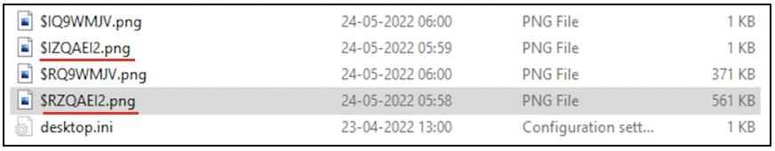

Even without copying the contents of the Recycle Bin to another computer, you can view the bunch of $I and $R files present via the Command Prompt.

The $I files can be parsed using tools like *$I Parse\*. The input to this tool will be the entire Recycle Bin acquired from a target computer.

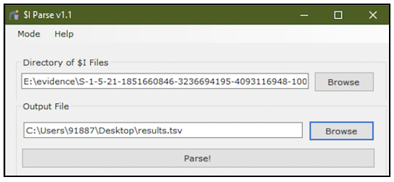

You can find metadata about the deletion operation for each file in the Recycle Bin. Timestamps are displayed in UTC. Time correction may need to be performed.

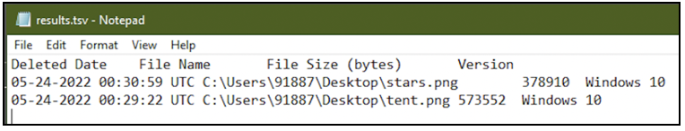

The $R files can be directly viewed using relevant applications. The PNG file has been viewed using _Photos_ app.

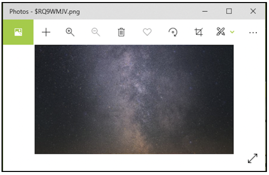

When you acquire the Recycle Bin from a target computer, parse the entire folder using tools like $I parse to find out the deletion timestamps and absolute path of the file.

## Can the Recycle Bin be configured?

The Recycle Bin can be configured through it’s _Properties_ menu (by right clicking it).

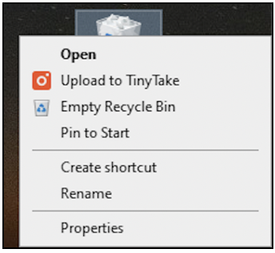

The maximum size of files that the bin can hold can be specified (selected in the following screenshot). In some cases, the Recycle Bin can be configured to not hold deleted files (second unselected option in the following screenshot). In that case, more advanced forensic techniques must be used to recover files. If you encounter a scenario where the Recycle Bin does not have any files, either it has been emptied or it has been configured to not store deleted files.

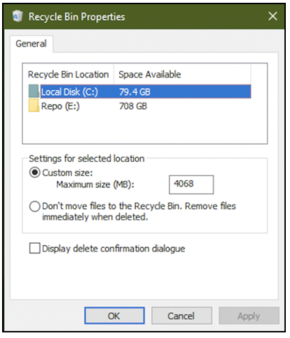

## A Note on Recycle Bin modification time

Currently there are two files in the Recycle bin of the currently logged in user. The latest addition to the bin was at 06:00 hours, as seen by the modification time in the following screenshot.

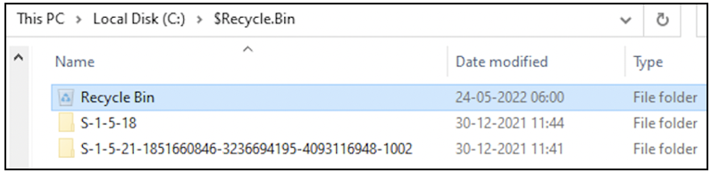

If one file has been restored,

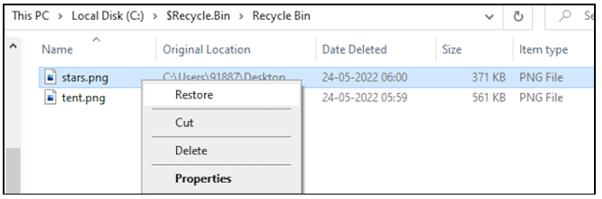

Then only one file remains in the bin, that was deleted at 05:59 hours.

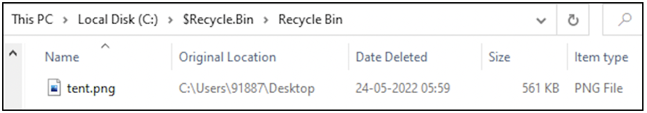

Since the bin has been modified, its modification time is updated to when the file was restored.

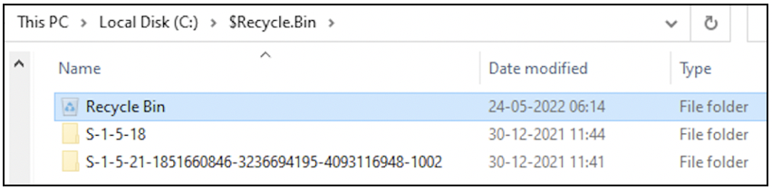

Now let us delete the other file too.

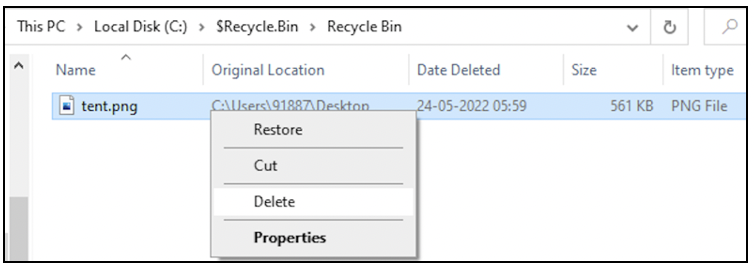

The bin is empty now.

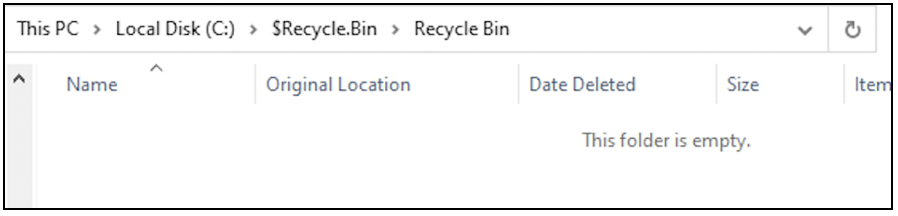

Now the modification time of the bin is updated to when the deletion was performed.

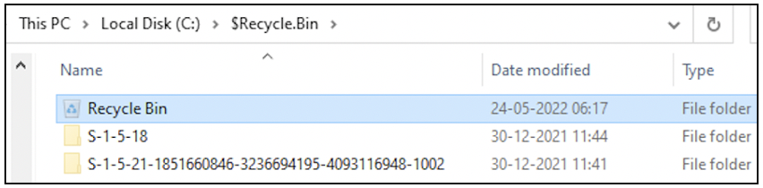

Here is a tip: when investigating the Recycle Bin, if the modification time of the bin does not align with the latest deletion timestamp; then a file that was previously deleted has been restored or deleted from the system forever. (When a file is deleted from the bin, it is deleted forever). If a suspect tries to hide their activity by deleting files from the Recycle bin, then the modification time of the bin will be a giveaway of their actions. Remember to have an eye on the modification time of the Recycle bin for all users on the system.

You can find files within the Recycle Bin folder, when the _delete_ key is used or when the user right clicks a file and selects _Delete_. When the _Shift_ key is held down while using the _delete_ key to delete a file, then the file is stored in a hidden system file and is not accessible to any user. In that case, advanced forensic techniques must be used to recover the deleted file.

## Project Idea

Here is a project idea for you:

- Choose about 10 files for deletion
- Delete the selected files on your computer
- View the contents of the Recycle Bin on the GUI
- View the contents of the Recycle Bin on the command line
- Copy the contents of the Recycle Bin to a USB drive and view the contents
- Use _$I Parse_ tool to parse all the $I files within the Recycle bin
- Use _Rifiuti2.exe_ to parse the contents of the Recycle Bin folder. Observe how the output is displayed
- Try to build a timeline corresponding to deletion of all the 10 files
- Are you able to identify the absolute path of the deleted files?

> **Want to learn practical Digital Forensics and Incident Response skills? Enrol in [MDFIR - Certified DFIR Specialist](https://www.mosse-institute.com/certifications/mdfir-certified-dfir-specialist.html).**
