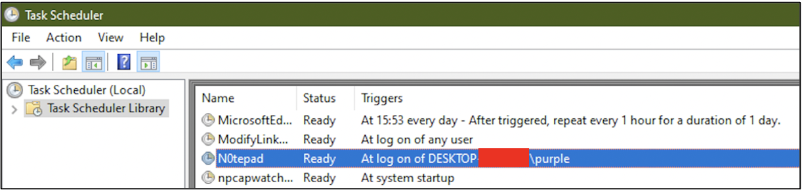
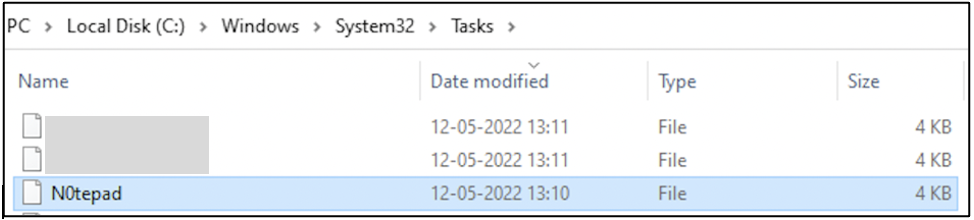
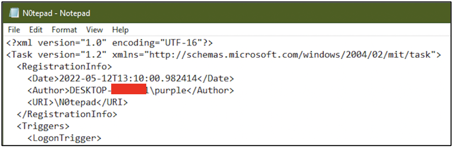
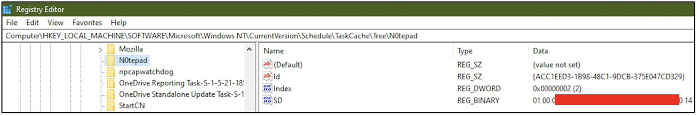
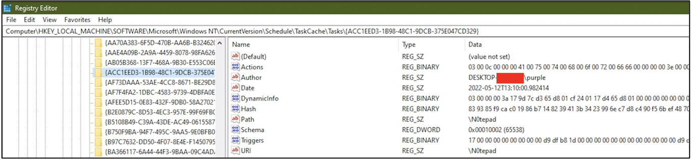
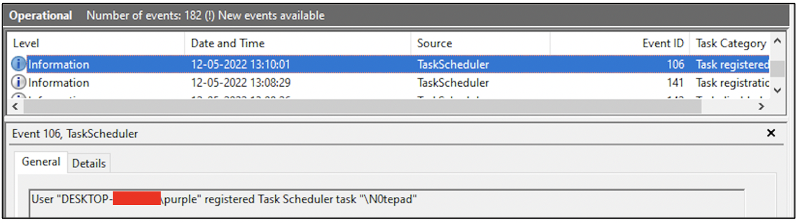
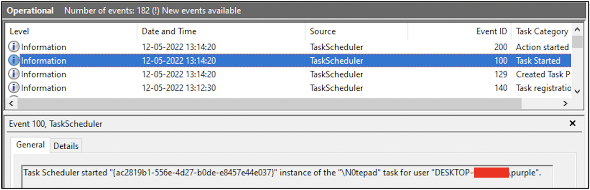
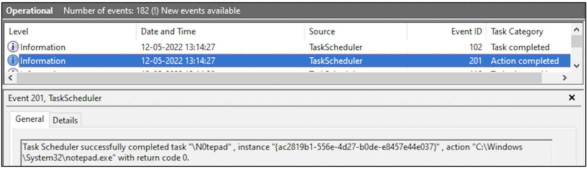

:orphan:
(windows-scheduled-tasks-in-digital-forensics)=

# Windows Scheduled Tasks in Digital Forensics

On Windows systems it is possible to schedule tasks to be completed at specific times or when specified triggers occur. This blog post discusses the significance of scheduled tasks in digital forensics.

## A quick primer to scheduled tasks on Windows

It is very easy to create a scheduled task using _Task Scheduler_ GUI application or command-line tools like _at_ and _schtasks.exe_.

The following screenshot shows that a task titled _N0tepad_ has been scheduled to execute when user _purple_ logs in to the computer. The action to take place when this task runs is: run _Notepad_ application.

Within _C:\Windows\System32\Tasks_ folder, there is an XML file with the same name as the scheduled task containing the task definition.

The following screenshot shows a snippet of the task definition of _N0tepad_ in XML format. This task has been configured to run _Notepad.exe_ whenever user _purple_ logs in to the computer.

Within the registry, at _HKLM\SOFTWARE\Microsoft\Windows NT\CurrentVersion\Schedule\TaskCache\Tree\task_name_, some values specific to the task can be seen. _Id_ refers to a unique sequence of characters assigned to the task. _SD_ refers to the Security Descriptor of the user who is authorized to run this task. A Security Descriptor defines a unique identifier and access control information for a user.

Within the registry, at _HKLM\SOFTWARE\Microsoft\Windows NT\CurrentVersion\Schedule\TaskCache\Tasks\Id_, the _Id_ described above, some more information about the scheduled task can be found, like:

- The date at which it was created
- User/application that created the task
- Information about the triggers and actions are stored in hex format, which can be interpreted easily using hex editor applications

Within Windows Event Logs, there is a special area where logs specific to scheduled tasks can be stored. However, for this logging to occur, it must first be enabled by the user.

Within the _Event Viewer_ application, navigate to _Applications and Services Logs\Microsoft\Windows\Task-Scheduler\Operational_ and enable this log. Now events related to scheduled tasks will be logged.

The following screenshot shows the event that was logged when the scheduled task _N0tepad_ was created by user _purple_.

The following screenshot shows the event that was recorded when user _purple_ logged in to the system. The task _N0tepad_ has begun its execution.

The following screenshot shows that the task _N0tepad_ has completion its execution successfully.

## Why are scheduled tasks important for digital forensics?

Scheduled tasks were created for users and system administrators to automate important tasks. However, cyber adversaries now utilize scheduled tasks for post-exploitation activities like running malicious scripts and programs.

When a Windows computer is suspected of being victim to foul play, it would be a good idea to look within the list of scheduled tasks for any abnormal entries.

Artifacts relevant to scheduled tasks can be found in three locations:

1. Within the registry
2. Task definition stored in XML format at _C:\Windows\System32\Tasks_ folder
3. If event logging has been enabled for scheduled tasks, it is possible to find events signifying task creation, task execution and task completion.

It is good cybersecurity hygiene for defenders and system administrators to enable event logging for scheduled tasks. Here is why:

Even if the definition information for a scheduled task is deleted from the registry and _C:\Windows\System32\Tasks_ folder, it is still possible for the scheduled task to run as intended until the system is rebooted again. Recently, new malware has been identified that makes use of this technique.

Even if information about the scheduled task in the registry or within the _C:_ drive has been deleted, if the scheduled task still runs, then information about its activity would be stored within the event logs. This is why it is recommended to enable event logging for scheduled tasks.

## Project Idea

Here is a project idea for you:

1. Enable event logging for scheduled tasks through the _Event Viewer_ application
2. Create a scheduled task using _Task Scheduler_ application or using the command line
3. Define your own action and trigger for the task
4. Ensure that the scheduled task executes at least one time
5. Head over to the event logs and see if you can identify events relevant to your scheduled task
6. Document your findings

Windows operating system has many sources of valuable logs for digital forensics. Enabling the collection of logs and knowing how to acquire them is a valuable skill.

> **Want to learn practical Digital Forensics and Incident Response skills? Enrol in [MCSI's MDFIR - Certified DFIR Specialist](https://www.mosse-institute.com/certifications/mdfir-certified-dfir-specialist.html)**
