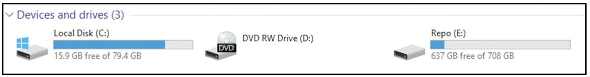
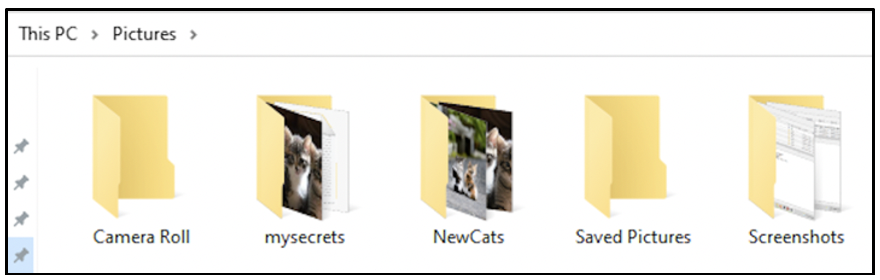
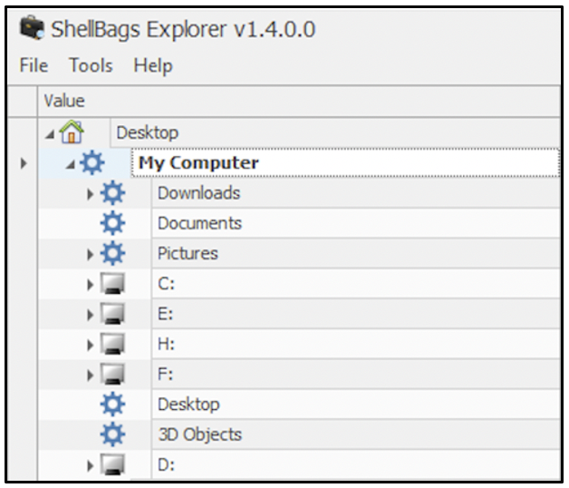
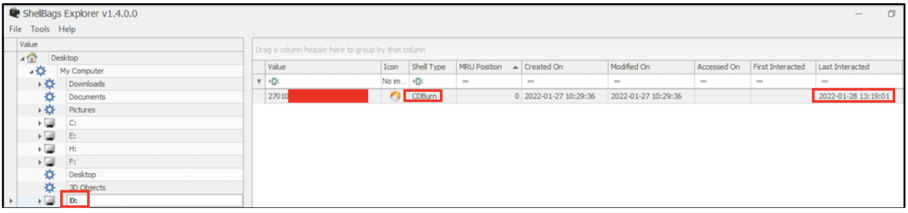
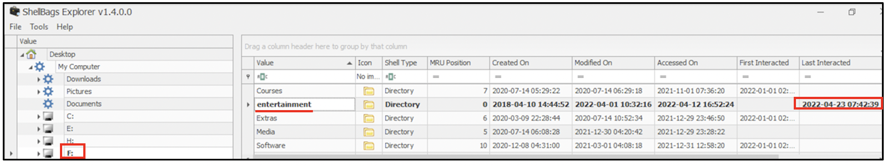
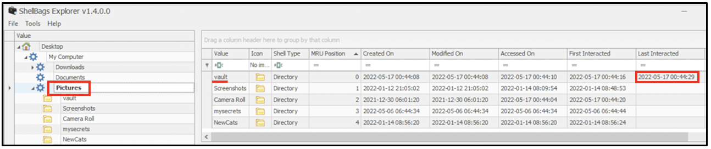
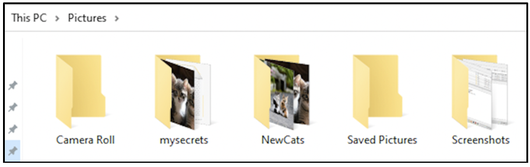
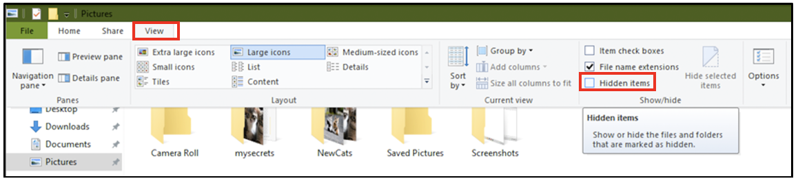
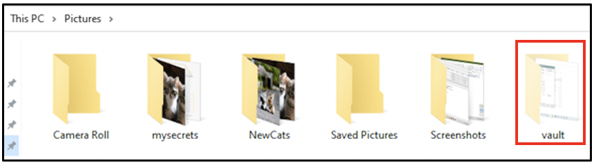

:orphan:
(windows-shellbags-in-digital-forensics)=

# Windows Shellbags in Digital Forensics

Every time you use your Windows computer, you are navigating through many files and folders. When you open a folder for viewing, you may also modify its viewing preferences. Windows stores information about it. Think of it as a logging system for folder access. These logs are stored in Shellbags. This blog post will introduce you to Windows Shellbags and highlight their significance for digital forensics.

## Why does Windows use Shellbags?

Windows uses shellbags to store information about user preferences. When a folder is accessed, you may modify its display settings – say from ‘Large icons’ to ‘Small icons’. Information about this settings change is stored in shellbags. When you close that folder and re-open it, its contents would be displayed as ‘Small icons’; as indicated by user preferences in shellbags.

Shellbags also retain information about folders that had previously existed on a system and were accessed. When removable media like a USB drive or an external hard disk are connected to your computer, you would open a folder to view the contents of the external media. This activity qualifies as folder access, which is logged by shellbags.

If your computer had connected to a network share, accessing that network share folder causes an entry to be made within the shellbags.

## Where are the shellbags stored?

Shellbags data is stored across two user registry hives on your computer _NTUSER.DAT_ and _UsrClass.dat_. Shellbag information from these two hives can be accessed within the registry hive HKEY*CURRENT_USER at \_HKCU\Software\Classes*.

There are various commercial and free forensic tools available that can acquire the shellbags from a target computer and process it.

## A quick demo

The following two folder operations were performed on a computer, across few days.

1. The computer had two storage drives _C:_ and _E:_ attached to it and one disc Drive _D:_, represented in the following screenshot. A CD was inserted into the disc drive and its contents were viewed. Some USB drives were also inserted, their contents were mounted in _H:_ and _F:_ and viewed.

2. Within _Pictures_ folder, a new folder called _Vault_ was created, some pictures were copied into it. Then it was marked as a hidden folder.

Let us see if we can find evidence of these two folder operations within Shellbags. Tools like _ShellBags Explorer_, _Windows Shellbag Parser_, etc. can be used to view the contents of shellbags.

Shellbags can be viewed directly on a live machine or the registry hive can be acquired for processing on another computer. In this demo, the shellbags were viewed directly on the live system using _ShellBags Explorer_.

Within the _My Computer_ drop down, you can see entries for all the drives that had been mounted on the system. You can also track recent changes to _Downloads_, _Documents_ and _Pictures_ folders here.

The shellbag entries relevant to _D:_ drive show that the contents of a CD had been viewed last on 28th January 2022 at 13:19 hours.

The shellbag entries relevant to _F:_ shows the contents of the USB drive that had been mounted on this computer. Folder _entertainment_ had been accessed on 23rd April 2022 at 07:42 hours.

The shellbag entries relevant to _Pictures_ folder shows that a directory called _vault_ had been used last on 17th May 2022 at 00:44 hours. This was the folder that was created and marked as hidden.

Currently, within _Pictures_ folder, it appears that _vault_ does not exist.

When folder viewing options are modified to view hidden files,

the hidden _vault_ folder can be seen.

Although there is no information within shellbags that _vault_ was hidden, having a last interacted entry for _vault_ indicates that the folder exists and is hidden or had existed and is now deleted.

In addition to recording changes to folders, shellbags also record information about zip files that had existed on the computer.

## What is the significance of shellbags for digital forensics?

When a Windows computer has been compromised, investigators attempt to process stored logs for any trace of malicious activity. Shellbags can be another useful source to identify:

- folders that has been accessed recently
- external media (hard disks, USB disks, CD) that had been used and accessed
- zip files that had been accessed

## Project Idea

Here is a project idea for you to experiment with shellbags:

- Create a folder called _secret_ within your _Documents_ folder and place some files in it
- Delete the folder _secret_
- Use tools to parse the shellbags on your computer and see if you can identify entries relevant to the deletion of folder _secret_

Some forensic tools display timestamps relevant to GMT. You may need to perform time correction according to the timezone your device is operating in.

## A final word on shellbags

This blog post intended to provide a quick overview about the forensic importance of shellbags. As a next step, you can research about the various keys and sub-keys within the registry that store information about shellbags. One to start with can be: ‘What is the significance of the key _BagMRU_?’

:::{seealso}
Want to learn practical Digital Forensics and Incident Response skills? Enrol in [MDFIR - Certified DFIR Specialist](https://www.mosse-institute.com/certifications/mdfir-certified-dfir-specialist.html)
:::
