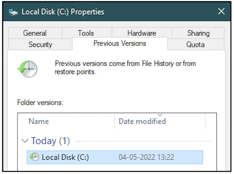

:orphan:
(windows-volume-shadow-copies-in-digital-forensics)=
# Windows Volume Shadow Copies in Digital Forensics
‘Say cheese!’ You just took a photograph with all your friends. When you look at the photograph days or years later, you will remember the good memories you had when the picture was taken. Windows has a similar ‘photograph’ feature that helps you capture the state of files on the system, called *Volume Shadow Copy Service*. This blog post will walk you through the importance of volume shadow copies for digital forensics.

## What are Windows Volume Shadow Copies?

Windows uses New Technology File System (NTFS) to store all the system files and user files. One feature of NTFS is Volume Snapshot Service or Volume Shadow Copy Service abbreviated as VSS, that is used to take a ‘photograph’ or ‘snapshot’ or ‘shadow copy’ of the current state of files on the hard disk. 

VSS has undergone changes and improvement across various versions of Windows. This feature was introduced along with Windows XP. Initially, only shadow copies of system files (contents of *C:* drive) could be taken. With the latest version of VSS, shadow copies of system files and user files can be taken.

## How are Shadow Copies created?

Shadow copies can be created automatically or manually. They are created automatically when a new program has been installed on a computer or before a Windows Update. They can be created manually by creating a ‘Restore Point’. 

Navigate to the *C:* drive on your computer. Open the *Properties* dialog box. In the *Previous Versions* tab, you can see if your drive has any shadow copies created for it already. From the following screenshot, we can see that one shadow copy exists for the C: drive.

## How are Shadow Copies useful for forensics?

Let’s say you are investigating a Windows machine. You are looking for a specific PDF document. Currently, you are not able to find it within any folder. You suspect that the user may have deleted it. You cannot find it in the Recycle Bin.

If the system had the Volume Shadow Copy Service enabled and a previous shadow copy exists on the system, it is possible that a copy of the PDF document exists in the shadow copy. From shadow copies, it is possible to retrieve files that have since been deleted by the user. 

However, it is not always possible to retrieve deleted files from shadow copies. This is because VSS does not record file-level changes, rather it records block-level changes to the file system. This means that minor small changes to the file-system will be accumulated and then recorded as a shadow copy. If information about file deletion is not recorded yet in a shadow copy, then it is not possible to retrieve the deleted file.

Still, there is a good chance that you may gain access to critical evidence in shadow copies. There are many forensic tools available that can process shadow copies.

## Project Idea

Here is a small project idea for you.

1. Create a file with some secret content, say in your *E:* drive
2. Create a shadow copy of *E:* drive on your computer
3. Delete the secret file
4. Identify forensic tools that can process shadow copies
5. See if you can retrieve the deleted file from the shadow copy

> **Want to learn practical Digital Forensics and Incident Response skills? Enrol in [MCSI's MDFIR - Certified DFIR Specialist Certification Programme](https://www.mosse-institute.com/certifications/mdfir-certified-dfir-specialist.html).**