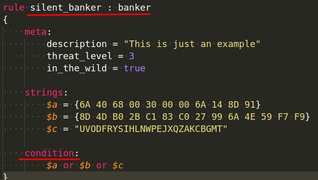
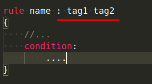
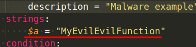
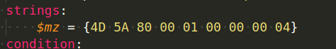
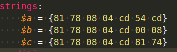
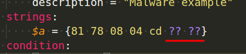
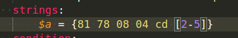
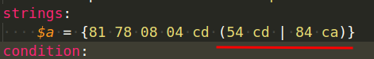
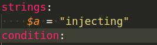
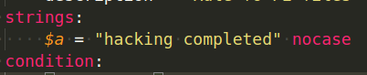

:orphan:
(yara-a-powerful-malware-analysis-tool-for-detecting-ioc-s-part-1)=

# YARA: A powerful Malware Analysis Tool for Detecting IOC's - Part 1

There has been a lot of research done over the years to increase detection skills, and researchers have managed to come up with a lot of novel detection methods and methodologies. Each one has its own set of advantages and disadvantages. As a result, we can't claim that we'll choose one over the other when it comes to detection. Some are better suited to one task but not to another. In many businesses, a hybrid solution will be implemented in this manner.

A detection technique can range from a tool that searches for files with a specific hash value or keyword, which is known as _"signature based detection"_, to a tool that searches for files based on statistics and patterns, which is known as _"anomaly based detection."_

The main detection mechanisms out there are:

- Signature based
- Anomaly and Behavioral based (e.g. UEBA)
- Reputation based
- Hybrid based (a mix of more than one)

We won't go into all of the detection mechanisms because that's beyond the scope of this series of posts, but if we had to recommend one reference, it would be the book [_Applied Network Security Monitoring_](https://www.amazon.com/Applied-Network-Security-Monitoring-Collection/dp/0124172083).

The signature-based detection approach will be covered in this blog post series. This series of articles delves into the many sorts of signatures and the information that may be utilized to assist you in creating your own signatures.

We'll utilize the _YARA_ program to create our own signatures and classify and detect malware samples using signatures.

Before we go into the many sorts of signatures and YARA-specific material, it's important to realize that no matter which detection technique you employ, if you don't provide useful information, it's a weak indicator. The better data you feed your detection method, the better the outcomes will be. If you don't remember this rule, you'll wind up with a lot of false-positives.

## What is an IOC?

Any forensic data discovered on a network or host that could be used to identify an intrusion with a high degree of certainty.

For example file hash or an IP address.

As you may recall from our lesson on hashes. Hashes are unique to files (with the exception of the uncommon "collisions"), and each file has its own hash value.

This means that if we look for malware with a specific hash on a host and discover it, we have confirmation that this host is also infected with the same malware.

**Types of IOCs: Network based indicators**

Network based indicators are:

- IP Addresses (IPv4 or IPv6)
- URLs
- Domain Names
- Source Email Addresses
- Email Message Objects
- Email Attachments
- X-Originating and X-Forwarding IP Addresses
- X509 Certificate Hashes
  etc.

**Types of IOCs: Host base indicators**

For example:

- File Names
- File Hashes
- File Locations (paths on host)
- DLLs used
- Registry Keys
- Process Handle or Mutex Name

_Why did we make the transition from signatures and detection techniques to IOCs? What are IOCs and how do they relate to signatures and all of this?_

**Answer: A signature could include one or more IOCs.**

A signature might be written to look for malware based on its hash value. That seems nice, but what if the hash value of the sample differs from the one you're looking for? Your signature, on the other hand, has been bypassed.

As a result, signatures with a lot of granularity are the best. We may identify that sample if we use just one IOC, but if we combine many IOCs and run the search, we will have a higher likelihood of detection and fewer false positives.

## YARA

[YARA](https://github.com/VirusTotal/yara) is a tool used to help malware researchers identify and classify malware samples.

Thanks to VirusTotal's _Victor Alvarez_ for creating YARA and providing the community with a fantastic tool for finding and classifying malware samples.

YARA is a language of describing the malware you are looking at/for. Each definition is referred to as a rule. Each rule consists of a set of strings and a Boolean expression, which determines its logic:

```
rule silent_banker : banker
{
    meta:
        description = "This is just an example"
        threat_level = 3
        in_the_wild = true

    strings:
        $a = {6A 40 68 00 30 00 00 6A 14 8D 91}
        $b = {8D 4D B0 2B C1 83 C0 27 99 6A 4E 59 F7 F9}
        $c = "UVODFRYSIHLNWPEJXQZAKCBGMT"

    condition:
        $a or $b or $c
}
```

Another example:

```
rule pe_file
{
    meta:
        description = "Rule fo PE-files"
    strings:
        $mz = "{4d 5a}"
        $mz1 = "MZ"
    condition:
        ($mz at 0x00) or ($mz1 at 0)
}
```

When using the YARA tool with this rule, we see that "malware" is detected:

```bash
yara pe_file.yar <path>
```


Our rule managed to find and classify two files as the same malware (or belong to the same family).

Don't be concerned if you didn't comprehend the prior rule or how it was applied.

The next paragraphs will take you from "zero to hero" in terms of designing YARA rules to categorize or identify malware, and some examples will show you how to put that knowledge into practice.

## YARA Core Syntax

Every rule starts with the word `rule` on the first line, followed by a name, when the rule matches, the `name` will be printed. Every rule has a `condition` that is implemented according to the logic defined in the rule:



The rule's name must always start with a character, but it can also include alphanumeric characters and an underscore. The names of the rules are case sensitive.

You can tag your rules as you write them so that you can filter your output later based on the tags you create:



Both the `meta` and `strings` sections we saw previously, in the example rule, are optional.

You can write YARA rules in any text editor, and the file extension `.yar` is the standard.

A file called `malware.yar` is an example.

The _metadata_ section is used to add metadata about your
rule.

There are a variety of reasons why you would wish to use this area, but we presume you already know how useful it is. Identifiers defined in the metadata section are not usable in the condition section later. These are solely for adding metadata to your rule; if you use them, you'll get an error.

If your rules are looking for the existence of strings, you'll also need this section: `strings`.

The identifier might be a single character or a phrase, but it must begin with the dollar symbol `$.` An example of a string is as follows:



We can only specify string values using characters, but we can search for bytes in hexadecimal representation using the strings section:



Another time you might want to use hexadecimal in the strings section is if you want to look for a certain sequence of bytes with four bytes that change from one sample to the next. The question mark `?` might be used to ignore the value of those bytes and accept any value as long as the rest of the sequence follows our rule. For example, let's say we want to search for a string that always has two bytes changing in each sample, therefore we cannot search for an exact match.

Here is an example of three different variations:

.

We can now benefit from the question mark sign to accept any value for last two bytes as shown below:



But wait, what if I want to look for a string that varies in length from `2` to `5 bytes` in some cases?
What changes do we need to make to our regulation to accommodate this? The good news is that YARA allows you to use wildcards.

The matching is achieved by using bracket signs to define
the length of characters we can disregard the value of:



What if we're looking for very particular values in those bytes? Assume that the only options are `54 cd` or `84 ca`:

The string to match this occurrence is defined like this:



We saw a string description for the portable executable (`PE`) files in prior examples, but we never utilized it to check the offset. Now that we know that `PE` files always begin with `MZ` at offset zero, we can create a rule to look for them:


We could also search for ASCII strings in the samples:



No case-sensitive:



Also, you can use _regular expressions_ with YARA.
Understanding regex is beyond the scope of this blog article.

## Conclusion

In this post, we looked at the principles of IOCs and how to use a YARA rules to do static malware analysis.
In the [next part of this series](yara-a-powerful-malware-analysis-tool-for-detecting-ioc-s-part-2), we'll look at how to evaluate malware by using conditions and modules in YARA.

**Resources:**

- [YARA](https://github.com/VirusTotal/yara)
- [awesome yara](https://github.com/VirusTotal/yara)
- [Practical Malware Analysis Book](https://www.nostarch.com/malware)

> **Would you like to learn practical malware analysis techniques? Then register for our online course! [MRE - Certified Reverse Engineer](https://www.mosse-institute.com/certifications/mre-certified-reverse-engineer.html).**
