:orphan:
(yara-a-powerful-malware-analysis-tool-for-detecting-ioc-s-part-2)=

# YARA: A powerful Malware Analysis Tool for Detecting IOC's - Part 2

YARA rules are important for identifying and classifying malware. They can be used to create IOCs (Indicators of Compromise) that can be used to detect and respond to malware incidents. YARA rules can also be used to generate signatures that can be used by antivirus and IDS/IPS systems to detect and block malware. In a [previous article](yara-a-powerful-malware-analysis-tool-for-detecting-ioc-s-part-1) we discussed YARA rules, syntax and IOC's. Let's continue our acquaintance with YARA rules!

## Conditions

Conditions are used in all computer languages to determine whether a Boolean expression is true or false. The same is true for YARA rules, where conditions are used to check for certain expressions. In the `conditions` section, conditions are defined.

Conditions can use one of the following operators:

- Boolean: `and, or, not`
- Relational: `>, <, >=, <=, ==, .=`
- Arithmetic: `+, -, *, \, %`
- Bitwise: `&, |, <<, >>, ~, ^`

Examples using conditions:

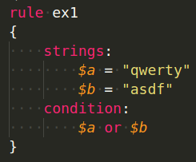

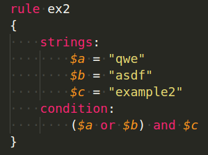

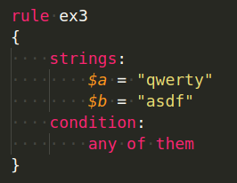

Sometimes, you might want to write an expression to check for a string or value at a certain offset, then this
could be done by using the `at` operator in the `conditions` section:

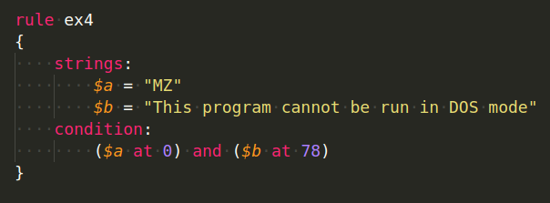

You might also wish to know whether a particular string was discovered in the file, but the search is based on how many times the string was found in the sample. The _arithmetic operators_ could be used to do this:

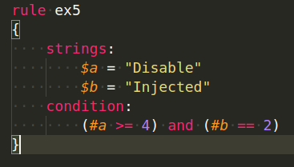

What if you don't know where the string you're looking for is located? What if you want to find a string within a range of bytes? This might also be done with the `in` operator:

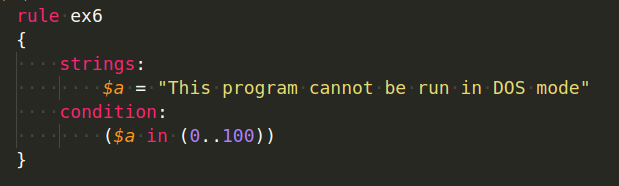

Another example is searching based on file size:

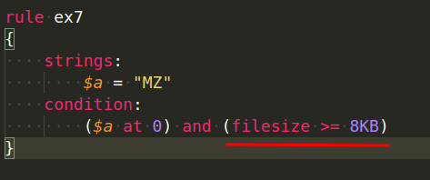

If you're going to run searches based on file sizes, bear in mind that you shouldn't use this condition when scanning files in memory because the file in memory won't be the same exact size as the file on disk, thus using the filesize directive on memory images is a terrible idea.

Before going on to expanding YARA rules using modules, I wanted to give one last example: _searching for data at a given file offset or virtual address_. This is dependent on whether you're scanning a file or a process in memory.

Functions available for reading are:

```cpp
// 8-bit signed little-endian
int8(<offset or virtual address>)
// 8-bit unsigned little endian
uint8(<offset or virtual address>)

// 16-bit signed little-endian
int16(<offset or virtual address>)
// 8-bit unsigned little endian
uint16(<offset or virtual address>)

// 32-bit signed little-endian
int32(<offset or virtual address>)
// 32-bit unsigned little endian
uint32(<offset or virtual address>)

// 8-bit signed big-endian
int8be(<offset or virtual address>)
// 8-bit unsigned big-endian
uint8be(<offset or virtual address>)

// 16-bit signed big-endian
int16be(<offset or virtual address>)
// 16-bit unsigned big-endian
uint16be(<offset or virtual address>)

// 32-bit signed big-endian
int32be(<offset or virtual address>)
// 32-bit unsigned big-endian
uint32be(<offset or virtual address>)
```

Use `uint16(0)` to check for the `2-bytes` at the beginning which are for the `MZ` signature, as seen in the example below:

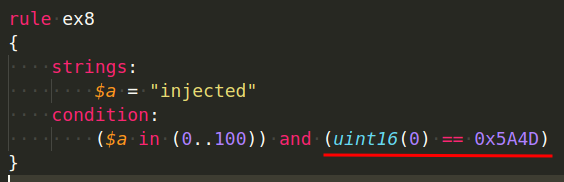

## Modules

YARA can be extended with the modules described below:

- **PE** - Creating more fine-grained rules for PE file by using attributes and features of the PE file format.
- **ELF** - Similar to PE, but for creating rules for `ELF` files.
- **Cuckoo** - Creating rules based on behavioral data obtained from the [_Cuckoo sandbox_](https://cuckoosandbox.org/).
- **Magic** - Using the file CLI output to create rules to detect file types (`Unix`-only).
- **Hash** - Calculate hashes for parts of your files and create signatures based on them.
- **Math** - Calculate certain values for parts of your files and create signatures based on them.
- **dotnet** - This module allows you to create more fine-grained rules for `.NET` files by using attributes and features of the `.NET` file format.
- **time** - The Time module allows you to use temporal conditions in your YARA rules.
- **Console** - Allows you to log information during condition execution.

> Although there are presently only nine modules available for use with YARA, this does not exclude you from creating your own and extending YARA with it.

In this article, we will only be covering the modules _PE_, _Hash_ and _Math_. For others, please check the documentation found below.

### PE module

First of all, in order to use a module in your rules, you need to import the module, as seen in the example below:

```python
import "pe"
```

If you're familiar with Python, you'll see that it's fairly similar, with the exception that double quotes are required.

Let's start with the PE module, and our first example will be checking a file's PE timestamp, which is found at offset `0xF0`. Even though it is no longer accurate and most likely does not represent the time when the PE file was created/modified, it is still a useful example to display:

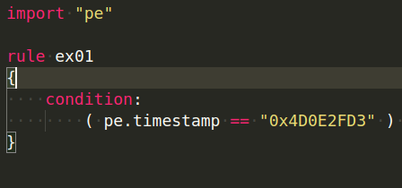

Next example, we are checking for a specific string at
the Entry Point of the PE file:

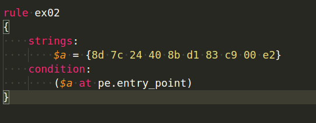

What if you wanted to see how many sections there were?
Very simple, as shown in the example below:

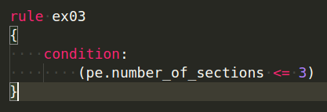

What if you wanted to check for a specific function being
called from a DLL? Well check the example below then:

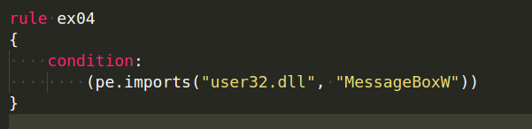

Check if the file is 32-bit or 64-bit using the machine type field as seen in the example:

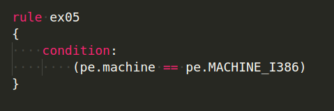

In the example below we are checking in the version information of the PE file if it belongs to `Mosse Security` or not:

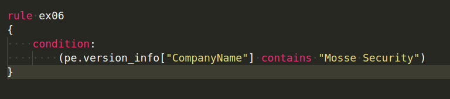

Let's say you want to see if UPX was used to pack a section.
As shown in the sample below, we can scan all of the sections:

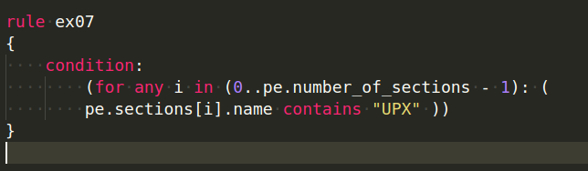

## Hash module

The hash module extends YARA’s capabilities to be able to scan for files with a specific hash value. We can use this module to calculate hashes using `MD5`, `SHA1`, and `SHA256`.

The functions for calculating the hash use the following syntax:

```cpp
hash.hashFunction(offset, size)
```

The `HashFunction` can be `md5`, `sha1`, or `sha256` once again.

They can now be used to generate hashes for strings in addition to calculating the hash value of a part of a file. The following is the syntax:

```cpp
hash.md5(string)
```

The same is true for `sha1` and `sha256`, which take a string and return the hash value for it:

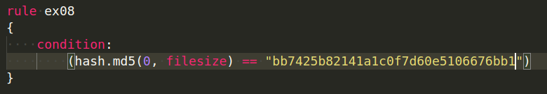

Notes:

1. Don't forget to import the `hash` module in your code.
2. The entire file is considered from offset zero to filesize.
3. The hashes you're looking for must be in lowercase.
4. Multiple hash functions can be used in the same rule.
   You are not limited to using just one hash function.

For example, you can use the same rule to look for `MD5` and `SHA1`:

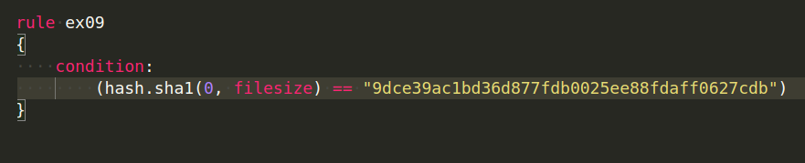

## Math module

The `Math` module will be the final module discussed, and it can be used to extend YARA by computing values from specific sections of the file.

Remember to include the following module:

```python
import "math"
```

Calculating the entropy of a file or a partition of a file is one of the most prevalent uses of the math module. As previously stated, the entropy can help you determine how much unpredictability is included in a file.

Obfuscation is occasionally used as a signal.

Remember that the entropy range is `0` to `8`. The closer to `8`, the more randomness there is (higher entropy). The syntax is comparable to that of the hash module.

Could be used to calculate a portion as seen in the following code:

```cpp
math.entropy(offset, size)
```

or used to calculate the entropy for a string:

```cpp
math.entropy(string)
```

In our example below, we are searching for files that have
an entropy higher than `7.0`:

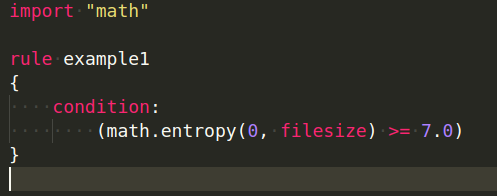

There are other math functions that we recommend you
check out. They could be found in the [link](https://yara.readthedocs.io/en/v3.7.0/modules/math.html)

Try to figure out the purpose:

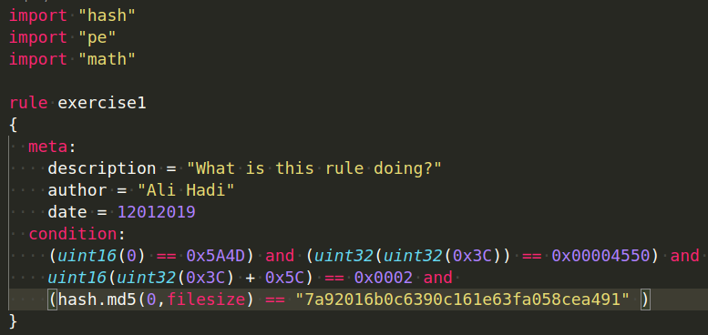

- `(uint16(0) == 0x5A4D)` -> checking for the MZ Signature
- `(uint32(uint32(0x3C)) == 0x00004550)` -> checking for the PE Signature
- `(uint16(uint32(0x3C)+0x5C) == 0x0002)` -> checking if PE is a GUI
- `(hash.md5(0,filesize) == "7a92016b0c6390c161e63fa058cea491")` -> checking for file hash that is equal to the one given

Below are some great articles written by Florian Roth that we recommend you read:

[Yara Performance Guidelines](https://gist.github.com/Neo23x0/e3d4e316d7441d9143c7)

> **Would you like to learn practical malware analysis techniques? Then register for our online course! [MRE - Certified Reverse Engineer](https://www.mosse-institute.com/certifications/mre-certified-reverse-engineer.html).**
