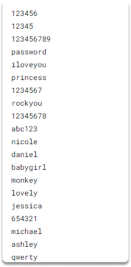
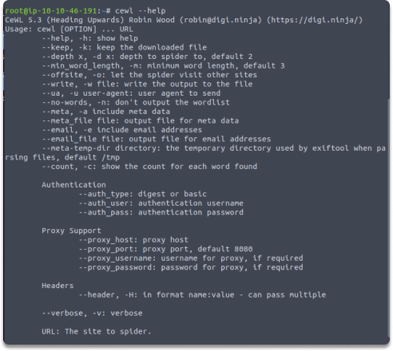
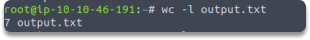
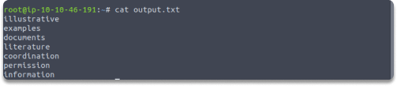

:orphan:
(a-brief-introduction-to-wordlists-and-how-to-generate-them-with-cewl)=

# A Brief Introduction to Wordlists and how to Generate them with CeWL

In this blog post, we will make an introduction to wordlists and make a quick custom word generation exercise with CeWL.

## Introduction

Developers and IT experts may sometimes create passwords for their businesses and online web applications that are relevant to the organizational mission, purpose, goods, and services. Custom Word List Generator (CeWL) is a password generator service that allows penetration testers to undertake web crawling/spidering of a website and collect terms to produce a custom wordlist from which to perform dictionary-based password attacks against a system or file.

## Why do we require customized wordlists?

In some circumstances, creating a customized wordlist may be a good option. If we think that you will frequently re-use the wordlist, creating one will save computing power over utilizing a mangling algorithm. Also maybe, you are thinking that John the Ripper's syntax is too complicated for you.

Creating a unique wordlist might be very beneficial if you have a lot of knowledge about your target business. Popular terms, buzzwords, and even private details from employees can be added to make a dictionary that has a better probability of breaking passwords than a basic lexicon or generic wordlist.

## Different wordlist options

Let's look at some alternative wordlists.

`SecLists` is a centralized repository for several sorts of lists used during assessments. Account names, passwords, URL addresses, private data structures, fuzzing payloads, shells, and many other list kinds are available.

`wordlistctl` is a script that retrieves, installs, updates, and searches wordlist catalogs from websites that provide wordlists, with over 6300 wordlists accessible.

`rockyou.txt`: The rockyou.txt file in Kali Linux contains all 14,341,564 unique passwords.

Here is an image of `rockyou.txt` file. You can also download it from github.

### Quick Excercise: Creating a custom wordlist with CeWL

_Time Estimated: 5 minutes_

Use the following command to generate a custom wordlist from a target website's CeWL:

`cewl example.com -m 8 -w output.txt`

This command will generate a custom wordlist containing words with a minimum length of 8 characters using keywords from the website example.com. It will then output the results in the `output.txt` file, within your current working directory.

You can also see the contents of this file with the following commands:

## Conclusion

Running CeWL against the sites of a target organization can assist develop a customized word list, but always remember the good habit of adding keywords yourself depending on your own efforts.

> **Looking to expand your knowledge of penetration testing? Check out our online course, [MPT - Certified Penetration Tester](https://www.mosse-institute.com/certifications/mpt-certified-penetration-tester.html)**
