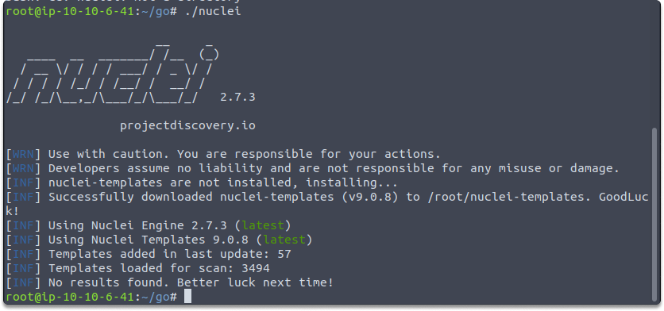
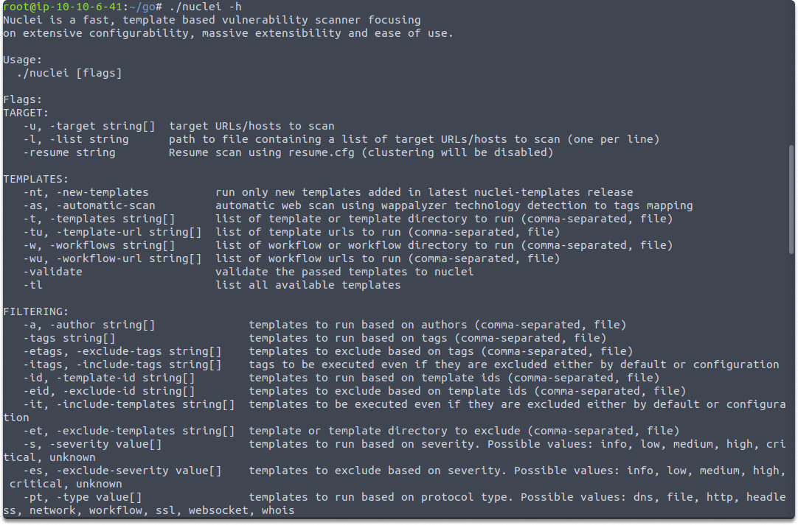
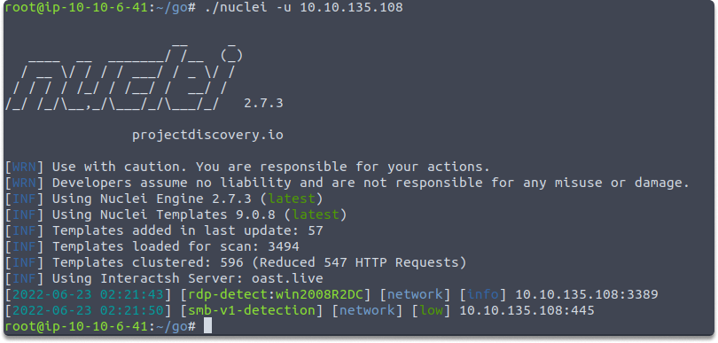
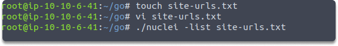
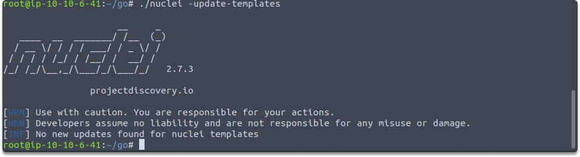

:orphan:
(a-general-overview-of-nuclei-command-line)=

# A General Overview of Nuclei Command Line

In this blog post, we are going to make a quick introduction to Nuclei and it's powerful components. First let's start with explaining why we need automated tools in scanning.

## How do automated vulnerability scanners work?

Automated scanners are designed to make our life simpler by enabling us to scan a specific online resource or system against weaknesses in just a few simple steps. It enables a company to assess its systems for complicated flaws. This makes these scanners a better alternative for businesses with limited resources to engage pen-testers. A vast majority of automated vulnerability scanners include a collection of Common Vulnerabilities and Exposures.

For testing purposes, you may also utilize a current template or design a custom one. In certain circumstances, automated scanners categorize those vulnerabilities to enable users to assess if the systems meet a specific regulatory need such as PCI DSS, or HIPAA.

## What is Nuclei?

Project Discovery's Nuclei is a strong community-powered automatic vulnerability scanner. Nuclei can help you with the great majority of security tests, including vulnerability scanning, reconnaissance, and penetration testing. You only need to define a target and choose or build a template. Queries may be sent across your destinations using a variety of protocols such as HTTP, DNS, TCP, FILE, and SSL.

### What are Nuclei templates?

Nuclei use template files to determine how queries are received and handled. YAML is used to create these templates. As you may be aware, YAML features a basic and easy-to-read format, as demonstrated in a recent blog article. Nuclei use the advantages of YAML to efficiently specify the process flow. However, we won't delve into template specifics in this blog article because it will be a fast introduction to Nuclei.

## Nuclei template repository

Nuclei provides a repository devoted to storing several sorts of vulnerability templates. While you may create your own YAML templates, you can use this fantastic library created by various security practitioners for your initial automated scans.

Now that we've covered the fundamentals of Nuclei, let's have a look at how it works on our terminal.

### An introduction to Nuclei command-line

You have various options to download and get started with Nuclei. For demonstration purposes, we are going to run the binary after downloading the zip file from https://github.com/projectdiscovery/nuclei/releases site. Simply type nuclei on your terminal.

`nuclei`

Run the following command to display your available options and switches:

`nuclei -h`

Lastly, let’s have a look at how to start an automated scan with default templates in Nuclei. We have set up a vulnerable machine to target with the following command:

`nuclei -u 10.10.135.108`

As we can see in the illustration, Nuclei loaded 3494 templates and even reduced them 547 HTTP Requests and displayed it’s findings.

We can also create a file and scan multiple hosts with the following commands:

`touch site-urls.txt`

`vi site-urls.txt`

`nuclei -list site-urls.txt`

Although Nuclei supports template updates regularly, you can still use the update them with the following command:

`nuclei -update-templates`

### Task: Practice Nuclei help

_Time estimated: 5 minutes_

- Download Nuclei and verify the installation by running the following command: `nuclei`.

- Run the appropriate command to display your options and switches.

- Which switch we can use to scan a specific host as an alternative to `-u`
  Hint: `-******`

## Conclusion

Congratulations! Upon completion of this blog post, you have gained a general understanding of the powerful automated security tool Nuclei.

:::{seealso}
Looking to expand your knowledge of penetration testing? Check out our online course, [MPT - Certified Penetration Tester](https://www.mosse-institute.com/certifications/mpt-certified-penetration-tester.html)
:::
