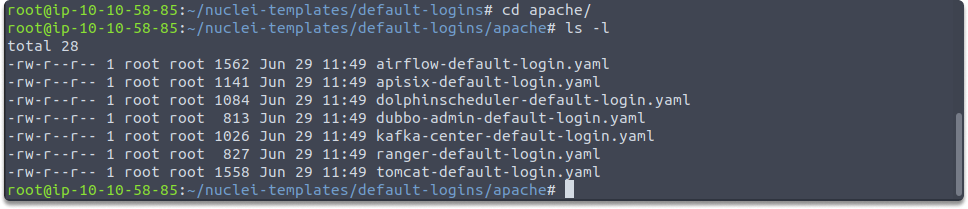

:orphan:
(an-overview-of-nuclei-default-templates)=

# An Overview of Nuclei Default Templates

You can model various security checks with Nuclei. In today’s blog post we are going to take a quick look at default templates in Nuclei.

## Displaying Nuclei templates

Let’s start by running Nuclei and changing the directory to where Nuclei templates are installed with the following commands:

`./nuclei`

`cd nuclei-templates`

`ls -l`

`nuclei-templates` folder is automatically created when you install the tool.
Now you can see that we have listed default templates. Let’s run the following command to change the directory to default-logins

`cd default-logins/`

`cd apache/`

`ls -l`

You can see that there are various directories to explore, let’s take a look at a basic one more in-depth. Change directory to `cves` by running the following commands:

`cd nuclei-templates/`

`cd cves/`
`cd 2018/ `

## Analysis of `CVE-2018-12613.yaml`

Now we are going to take a look at the CVE-2018-12613 repository. Run the following command:

We can see that this is a YAML file. The first thing we see is a unique ID and some information about the vulnerability in the info section. Then we can see a GET request. This is the section we define what we want Nuclei to check. As we have learned before YAML works by indentation. After the request is sent, then it will be checked if it matches the conditions defined in matchers section.
`nuclei-templates/cves/2018/CVE-2018-12613.yaml` .

It’s going to look for a specific regex in the body section and if it finds it will also look at the status code. If the status code is also 200, then we can understand that the target is vulnerable. However, you need to be cautious with Nuclei. It can generate a lot of noise and so many requests.

### Rate-controlling in Nuclei

Nuclei have numerous rate limit control mechanisms for a variety of factors, such as the number of templates to run, the number of networks to inspect for each template, and the number of requests / for each second. In some cases, you may need to set a maximum number of requests per second. We can address this with the help of the following command:

`rate-limit` or `-rl`

An example would be:

`./nuclei -target 10.10.228.42 -rate-limit 5`

Thanks to rate-limiting we make sure that our target doesn't go down.

### Using the CLI to set a custom header

You may also have to specify the HTTP traffic you generate; you may do so by using a config file and a CLI flag by adding an extra parameter. The following parameters help you tag your traffic better utilizing Nuclei CLI:

`-header 'User-Agent: XStartupCompany’`

`-H ‘ProgramX: Elya’`

## Final Words

Upon completion of this blog page, now you have learned how to access Nuclei templates, what these `YAML` files look like, and how to read a template. Now you are ready to create your own templates.

> **Looking to expand your knowledge of penetration testing? Check out our online course, [MPT - Certified Penetration Tester](https://www.mosse-institute.com/certifications/mpt-certified-penetration-tester.html)**
