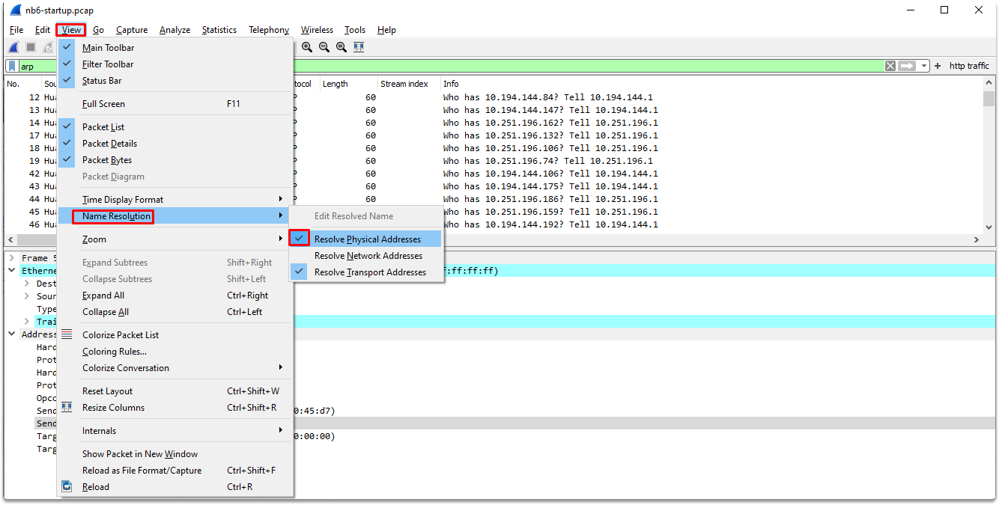
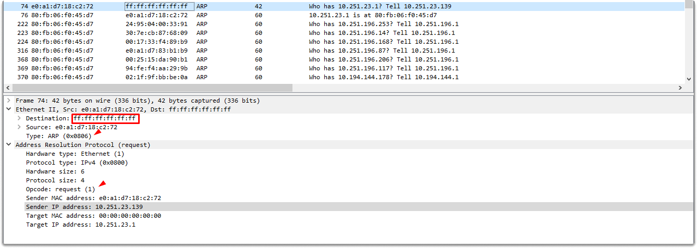
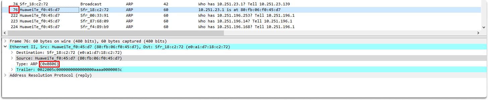
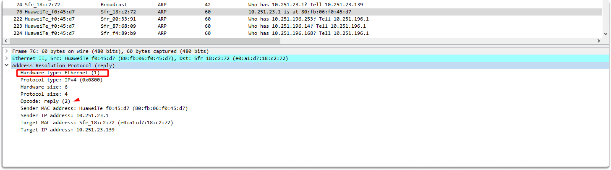

:orphan:
(analyzing-arp-responses-in-wireshark)=

# Analyzing ARP Responses in Wireshark

In a [previous blog post](identifying-arp-request-packets-with-wireshark), we made an introduction to powerful traffic analyzer Wireshark by identifying what an ARP request looks like. In this blog post, we will continue network traffic analysis by taking a look at what an ARP reply traffic looks like in Wireshark. Upon completion of this blog page, you will enhance your network analysis skills as a security operations analyst.

## Analyzing ARP responses

In the previous article, as you might remember, we analyzed packet 58, which was a broadcast ARP request packet from HuaweiTe_f0:45:d7. Now let’s start analyzing an ARP response by typing arp in the filter pane as a first step.

### Mac address name resolution vs Raw values

As you can see name resolution is enabled for Mac addresses (rather than the byte value or source and destination addresses). Let’s convert mac addresses to raw values. Click on the View menu name resolution and resolve physical addresses as shown in the example.

Now we have raw mac addresses also in the destination field. Let’s switch back to resolve the physical address and take a look at packets 74 and 76.

Packet 74 is a broadcast ARP request message which simply says these:

- I have an IP datagram for 0.251.23.1 but I don’t know its mac address. Yes, I have also looked at my arp cache, but couldn’t find any binding. We are all on the same local area network. This means that I can send a broadcast arp request message and I know that all the nodes connected to the same network will get my message. You can see in my broadcast ARP request that I encoded an IP address. I know that only the host with a 0.251.23.1 IP address will reply back to my broadcast, and that’s what I want. My layer 3 address is 10.251.23.139, just waiting for your data link-layer address.

### Finding the ARP reply

Let’s try to find the response to this request. We can see that in packet 76, HuaweiTe_f0:45:d7 identified its IP address in the Target Protocol Address section of the broadcast and created an ARP reply frame.

The response packet follows the request as shown in the image.

Let’s expand the Ethernet II section. As we can see in the screenshot, this is an ARP packet and we can verify that by its hex value. We can also see that the destination mac address is e0:a1:d7:18:c2:72 (which is the ARP requester).

Let’s expand the Address Resolution Protocol (reply) section to learn more.

The first thing we are going to look at is its opcode, which is 2 in ARP responses. We can also see that the sender MAC address is HuaweiTe_f0:45:d7 (80:fb:06:f0:45:d7). This ARP response is sent to the requester which is Sfr_18:c2:72 via unicast ethernet frame.

Wireshark simply interprets this whole information in the info section by simply saying these:

- Hey requester, I looked at my arp cache and found binding for the IP address you specified which is 10.251.23.1. And it has the following mac address: 80:fb:06:f0:45:d7.

In this ARP reply message, the target host which is HuaweiTe_f0:45:d7 simply say these:

- Sfr_18:c2:72, I got your broadcast message and processed the frame you created. I saw that it was for me and I created an ARP reply frame. I also updated my cache for future communications. My layer 3 address is 10.251.23.1 and here is my mac address: 80:fb:06:f0:45:d7. Now both of us have all the required details for hardware-to-hardware direct communication.

What happens from now on is that, Sfr_18:c2:72 will also process the ARP reply frame and updates its cache.

We will deep dive into the ARP cache in future penetration testing blog pages and learn how to manipulate it but until then keep in mind that you can see the current data link layer and layer 3 address bindings with the following command:

`arp -a`

## Conclusion

Upon completion of this blog page and hopefully also [Identifying ARP Request Packets with Wireshark](https://blog.mosse-institute.com/2022/06/23/identifying-arp-request-packets-wth-wireshark.html) now you know how does a normal ARP request and response traffic look like in Wireshark.

> **Do you want to get practical skills to work in cybersecurity or advance your career? Enrol in [MCSI Bootcamps](https://www.mosse-institute.com/bootcamps.html)!**
