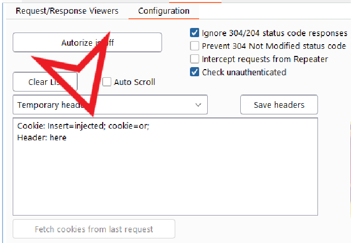
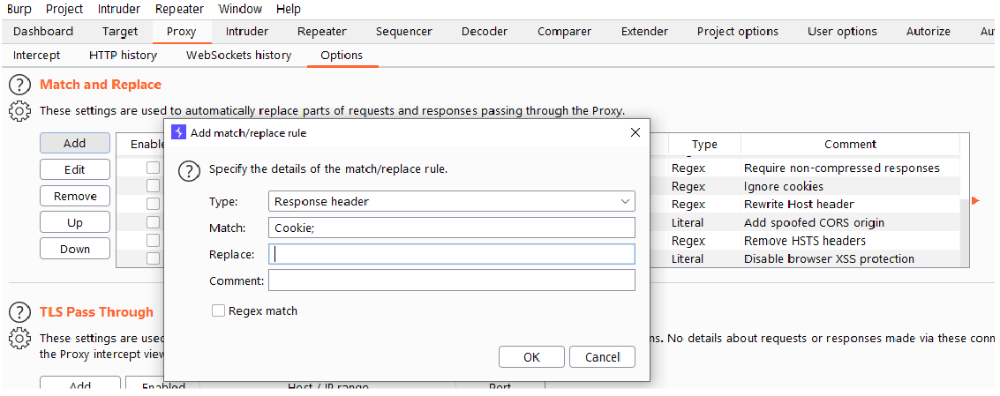

:orphan:
(broken-access-control-bac)=

# Broken Access Control (BAC)

Users cannot behave beyond their specified privileges because access control imposes numerous policies. Hence, unauthorized disclosure of information, alteration or loss of any or all data, or executing a corporate activity outside of the user's bounds are all common outcomes of failures and may lead to <b> Broken Access Control</b>.

## Examples of BAC

- We have an admin and a normal user. We can test the admin settings with the low privilege user

- We have a normal user and a prospect user. The prospect user can not execute all the functions because he only has a trial account

- We have two users of the same authorization level: Refer to the IDOR article.

## The impact of a BAC vulnerability

The repercussions of a defective access control mechanism can be catastrophic when one vulnerability is detected. An attacker could exploit this vulnerability to edit or remove content, execute unlawful operations, and sometimes even take control over the website governance in addition to watching illicit content.

## Attack Strategy

### General Tips

Make sure you have the right target

- Need users with different access levels for vertical privilege escalation
- Need multiple accounts if testing for IDOR (See IDOR article)
- No static websites

Make a mindmap of the target

- Note down functionalities
- Note down privilege levels
- Indicate whether the privilege level has the ability to perform the desired functions.

### Manual Testing

We have numerous solutions for manually testing for BAC:

Javascript and the browser's developer console are two of the most powerful tools we have. The functions in JavaScript files will be executable. The simple disablement of UI components is a typical method used by programmers to safeguard their apps. The javascript methods may still be usable as a result of this. If this is the situation, we have a BAC on our palms. For instance, if we can't navigate on the UI component to access the invoices but can run the javascript function that displays the invoice data, we have a BAC.

We also spoke about the browser's console window since it includes a tab named "console" that allows you to run any javascript and features Intellisense. This implies that if you input any letter, the console will instantly search for and show any javascript files that include that letter. We can however run our javascript functions and get the results right away, in addition to the above-mentioned benefits.

We may also take a much more straightforward approach by logging in as a high privilege user, navigating to features that a low privileged user cannot access, copying the URL, logging in as the low privilege user, and pasting the URL into the browser. However, there are a few drawbacks of this method: we must be aware of the degrees of permission supported by the software, as well as what those categories of users can and cannot access.

The last method we may employ is automation, which would be the first part of preparing for the next phase.

We may also use a person-in-the-middle proxy like burp suite to transmit the whole of our queries which low-privileged users cannot perform to our repeater and alter the authorization technique (such as JWT or session cookies, see IDOR). In the meantime, the aim is to check for broken access control concerns, not to steal the authorization headers of low-privilege users.

### Semi-automated Testing

We may use the free burp suite add-on authorize.

Copy our cookie, after logging in as a low-privilege user, and paste it in authorize. Then log in as an administrator, and activate authorize

We can also use the Auto Repeater with the Match and Replace, two other extensions of Burpsuite.

## Preventing Broken Access Control

Access control is only efficient if it is implemented through a trustworthy server-side code or sometimes a serverless Application Programming Interface, in which the access control audit or metadata cannot be modified by the intruder. By convention, access to features should be restricted. Authentication techniques based on roles and ACLs or what we call access control lists should be implemented.

> **Looking to expand your knowledge of penetration testing? Check out our online course, [MPT - Certified Penetration Tester](https://www.mosse-institute.com/certifications/mpt-certified-penetration-tester.html). In this course, you'll learn about the different aspects of penetration testing and how to put them into practice.**
