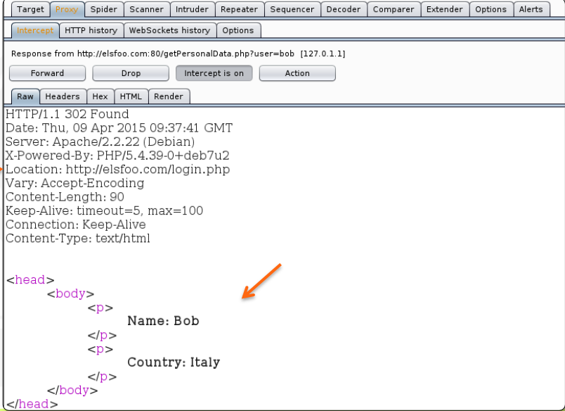

:orphan:
(bypassing-authorization-in-web-applications)=
# Bypassing Authorization in Web Applications
 
In this article we will discuss flaws that let an attacker get around permission. Take attention of the word `"bypass"`. In contrast to the another tricks like password enumeration, we won't search for a password; instead, we'll attempt to access protected content without logging in...

A web application often offers a set of anonymous or public pages that are open to everyone and a set of protected pages that are only accessible by authorized users (usually after a login).
If the site developer does not properly set controls on each protected page, even unauthorized users may be able to access these resources.

Any browser can be used to access the resource via a link, and an attacker can alter any parameter value that points directly to another object. This kind of vulnerability is known as [Insecure Direct Object References - A4](https://www.owasp.org/index.php/Top_10_2013-A4-) according to **OWASP**.
This kind of vulnerability is primarily the result of carelessness on the part of the system engineer or web developer.
It is widely used in unique web apps due to its characteristics.

Consider logging into your government portal to manage your most recent tax documents.
You can obtain your report by visiting this URL:

```html
http://taxes-are-beautiful.yeah/report.php?id=123
```

Although you should not be permitted to access other reports, you are permitted to view this report. There is an **Insecure Direct Object reference** if you can view reports from other users by altering the id parameter.
When a web application fails to correctly validate the associated input parameters, a reference becomes unsafe (thus the name of the vulnerability), allowing an attacker to modify them to access other objects.

A prologue is required on every protected page. A piece of code in a server-side scripting language makes up the prologue (**PHP, ASP NET, JAVA**).
In order to prevent unauthorized access, the prologue checks to see if users are authorized to access the resource and, if they are not, stops script execution.

An extremely basic **PHP** prologue sample is shown below:
```php
<?
  session_start();
  if (!isset($_SESSION['logged'])) {
      header("Location: http://www.foobar.com/login");
      die();
      }
?>
...
// Protected Content
...
```

It is important not to confuse OWASP A4 with [Missing Function Level Access Control (A7)](https://www.owasp.org/index.php/Top_10_2013-A7-), also called as [Failure to Restrict URL Access (A8)](https://www.owasp.org/index.php/Top_10_2010-A8-) in the OWASP Top 10 -2010.
Here, an attacker can alter a parameter or the URL to gain access to privileged features (not an object like in the previous examples).
Attackers can typically bruteforce URLs or guess links to find vulnerable pages.

A URL for a website's management interface or the back-end XML of a web application could serve as an illustration of this: 
```html
http://mysite.site/admin/manage.php
```

The issue is present if a non-admin user may view the page.
A parameter that specifies the functions to call is another illustration. If there is no way to control who can call for particular functions, there is a vulnerability.

Web designers will occasionally employ preset parameters to grant users access to protected pages. An attacker could use this flaw to get access to the protected data if no further safeguards are offered.
Keep in mind that anything coming from **GET, POST, FILE, REQUEST, COOKIE**, and other areas of **SERVER** would be considered user-controllable input in **PHP**.

Let's say the website http://www.elsfoo.com/login contains a web application that requests credentials.

- http://www.elsfoo.com/index.php?auth=TRUE
The user will be routed to the page if they enter the correct credentials (containing protected contents)

- http://www.elsfoo.com/index.php?auth=FALSE
The user will be forwarded to the page if they enter invalid or no credentials (containing public contents)

The web application uses the fixed parameter **auth** to differentiate between authenticated and unauthenticated sessions.
The argument **auth** can be quickly changed to **TRUE** by an attacker. The attacker will be able to access protected data since the web application only looks at the auth parameter when determining whether a request is authenticated or not.

This type of logical error is not well-documented, although it is discovered more frequently than you might think.
It is typical practice for users to be forcibly redirected to a web page that requests correct credentials or merely displays an error notice when they attempt to access a resource that is intended to be protected.

A web application that wants to redirect a user to a new page includes this header (containing the new page location) into the **HTTP** response. This feature is often accomplished using the **Location HTTP header**.

Let's utilize the following scenario to make things clear. On the following page, the user asks access to protected content:
http://www.elsfoo.com/getPersonalData.php?user=bob
The user will get an HTTP response with the following header because they are not authenticated:
```
Location: http://www.elsfoo.com/login
```
In order to avoid displaying the content body of the initial request, the user's browser will examine the header of the **HTTP** response before making a new **GET** request to the new page **(login)**.

The web browser, after receiving the **HTTP** response with a Location header, will not process the rest of the **HTTP** response and will issue a new HTTP **GET** request to the new page (/login).

If the HTTP response has a **Location** header, the web browser won't display the body of the response, but it doesn't mean the body doesn't exist!
Because the developer neglected to end the server script execution immediately following the redirect, it may have actually been received by the client and may have contained information that a rogue user or penetration tester could utilize.

The image below illustrates a proxy intercepting an **HTTP** response in a web application that uses redirects to safeguard data.
The user is asking to retrieve Bob's personal information from the protected page **getPersonalData.php.**
In this instance, a user who was not authenticated made the request.

The web browser automatically redirects us to **login.php.**
We will not see the contents of the page.



The browser will utilize the Location header to make a new `HTTP` request and ignore the old one's body. In the case of non-authenticated queries, the site developer has not omitted the body of the `HTTP` response.
Therefore, utilizing a proxy allows an attacker to readily view protected items; in this instance, user Bob's personal information was accessed.

When utilizing a redirect to secure content, a web developer must remember to end script execution after the redirect statement has been included.
Various methods can be used to do this depending on the scripting language **(PHP, ASP NET, Java, etc.)**.

An illustration created in PHP. Keep in mind the **die()** function.

```php
<?
session_start();
if (!isset($_SESSION['logged'])) {
header("Location: http://www.foobar.com/login");
die(); }
?>
...
// Protected Content ...
...
```
The `Location` header will be included to the HTTP response by the instruction header, and the `die()` instruction will put an end to the script's operation.

The web server will send an `HTTP response` with the Location header but no body.

Web applications typically control authentication by giving each authenticated session a special token.
After a successful login, the server will send the user a session token, also known as a **session identifier**, which the user must re-sent in subsequent HTTP requests (embedded in the URL or in the cookie).

If a **session identifier**'s generation is predictable, an attacker can quickly guess it. The following qualities must be included in a strong session identifier:
- time-limited; 
- completely arbitrary and unexpected; 
- only good for one session

Without the victim's credentials, an attacker can spoof the victim's session if he discovers a legitimate session identifier.

A method of attacking a database is **SQL injection**. If a web application relies on a database for authentication and user input is not properly sanitized, an attacker may use this to obtain access to the system without authorization by pretending to be another user.
If you wish to get around login and authorization processes, keep this in mind.

Two other flaws that can be utilized to get around a web application's security authorisation methods are **local file inclusion** and **path traversal**.
Usually, they occur when a web application seeking to obtain a file from the file system does not correctly sanitize the user input.

In the upcoming articles, we will examine these two vulnerabilities in detail. Let's say for the moment that:
- **Path traversal**: enables hackers to access data not meant for public access on the web server
- A path traversal technique called "**Local File Inclusion**" enables attackers to read or run the code of a local file (local to the web server)

## References

[Google's 2-step verification](https://support.google.com/accounts/answer)

[Seclist](https://github.com/danielmiessler/SecLists)

[bAdmin](http://web.archive.org/web/20150328012647/http)

[SkullSecurity](https://wiki.skullsecurity.org/Passwords)

[Bypass CAPTCHA with OCR engine](http://www.debasish.in/2012/01/bypass-)

[Virtual sweatshops versus capt](http://boingboing.net/2012/01/09/virtual-)

:::{seealso}
Looking to expand your knowledge of penetration testing? Check out our online course, [MPT - Certified Penetration Tester](https://www.mosse-institute.com/certifications/mpt-certified-penetration-tester.html)
:::