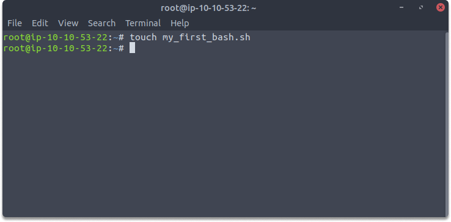
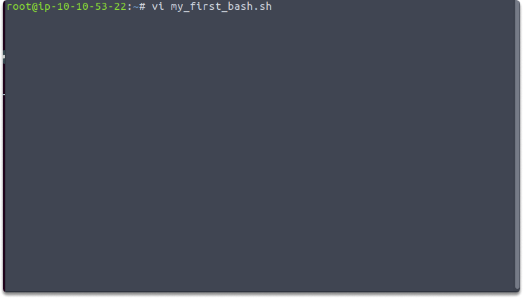
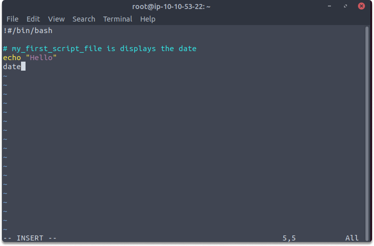
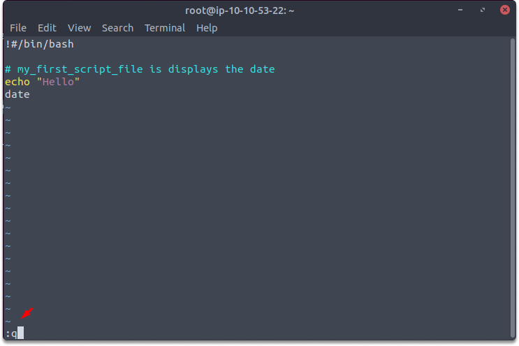
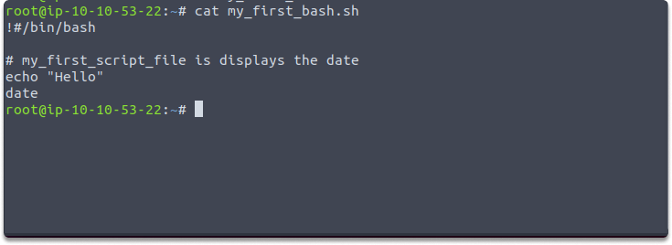
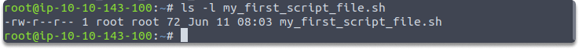
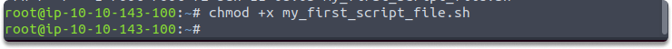
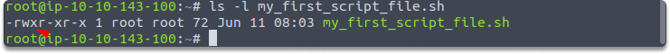
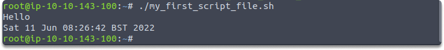

:orphan:
(creating-and-executing-linux-shell-scripts)=

# Creating and Executing Linux Shell Scripts

Previously we discussed the concept of [Linux shell scripts](linux-shell-scripts-automate-your-command-line-tasks). In this article we are going to write our first script, take a look at how to execute it, plus discuss the importance of `shebang` and function of `chmod` command.

Let's start!

## How to start a script file

A script starts with `#!/bin/bash`. When you write a shell script file, you must specify the absolute path of the shell interpreter of the current shell in the first line in the text file. The line should start with the

- exclamation mark (!)
- hash sign (#),
- and the full path of interpreter of bash, which is ` /bin/bash`.

**Comments**

You can also type `#` when you want to write a comment. Typically the hash symbol (#) is used for a comment line. When a line begins with a hash sign (#), the interpreter discards the whole line content up to the next NEWLINE character. Then you can start entering commands on each line or on the same line separated with semicolons (;). However, a shell likes commands to be written on separate lines.

## Simple Excercise

**Create your first script file with vi editor**

_Time estimated: 5 minutes_

Let’s create our first script.

**Step 1**: First, we will create an empty file. This command will create an empty file named `my_first_script_file.sh`:

`$ touch my_first_script_file`



**Step 2**: Let’s open this file with an editor. We will use `vi` to open and edit our file. Run this command on your terminal:

`$ vi my_first_script_file`



**Step 3**: Type `i` and specify the absolute path as we learned by typing this:

```
#!/bin/bash
# my_first_script_file.sh displays the date
```

**Step 4**: Copy and paste these into your editor.

```
$ echo “Hello”
date
```



**Step 5**: Lastly, let’s save and exit from the vi editor with the following steps:
Press `esc` key
Type `:q`



**Step 6**: You can display the contents of your first script by the following command:
`$ cat my_first_script_file.sh`



## Shebang's Mission (#!)

On a system, Linux provides a variety of shell and script files. Every shell programming language has its own distinct command structure. There must be a way to connect with Linux in order to define which interpreter should be used to run a script. As a result, at the head of each script, a special line has to be used to indicate the chosen interpreter program which reads the remaining lines of that script file.

The special line must begin with #!, a notion known colloquially as shebang, which stands for sharp (#) and bang(!). The statement tells the user that the program bash can be located in the `/ bin `directory and designates bash as the interpreter for the specified script file.

This diagram also shows the shebang line for various shells:

| Shebang Line Notation | Description                  |
| --------------------- | ---------------------------- |
| n                     |
| --------------------- | ---------------------------- |
| #!/bin/sh             | The Bourne shell             |
| #!/bin/csh            | The C-shell                  |
| #!/bin/tcs            | The enhanced C-shell         |
| #!/bin/zsh            | The Z-shell                  |
| #!/bin/ksh            | The Korn shell               |
| #!/bin/sed            | The stream editor            |
| #!/usr/bin/awk        | The awk programming language |

Think back to the exercise, we created our first script file and displayed its contents with a cat but didn’t run yet. Now we are taking a step further and converting our script into an executable file.

**unmask**

When you make a new file, the system 'umask' number defines the file's default file access setting. If the system 'umask' value is set to 022, the system is only allowed to read and write. As a result, the 'my first script file.sh' shell script file only has read and write permission as you see in the illustration, not execute permission. Don’t worry we will cover this in detail in further articles but for now, this information is sufficient to understand why we couldn’t run our script in the previous article and take a further step to make it an executable. Let us test this using the following command:

`$ ls -l my_first_script_file.sh`



Are you ready to make it an executable? Then, let’s meet with `chmod`

## What is chmod?

Chmod adds or removes permission along with the existing files. To make any file executable, use the chmod command with the +x option:

`$ chmod +x my_first_script_file.sh`



Let’s verify the permissions again:

`$ ls -l my_first_script_file.sh`



As you can see we have added the execute permission which is indicated as `x`.

Once you give the execute permission, its color change and it is executable by its owner, group members, and others on the system. Let’s run our first script with the following command:
First type `./` which indicates the current directory. And follow by the name of your file as in the example:

`$ ./my_first_script_file.sh`




Congratulations! You have made your script file an executable.

**Challenge**

Here is a challenge for you.
Can you remove execute permission from your script file and try to run it again?

_Hint: +/-_
