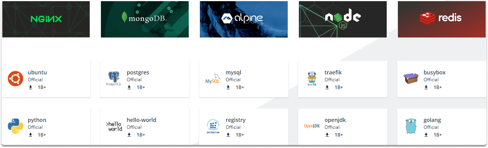

:orphan:
(docker-the-easy-way-to-manage-containers-and-run-code-in-any-configuration)=

# Docker: the Easy Way to Manage Containers and Run Code in Any Configuration

Docker, in it's most simple terms, is a container management framework. Docker allows software developers to bundle programs into containers, which are predefined binary units that include all of the operating system (OS) libraries and external dependencies needed to run the code in any configuration.

## Appliances of Docker

Docker is largely used for application development, delivery, and operation. Docker allows you to separate apps from your underlying infrastructure, allowing for faster software delivery than ever before. Docker makes infrastructure management straightforward and uncomplicated since it can be handled in the same manner that we manage our own apps.

## Benefits of using Docker

Using Docker for packaging, debugging, and distributing code, we can dramatically cut the time between the production stages and running. While programmers may also create containers without it, Docker enables building, deploying, and managing containers lighter, faster, and more secure. It's basically a toolset that allows developers to use simple commands and automation to create, distribute, operate, upgrade, and terminate containers.

## What is an image?

Docker images are pre-built containers. They are analogous to Virtual machine snapshots in the VM realm. Everyone can create and distribute an image, enabling others to run it without having to create it themselves. You will understand better images in the last section where we will also pull and run an image from docker hub (https://hub.docker.com/).

Docker proves to be a quick, simple, and effective solution for containerizing your program by allowing you to create images that are representations of a software ecosystem's configurations and actions. You may then execute containers that are the real binary package from those images.

Here is an illustration of how you can access images.

## Command-Line in Docker

Docker's primary command-line utility may be used to rapidly set up and run containers based on pre-built images.

### Hands-on Introduction to Docker Commands

Let's explore some basic command-line utilities.
First of all, you can check the docker version with this command:
`$ docker version`

You can check host Information with this command:

`$ docker info`

You can pull an image with the following command:
`$ docker pull registry:5000/alpine`

Now let’s list all docker images with the following command:

`$ docker images`

Let's pull an image with the following command:

`$ docker pull registry:5000/alpine`

You can run the newly downloaded image in detached mode with the following command:

`$ docker run -dt registry:5000/alpine`

Now let’s list all running containers with the following command:

`$ docker ps`

As you can see our container is now live and running. Now let’s learn how to stop a running container.

All you need to do is copy and paste the container ID after this command:

`$ docker stop cf260af002a9`

## Quiz

1- Why do we prefer Docker as a container solution? What are its strengths?

2- Which command-line utility did not we learn today?

- docker ps
- docker stop
- docker attach

Couldn't find the answer, then decode this message!

`ZG9ja2VyIGF0dGFjaA==`

Congratulations. Now you are familiar with Docker, its superior features, and basic command-line utilities.

> **Want to learn practical cloud skills? Enroll in MCSI’s - [MCSF Cloud Services Fundamentals ](https://www.mosse-institute.com/certifications/mcsf-cloud-services-fundamentals.html)**
