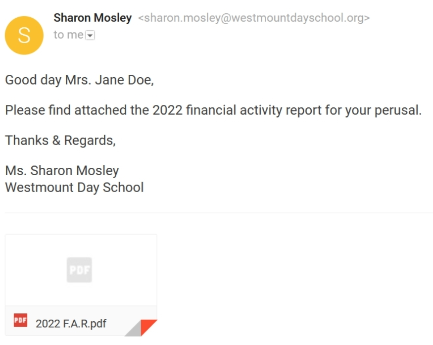

:orphan:
(dont-be-bait-for-phishing-attacks)=

# Don't Be Bait for Phishing Attacks!

Phishing, like fishing, is a technique used to "fish" for usernames, passwords, and other sensitive information from a "sea" of users. Because hackers frequently use the letter "ph" instead of the letter "f," they were initially dubbed "phreaks." Phishing (pronounced "fishing") is one of the social engineering attacks that attempt to steal your money or identity by tricking you into disclosing personal information – such as credit card numbers, bank account information, or passwords – on websites that appear to be legitimate.

## How is it done?

Phishing can occur through email, text messages, social media, or phone calls. The majority of
phishing attacks are delivered via email which can directly reach millions of users and hide among the
massive number of benign emails that busy users receive. The goal of such an attack is to steal personal
information or take over your social media account. There are five common types of phishing attacks:

- Spear phishing
- Whaling
- Smishing
- Vishing
- Angler phishing

### Spear phishing

Spear phishing is a type of phishing campaign that specifically targets a specific person or
group and frequently includes information known to be of interest to the target, such as current
events or financial documents.

_Figure 1 Example of Spear-phishing email: shared link directs to drive-google.com, instead of drive.google.com_

In figure 1, the attacker purposely shared a document via a link that directs to an illegitimate website that pretends to be a google site. This could harm the company for the unknown link can ask the target to submit sensitive information or even contain harmful malware. Spear phishing, like other social engineering attacks, exploits our most basic human traits, such as a desire to be helpful, provide a positive response to those in authority, a desire to respond positively to someone who shares similar tastes or views, or simple curiosity about current news and events.

### Whaling

Whaling attacks are even more targeted, with senior executives as targets. Whaling is a highly
targeted phishing attack that masquerades as a legitimate email and targets senior executives.
Whaling is a type of digitally enabled social engineering fraud that encourages victims to perform
specific actions, such as revealing sensitive data or transferring money.

_Figure 2 Whaling example, a fraud email contains a harmful pdf file from an unknown sender_

In figure 2, whaling or also known as CEO fraud, shows an example email directed to a specific
person (Mrs. Jane Doe as executive director) containing a harmful file disguised as a pdf. This email
trick a target into performing secondary action, which downloads the attached PDF and runs the
hidden program.

Whaling attacks are commonly used by cybercriminals to masquerade as senior players in an
organization and directly target senior or other important individuals in an organization to steal money
or sensitive information or gain access to their computer systems for criminal purposes.

### Smishing and Vishing

Smishing and vishing are two types of similar phishing attacks. The attacker uses impersonation to gain the target's trust without using email. These are scams that use SMS (smishing) and voice (vishing) to trick people into handing over money or personal information.
Smishing, which stands for "SMS phishing," is SMS-based phishing (text messages). As shown in figure 3, the victim of a smishing attack receives a text message which leads the victim to click on a link that leads to a site requesting personal information to be submitted.

_Figure 3 Smishing example, gift fraud which urges the victim to click on a fake website_

Smishing attacks are common among today's cybercriminals because people trust text messages more than emails. Hackers could use this to accomplish a variety of tasks. For example, stealing personal information by posing as a bank representative and then asking the victim to provide their data, or using sympathetic measures to gather sensitive information, such as messages about hurricane relief in which the threat actor requests a charitable donation from the victim via the included link. Once the hacker has the victim's credit card information, the criminal can charge it monthly to avoid alarming the victims.

On the other hand, vishing is an abbreviation for "voice phishing," which is the practice of
defrauding people over the phone by enticing them to divulge sensitive information. The attacker
attempts to steal the victim's data and use it for their benefit. Typically, to gain a financial advantage.

One of the most common types of vishing is when a fraudster calls the victim and claims to be
from their bank or another institution, informing them that there is a problem with their account or
credit card. The false alert may also arrive via SMS at first, instructing the recipient to call a number to
resolve the issue.

### Angler phishing

Angler phishing is a new type of phishing attack that targets people who use social media.
Angler phishing attacks are launched using bogus corporate social media accounts, as opposed to
traditional phishing, which involves emails spoofing legitimate organizations. People pose as customer
service representatives on social media to contact a disgruntled customers and obtain their personal
information or account credentials.

_Figure 4 Angler phishing example, disguised as financial company’s social media representative_

In figure 4, a customer of PayPal sent a complaint via tweet to PayPal’s official social media
representative on Twitter using the username @PayPal. The cybercriminal pretends to be a PayPal
tech representative (@AskPayPal_Tech) and reached out to the customer by replying to their tweet
and asking them to click on an illegitimate link that they provided a fake website of PayPal. The
fraudulent but realistic Twitter persona, landing page, and login screen all work together to create a
convincing lure that can entice users to enter their PayPal credentials into the fraudulent page, giving
scammers direct access to their accounts and any funds in them.

## Conclusion

Until a few years ago, detecting a phishing email was relatively simple. With a little
investigation, users could easily identify a forged sender address, misspelled words, or a manipulated
link URL. Scammers are much more cunning nowadays. The average user may be unable to detect
phishing emails.

Phishing has several negative effects on a business, including financial loss, intellectual
property loss, reputational damage, and disruption of operational activities. These effects combine to
cause a loss of company value, sometimes with irreversible consequences.

Protection from malicious messages could use anti-phishing and anti-spam software installed
on PCs. Anti-malware software should be included to protect against other types of threats. Anti?malware software, like anti-spam software, is programmed by security researchers to detect even the
most evasive malware.

> **Do you want to get practical skills to work in cybersecurity or advance your career? Enrol in [MCSI Bootcamps](https://www.mosse-institute.com/bootcamps.html)!**
