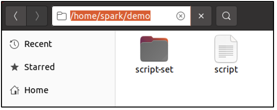
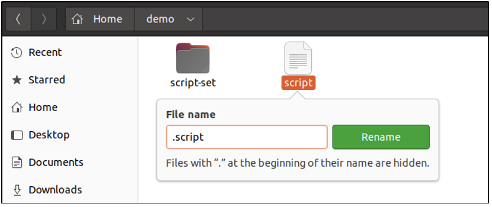
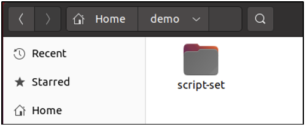
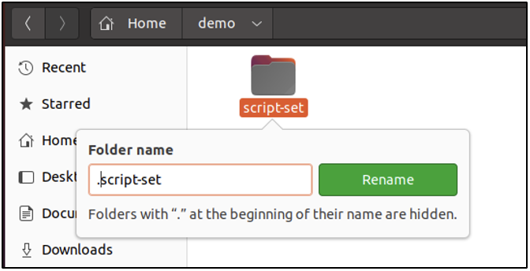
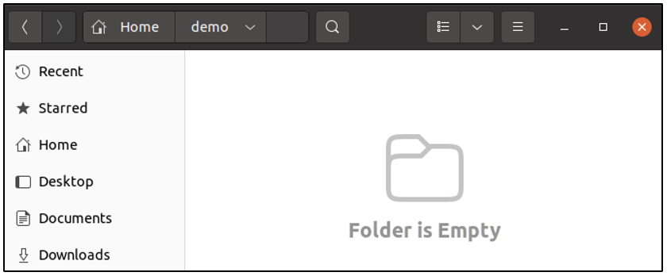
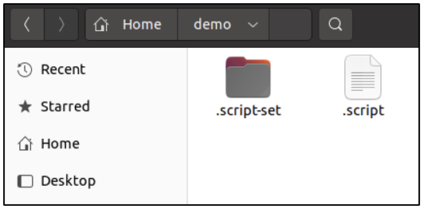
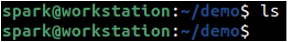
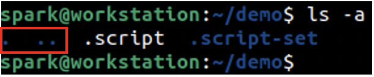

:orphan:
(dont-be-tricked-by-hidden-files-viewing-hidden-files-and-directories-in-linux)=

# Don't be tricked by hidden files: Viewing hidden files and directories in Linux

Did you know that it is possible to hide files and directories on a Linux system? This is actually a legitimate feature that exists by default, that has been misused by cyber adversaries. This blog post will introduce you to the ‘hiding’ feature present on Linux systems and present its security implications.

## What qualifies as a hidden file or hidden directory?

Currently, user _spark_ is logged into the system. Within the _/home_ directory, there is another directory called _demo_, that has one file called _script_ and one directory called _script-set_. The file and directory are both visible in the GUI.

In the following screenshot, it can be seen that the file is being renamed. A dot (.) has been added in front of the file name.

When the _Enter_ key is pressed, the file is not visible on the GUI anymore. It still exists on the system, but it is a hidden file now.

In the same way, as shown in the following screenshot, the name of the directory is also modified to denote a hidden directory.

When the _Enter_ key is pressed, the directory is not visible anymore.

Files and directories with a dot in front of their names, qualify as _hidden_.

## What is the legitimate use of hidden files/directories?

Some files and directories are marked as hidden by default, by the operating system. This is to avoid accidental modification by the user. For example: critical configuration files for the bash shell are present in the _/home_ directory for every user, but is hidden by default.

If you use SSH keys to remotely login to a system, those private keys must be kept secure throughout its lifetime. SSH keys are typically stored as hidden files within hidden directories, in a user’s _/home_ directory.

Any applications installed by the user have their configuration files stored as hidden files in hidden directories, in a user’s _/home_ directory.

It can be summed up that Linux hides some directories and files from a user to prevent accidental modification or deletion.

## How have hidden files/directories been maliciously used?

Cyber adversaries hide malicious scripts on a system they have gained access to.

Data may be planted into an exploited system and stored in hidden files to assist in post-exploitation activities.

## How to view hidden files/directories in the GUI?

On the GUI, to view hidden files and directories, simply use the _CTRL + H_ keystroke. The following screenshot was taken after the specified key combination was used. You can see the file and directory that we hid at the beginning of this post. Note the dot in front of the file names.

Try this out: Within the _/home_ directory on your computer, attempt to view the hidden files and directories. How many hidden entries do you see?

## How to view hidden files/directories in the Terminal?

Using the _Terminal_ application, it is possible to get information about hidden files and directories.

User _spark_ is currently within the _demo_ directory. When `ls` command is issued as shown in the following screenshot, we can see that no output is displayed – although there are hidden files/folders in this directory.

A special switch `-a` needs to be used issued with the `ls` command to view hidden file/directories.

`ls -a` stands for _list all files and directories_. In the following screenshot, you can see that you can view the hidden file _.script_ and the hidden directory _.script-set_.

Notice that in the beginning of the output, there are two other entries in blue. One with a single dot (.) and one with two dots (..)

The entry with a single dot refers to the current directory and the entry with two dots refers to the parent directory.

Every directory on Linux systems, has a hidden entry for current directory and parent directory.

In another _[blog post](linux-command-line-101-basic-file-and-directory-operations)_ where we discussed commands to traverse between directories, the command issued to navigate to the parent directory of any directory is `cd ..`

## How will this information be useful to you as a cybersecurity professional?

- As a penetration tester/red teamer, you may need to hide scripts/files for exploitation and post-exploitation activities.
- As a digital forensic investigator, you may need to hunt for files/directories that an adversary may have hidden on a system.
- As a cloud security professional, you may need to securely store SSH keys used to access cloud resources, within hidden directories.
- As a system/network security professional, you may need to work with hidden files/directories on a regular basis, to manage critical configuration information.

## Project Idea

Did you know that every terminal command can be issued with multiple switches?

- To view the _[permissions](file-permissions-in-linux)_ assigned to a file/directory, `ls -l` command is used
- To view the hidden files/folders within a directory, `ls -a` command is used.

What if you want to view the permissions of all the files/folders within a directory, including hidden files/folders?

Simply issue the `ls` command with both the switches as: `ls -a -l` or `ls -al`.

Try it out!
