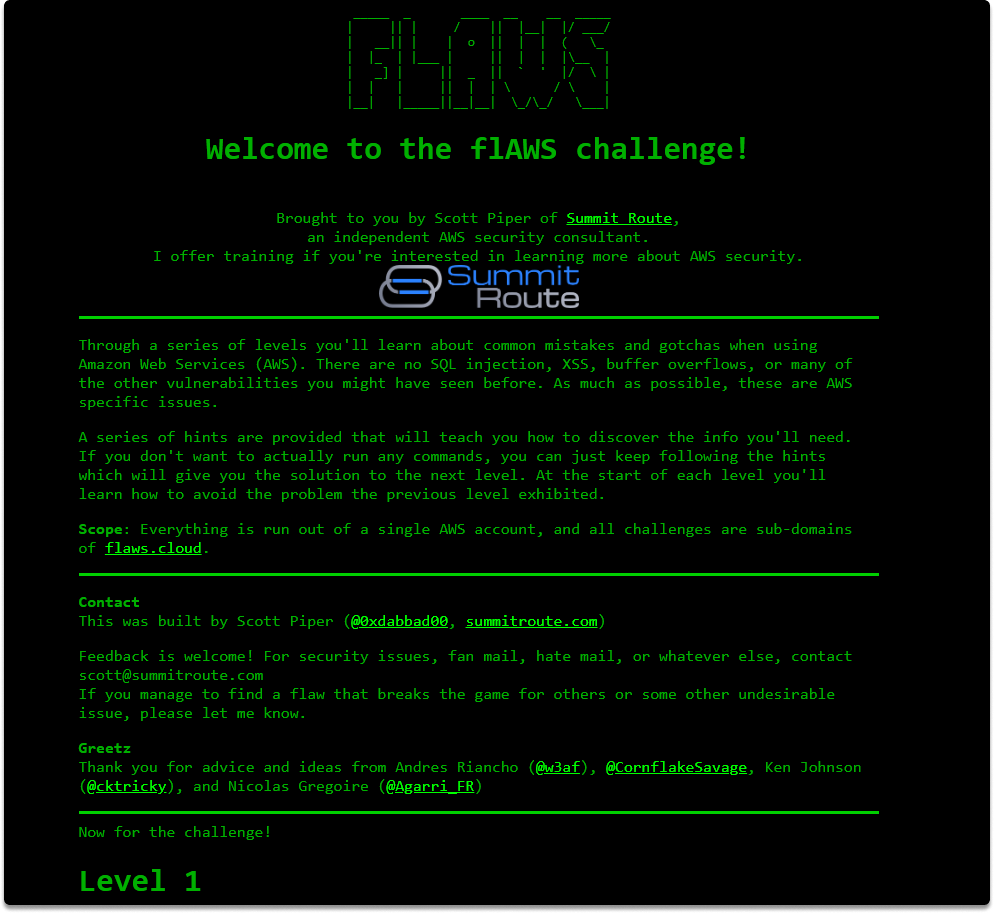
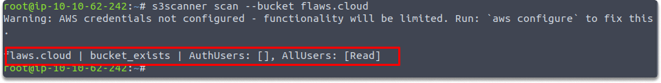
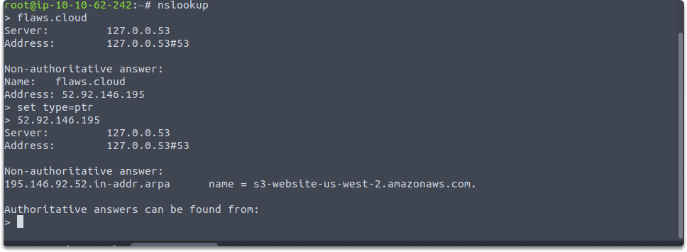
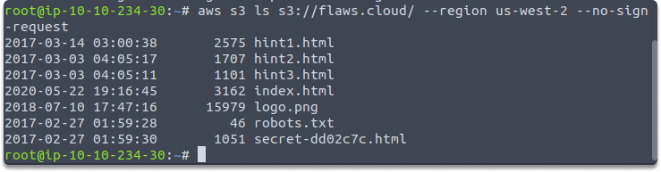
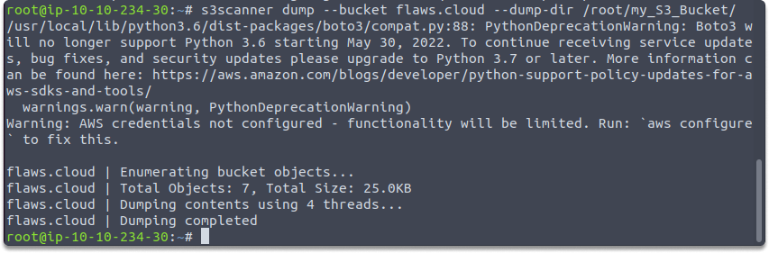
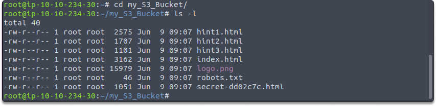
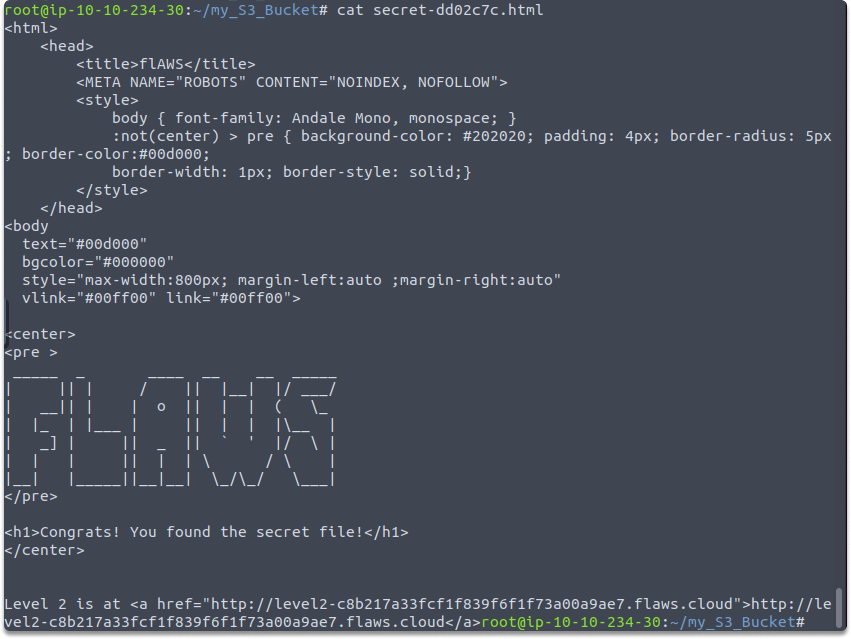

:orphan:
(enumerating-and-exploiting-aws-s3-buckets-with-s3scanner-and-flaws-cloud)=

# Enumerating and Exploiting AWS S3 Buckets with S3Scanner and Flaws.cloud

Now that we are done with enumerating S3 buckets in our previous article: [S3 Bucket URL Enumeration](s3-bucket-url-enumeration). We are ready to dump the publicly available files. We will start with S3Scanner.

We have downloaded this lightweight tool in the previous blog post. If you haven’t read it yet, I recommend you to read it first and then follow along from this point. It is a really brief walkthrough that sets the basics of S3 and gets the URL of a publicly available S3 buckets.

## Installing S3Scanner

S3scanner aims to extract things found in publicly available S3 buckets. We have previously downloaded S3Scanner with this command in the previous article:

`sudo pip3 install s3scanner`

Now that we have also said this, let’s move on.

## Flaws.cloud

AWS S3 buckets are utilized for more than just storing data such as files. Websites are also hosted on them. Now we will utilize free online learning tools which are designed by an AWS security specialist to assist the community in learning about the security vulnerabilities of AWS S3. As you might guess this platform is: http://flaws.cloud



## Verifying existence of an S3 with S3Scanner

Next, let's use S3Scanner to verify that a bucket exists and the available permissions:

`$ s3scanner scan --bucket flaws.cloud`

The following image demonstrates that S3Scanner was able to detect the existence of a bucket and that all users may view its contents:



Let's now try to read/view the contents of the AWS S3 bucket. If you haven’t followed the previous article, here is a quick refresher.

```
$ nslookup
>flaws.cloud
set type=ptr
52.92.146.195
```



## Accessing contents of an S3

Here we will utilize the no-sign-request parameter. Allows you to list the contents of an S3 anonymously and you do not need to be an AWS client. This means we don’t need to set any credentials. Do you remember what an S3 URL looks like?

Based on the findings in the last section of our previous blog, run this command:

`$ aws s3 ls s3://flaws.cloud/ --region us-west-2 --no-sign-request`

As seen in the picture below, the S3 bucket includes multiple files:



## Dumping files from the S3

Next, let's attempt to download the files into our Kali Linux system. Use the following commands to create a folder and transfer data into it:

mkdir my_S3_Bucket

`s3scanner dump --bucket flaws.cloud --dump-dir /root/my_S3_Bucket/`



Then, switch your working directory and display the files using the following commands:

`cd my_S3_Bucket`

`ls -l`



The picture below illustrates that the identical files in the S3 bucket are now locally available :

## Reading a file

Finally, you can use the cat command to directly inspect the contents of a file in the Terminal window:

`cat secret-dd02c7c.html `



## Conclusion

Businesses can leave data vulnerable on a cloud provider network. This might result in the retrieval of data and accounts. And as a side note, do not conduct such activities on systems for which you do not have legal authorization.

Congratulations! You learned how to enumerate and exploit AWS S3 buckets using various tools and strategies in this part.

## Challenge

_Time: 15 minutes_

- Create a free tier account in AWS.
- Create an S3 bucket.
- Upload a .`png` file to your bucket.
- Go to your management console and navigate to your S3 bucket.
- Select the `.png` file and make it public.
- Open your S3 bucket URL in a new tab.
- Apply all we have learned to your bucket.
- When you're done, don't forget to delete your bucket or change public availability.

:::{seealso}
Looking to expand your knowledge of penetration testing? Check out our online course, [MPT - Certified Penetration Tester](https://www.mosse-institute.com/certifications/mpt-certified-penetration-tester.html)
:::
