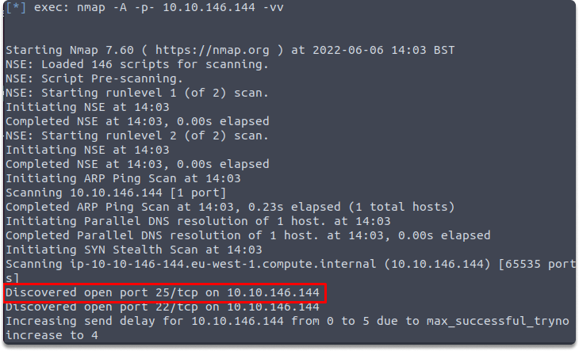
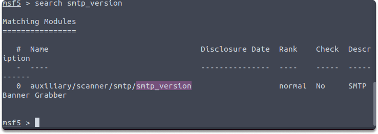
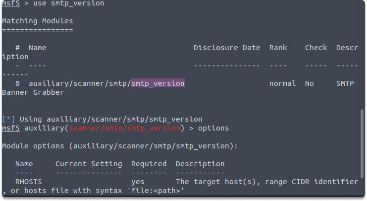
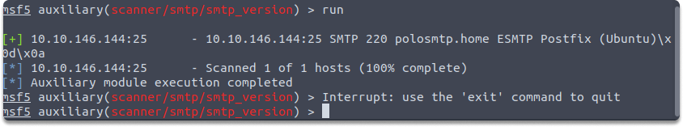

:orphan:
(enumerating-smtp-with-metasploit)=

# Enumerating SMTP with Metasploit

In this blog post we are going to take a quick look at what is SMTP, and how we can get information about the target system utilizing Metasploit modules.

## What is The Simple Mail Transfer Protocol (SMTP)

The Simple Mail Transfer Protocol is the protocol used to send email which uses TCP port 25 in default. SMTP, like FTP, is a relatively ancient technology with little security in design. For that reason, SMTP has been targeted for years, and most organisations that host SMTP servers have learnt how to protect these servers against exploitation.

### Taking advantage of SMTP vulnerabilities

The most helpful SMTP attacks for a pentester are often coupled with a single susceptible SMTP server version.

Mail servers that are poorly configured or susceptible may frequently give an initial ingress point into a network, but before we begin an attack, we want to fingerprint the server to ensure that our pinpointing is as exact as possible.

To do this, we will employ MetaSploit's "smtp version" module. Metasploit contains an SMTP enumeration utility in its list of auxiliary scanners. We will utilize _auxiliary/scanner/smtp/smtp_enum_.

It checks a range of IP addresses and evaluate the version of any mail servers it discovers. This list also contains a module named "smtp enum" as we see in the provided path. To use the module, you just need to provide it with an address or range of addresses to scan and a wordlist including names to list.

Let's do a quick activity.

### Quick hands-on excercise: Enumerate a vulnerable SMTP server

_Time estimated: 5 minutes_

In this excercise, first we are going to discover if SMTP is running on a standard port on the target IP with this _nmap_. This command will produce the scan result with increased verbosity.

`nmap -A -p- 10.10.3.242 -vv`

This image shows that SMTP is open in the target machine and running on a standard port which is 25.

After discovering what port we should be targeting, we can run Metasploit with this command: `msfconsole`

As a next step, running `search smtp_version` command gives us the module names and descriptions in Metasploit terminal.

We can list the options of the current module by with interacting this command: `use smtp_version` and then typing `options`

We can also set a value for our target machine: `set RHOSTS 10.10.146.144` and then run this command: `run`

Successful output will also show the system mail name and what Mail Transfer Agent (MTA) is running.

> **Looking to expand your knowledge of penetration testing? Check out our online course, [MPT - Certified Penetration Tester](https://www.mosse-institute.com/certifications/mpt-certified-penetration-tester.html)**
