:orphan:
(environment-variables-in-linux)=

# Environment Variables in Linux

While working with Linux systems to run scripts or applications, you may encounter an error like this: ‘environment variable not set.’ Environment variables are an important feature of Linux systems (you will also find it on Windows and OSX). This blog post will introduce you to what environment variables are, how they can be created on Linux systems and their significance in cybersecurity.

## What are Environment Variables?

Environment variables are name-value pairs defined through the _Terminal_, that provide additional settings for a program to run. Their values can be modified by the user. Here is an example of an environment variable and its value. The variable denotes the path to where binaries exist on the system.

`PATH=/usr/bin`

The name of the environment variable is specified in uppercase to the left of the = sign. The value assigned to the variable is specified to the right of the = sign.

## Types of Environment Variables in Linux

There are two types of environment variables used in a Linux system.

1. **Local environment variables**: This type of environment variable that is set in the terminal, has local scope only within the terminal. Child processes created within the terminal cannot access this variable. (Child processes? More on this below. Read on.)

2. **Global environment variables**: Once this type of environment variable is set in the _Terminal_, it has scope within that terminal and all of its child processes.

Once the environment variables are set in the _Terminal_, they are stored in special files on disk.

## How to set and use local environment variables?

To set a local environment variable, simply type the variable name and its value in the terminal, as shown in the following screenshot. Here a local environment variable TITLE with the value _linux_ has been created.

To view the created local environment variable, `set` command can be used. Since the output of `set` is verbose, `grep` command has been used as shown in the following screenshot, to only view the results for TITLE environment variable.

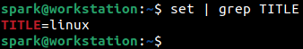

We can view the value of the variable using `echo` command as shown below. The command followed by a dollar sign ($) and the name of the variable prints its value.

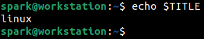

Now, let’s open a child process within this _Terminal_ application. A child process simply one created by another process! The system this demo was carried out on is currently using the bash shell. You can think of bash as the backend for _Terminal_. To open a child process for bash, simply type the `bash` command in the terminal as shown below. Once the child process is opened, we can try to print the value of the local environment variable that we have set earlier. You can see from the following screenshot, that the value of local environment variable is not accessible. We can exit out of the child process.

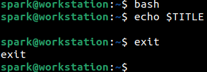

More precisely, local environment variables are referred to as _shell variables_ - because they are accessible only within the current shell.

## How to set and use global environment variables?

To create a global environment variable, we follow the same process as earlier, after appending the keyword _export_ to the front of it. In the following screenshot, we are creating a global environment variable called _SECRET_DIRECTORY_ with the value _/home/spark/secret-dir_.

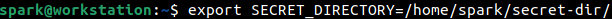

If the name of the global environment variable has more than one word, it is good practice to separate the words using an underscore.

We can view the value of the set variable using `echo` command as shown below.

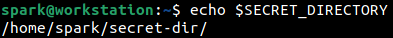

`set` command can be used to view the global environment variable.

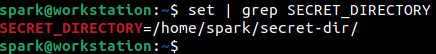

In addition to this, two more commands `printenv` and `env` can also be used to confirm the existence of the global variable. These two commands do not print local environment variables like `set`.

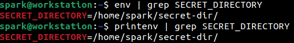

It was mentioned that global environment variables are available to child processes. Let’s confirm this by starting a child bash process. From the following screenshot, we can see that the global environment variable is accessible within a child process.

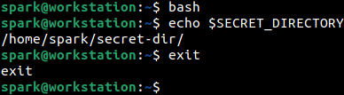

This is the type of environment variable we would use most often.

Once you set a global environment variable in the _Terminal_ and close the _Terminal_ application, then the global environment variable is lost and must be defined again. There is a way for the definition of environment variables to persist across application restarts and system reboots. Research about it!

## Demo – Using Environment Variables in a Script

Let’s review a quick demo of how the global environment variable comes in handy in a script _test-script.sh_, as shown in the following screenshot. A line of text is written into a file _message.txt_. That file will exist in the directory the script is run from. Then the file is moved to the location pointed to by the global environment variable `$SECRET_DIRECTORY` and written into a file _msg.txt_.

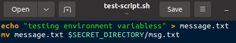

Before we run the script, let’s confirm that we are in user spark’s _home/_ directory.

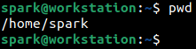

The script has executable permissions set.

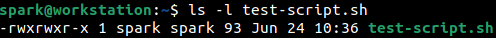

Currently `$SECRET_DIRECTORY` is empty.

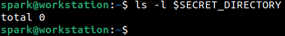

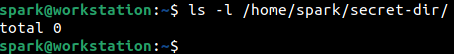

Let’s run the script.

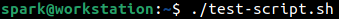

Now let’s confirm the contents of `$SECRET_DIRECTORY`. It looks like the script has executed successfully and now we have a file in the secret directory.

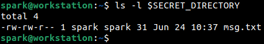

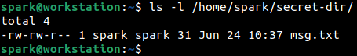

In this way, you can use environment variable in your scripts and applications. Environment variables are often used to define the path to various other executables on the system. If you are compiling a C program, you can define an environment variable to point to the path of the compiler.

## Why should cybersecurity professionals know about Linux environment variables?

- Penetrating testing and red teaming professionals use environment variables quite often to compile malicious programs, to run malicious scripts and alter the behavior of existing programs.
- Digital forensics professionals can observe the existing set environment variables, to understand recent and possible activity on the system. Some forensic tools may require environment variables to be configured to acquire evidence.
- Cloud security professionals use environment variables to configure the behavior of various cloud services.
