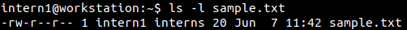
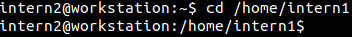

:orphan:
(file-permissions-in-linux)=

# File Permissions in Linux

Every file on a Linux system has a name, its data and associated metadata. The metadata includes the timestamps associated with the file (creation time, modification time, access time), user that the file belongs to, group that the file belongs to, security information for the file, etc. The security information for a file includes the permissions assigned to it. The permissions will dictate which user or group will have access to the file and also define the level of access. This blog post introduces you to how permissions exist for a file in Linux.

## Viewing information about users on the system

The following demo was performed on an Ubuntu machine having two users ‘intern1’ and ‘intern2’ as part of the group ‘interns’. _[This](user-accounts-on-linux-systems)_ post gives you an introduction to the types of user accounts on Linux systems.

The following screenshot shows that the user ‘intern1’ with UID 1001 is a part of the group ‘interns’ that has its GID as 1002.

The following screenshot shows that the user ‘intern2’ with UID 1002 is a part of the group ‘interns’ that has its GID as 1002. Although the UID and GID are the same values for ‘intern2’, they indicate the user ID and group ID information.

## Analysing permissions for a file

Now let us view the permissions for a file created by ‘intern1’.

‘intern1’ is logged into the system and is using the _Terminal_ application. Currently, we are in the _/home_ directory of ‘intern1’. This is confirmed by issuing the `pwd` command.

A text file _sample.txt_ is created and some content is written into it. _[This](linux-command-line-101-basic-redirection-and-pipes)_ post gives you can idea about how text files can be created in the command line.

‘intern1’ can view the contents of the file using `cat` command.

Typically, the `ls` command is used to view the contents of a directory. However, it is a very powerful command with many capabilities. It can also be used to view the security information for a file. This is can be done by issuing `ls` command with the `-l` (lower case L) switch.

`ls -l [filename]`

From the following screenshot, you can see the security information printed for ‘sample.txt’. There are various fields of information separated by spaces.

The following section elaborates what each field of information represents:

- **-rw-r--r--** : permission string for the file

This is a specially formatted string which signifies the level of access different users have on the file. More on this in the following section.

- **1**: number of links associated with the file

If a file has any shortcuts or additional names, then the link count will be incremented accordingly. A value of 1 indicates that the file currently has no shortcuts or additional names.

- **intern1**: user who owns the file

The file was created by ‘intern1’. So, the file is automatically owned by ‘intern1’. In some situations, it may be required to change the owner of a file. It can be done using `chown` command, which stands for ‘change ownership’.

- **interns**: group that has access to the file

The group that the file creator belongs to is automatically given access to the file. The level of access the group has on the file is defined by the permission string.

- **20**: number of bytes in the file

The number of bytes that make up the file is represented here.

- **Jun 7 11:42**: last modification time of the file

The time at which the file was last modified is represented in this field. Other timestamps like creation time and access time are not displayed by the `ls` command.

- **sample.txt**: file name

The name of the file is displayed in the last field.

## Dissecting the permission string

For _sample.txt_, the associated permission string is -rw-r--r--. Let us break this down into four sections. The first section has a single character, while the other three sections have three characters each.

The file type field identifies if we are dealing with a file, a directory, a shortcut file, etc. More on Linux file types in another blog post!

Now consider the last three sections of the permission string. They all have three characters: represented by either r or w or -. What do these mean?

Let’s take one section:

The first character always signifies the read permission. If a user/group/others have read permissions on a file, then the first character will have ‘r’ in it. Else it would have a -, which signifies that the user/group/others cannot read the file. In the permission string above, the first character is ‘r’ in all the three sections. This means that the user/group/others can all read the file.

The second character always signifies the write permission. If a user/group/others can write to a file, then the second character will have ‘w’ in it. Else it would have a -, which signifies that user/group/others cannot write to the file. In the permission string above, the second character is set as ‘w’ only for the file owner. This means that only the user (file owner) can write to the file. Other members of the group and users who are not part of the group cannot write to the file.

The third character always signifies the execute permission. This is typically set for binaries and scripts. If a user/group/others can execute a file, then the third character will have ‘x’ in it. Else it would have -, which signifies that user/group/others cannot execute the file. In the permission string above, the third character is not set as ‘x’ in any section. This means that no one can execute a file. This is just a simple text file, it does not require any permissions for execution.

Here is another permission string: -rwxrw-r--

What do you think the permission string indicates? Try it out!

## Verifying the Assigned Permissions

We know that other members of the group ‘interns’ can only read _sample.txt_. Let’s verify that.

Now ‘intern2’ logs into the system and navigates to the _/home_ directory of ‘intern1’ to access ‘sample.txt’.

`cd` command is used to navigate into the _/home_ directory of ‘intern1’.

`pwd` command is issued to confirm the directory where ‘intern2’ is in.

‘intern2’ can view the contents of the file.

‘intern2’ can also view the security information associated with the file.

But ‘intern2’ will not be allowed to write into the file.

This confirms what we have interpreted from the permission string. Even if a user who is not part of ‘interns’ group attempts to access _sample.txt_, they can only read the file.

## How can the permissions assigned to a file be modified?

To allow ‘intern2’ to write into the file, the permission associated with the group must be modified by ‘intern1’. This can be achieved using `chmod` command which is specially designed to modify a file’s permissions. The syntax for `chmod` command is as follows:

`chmod [new permissions] [filename]`

## Next steps

Here is a project idea for you:

- Set up Ubuntu or Fedora or Cent OS on a virtual machine
- Create three users ‘trainee1’, ‘trainee2’ and ‘trainee3’ and add them to a group called ‘trainees’
- Login as ‘trainee1’
- Create a text file and add some content to it. View the file’s permissions
- Login as ‘trainee2’ and attempt append content to the same file. Is it possible?
- Modify the file’s permissions so that only ‘trainee1’ has read and write permissions on the file
- Login as ‘trainee3’. Is it possible to view the file’s contents using `cat` command?
