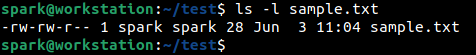
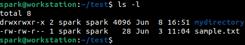
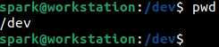
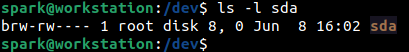
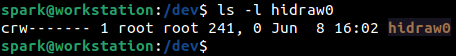
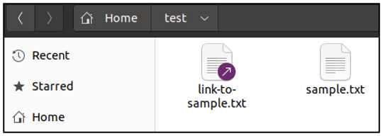
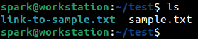
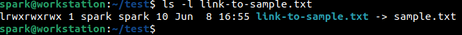
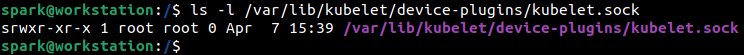
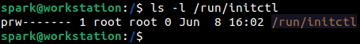

:orphan:
(file-types-in-linux)=

# File Types in Linux

Think about a library. It has a lot of books – there would be children’s books, magazines, graphic novels, encyclopedias, mystery novels, etc. But they are all books. Here **book** is a blanket term for every type of it. On a Linux computer, every single file or directory that you see is referred to by the blanket term **file**. This means that a directory is also a type of file. Interesting, right? There are more types of files that a Linux system works with. This blog post introduces you to the different types of files on a Linux system.

## What are the various file types in Linux?

There are seven different types of files on a Linux system.

## 1. Regular File

The first type is a regular file. This can be text files, json files, csv files, source code files, shell scripts, etc. How can we find out whether a file is a regular file or not? By looking at the file’s permission string. _[This](file-permissions-in-linux)_ post introduces you to Linux file permissions.

The following screenshot represents how the security information for _sample.txt_ is viewed using `ls` command. User _spark_ is currently logged into the computer and is within the _/test_ folder.

Note the first character of the permission string, it always indicates the file type. In the output shown below, the first character in the permission string is a hyphen (-), which indicates that this file is a regular file.

## 2. Directory

The second type we will consider is directory, which is also referred to as folder. Within the same _/test_ folder is a directory called _mydirectory_. The security information for all the contents of _/test_ can be viewed simply by issuing `ls -l` command without a name following it. When used this way, `ls -l` will print the security information for all the files and folders in the current directory.

From the following screenshot, notice the first character in the permission string for _mydirectory_. There is a _d_. For a directory, the file type in the permission string is always denoted by a _d_.

## 3. Block File

The next file type is block file. Every computer has a hard disk. Every time you read a file or write to a file, you interact with the hard disk. On Linux systems, this interaction is assisted by block files.

Data is read from and written to a hard disk in blocks with the help of block files. For every hard disk attached to your computer, you will find a block file in _/dev_ directory.

Currently, user _spark_ is in the _/dev_ directory.

Every hard disk is assigned a name of the form _sdX_, where _X_ stands for a, b, c and so on; depending on the number of devices attached to the computer. The first hard disk identified by Linux is assigned the name _sda_. If you attach an external hard disk, it would be assigned the name _sdb_.

There is one hard disk in _spark’s_ computer, it has been named _sda_. In the following screenshot, notice the first character in the permission string. A block file is always assigned as _b_.

## 4. Character Device File

A character device file helps to interact with hardware devices attached to your computer. Some examples of hardware devices are keyboard, mouse and serial interface devices. Interaction with hardware devices occurs character by character, which is performed with the help of character device files.

In the following screenshot, _hidraw0_ corresponds to a USB mouse attached to _spark’s_ computer. Note the first character in the permission string. Character device files are always identified with a _c_.

## 5. Link File

First, let’s understand what links are. In the following screenshot, you can see that the _/test_ directory has two files: one is a text file _sample.txt_ and the other _link-to-sample.txt_ is a shortcut to it. Note the purple arrow in the icon of the shortcut file.

Let us view the contents of both the files.

_sample.txt_ has two lines of text. We expect to find the same content within _link-to-sample.txt_ also, as it is just a shortcut file.

The contents of _link-to-sample.txt_ is as expected. In fact, when you open _link-to-sample.txt_, you are simply redirected to the contents of _sample.txt_. In this case a link has been created in the same directory for a file. It is quite common to see links created for files/directories in other locations.

Within the command line, we can see _sample.txt_ and the link for it within _/test_ directory.

The following screenshot displays the security information for the link file. Notice that the first character in the permission string is _l_ (lower case L). Link files always have _l_ as the first character in the permission string. Also note the file name section. You can find the name of the link with an arrow pointing to the actual file it is a link to. If the actual file was in another directory, you will find that full path to the right of the arrow.

## 6. Socket File

Socket files are typically created by the system for inter-process communication or network communication. The following screenshot represents the security information for a socket file _kubelet.sock_. Notice the _s_ as the first character in the permission string. In this post, we will not dive into the use of this file _kubelet.sock_.

## 7. Pipe File

Pipe files are used to send data between processes. These files always have _p_ as the first character in the permission string, as shown in the following screenshot for file _initctl_.

## Why should a cybersecurity professional know about the file types in Linux?

Regardless of the cybersecurity domain you are working on, you will encounter situations where you will have to work with the Linux command line. Knowing how to identify file types will come in handy anytime.

There is a command called `file`. Here is a project idea for you.

- Set up Ubuntu or Cent OS or Fedora on a virtual machine
- Identify files of different types on your VM
- Research how `file` command works
- Run `file` against every file and see what information is printed about its type
- Compare the results of `file` and `ls -l` for every file
